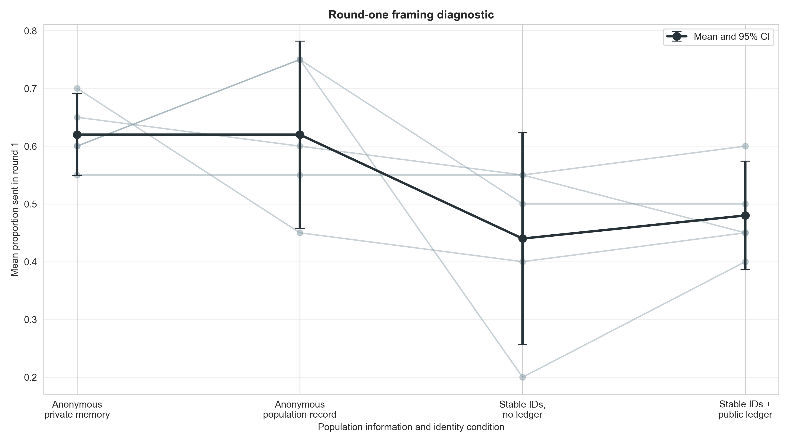
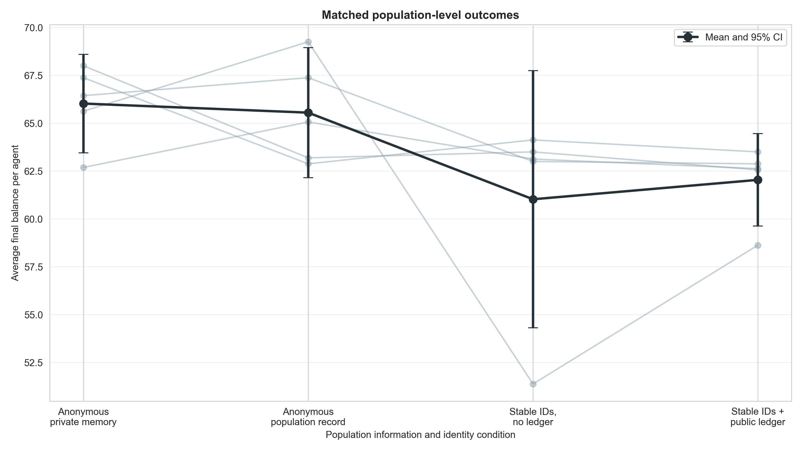
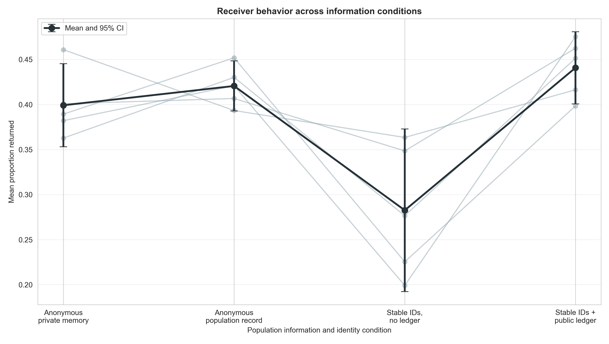
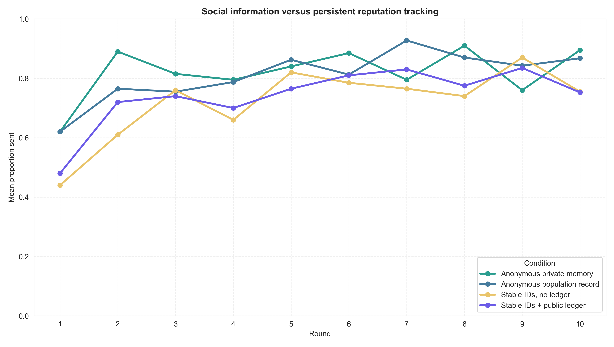

# GPT-5 Nano anonymous population-record mechanism screen

## Frozen question and design

This screen separates population-level social information from persistent
reputation tracking. It adds an anonymous population-record arm to three
existing matched Game-only conditions:

- **Anonymous private memory:** no synthetic history block.
- **Anonymous population record:** all communicated/noisy transfers from the
  previous three population rounds, but historical dyads are independently
  relabeled `Pair 1`–`Pair 4` in each round and cannot identify the current
  co-player or track individuals.
- **Stable IDs, no ledger:** persistent `Member A`–`Member H` IDs identify the
  focal agent and current co-player, but no population records are shown.
- **Stable IDs + public ledger:** persistent IDs plus all communicated/noisy
  transfers from the previous three population rounds.

All four arms use GPT-5 Nano, five independent eight-agent populations, ten
rounds, balanced rotating dyads, three-round private chat memory, informed
signed `U(−1,+1)` noise after both decisions, and matched pairing/noise seeds.
The anonymous-record protocol was frozen before its outcomes in
`docs/anonymous_population_record_protocol_2026-08-21.md`.

## Acceptance gate

All 20/20 selected populations passed the joint expanded audit:

- 200 complete population-rounds and 800 completed dyads;
- 1,600 accepted decisions with no retries or unrecovered failures;
- 1,600 noise checks with no violations;
- identical schedules across all four matched arms; and
- exact reconstruction of anonymous/public history rows from communicated
  values, with no Member or hidden Agent identity leaked into anonymous-record
  prompts.

## Results

| Condition | Round-1 sent | Final balance/agent | Proportion sent | Return ratio |
|---|---:|---:|---:|---:|
| Anonymous private memory | .620 [.549, .691] | 66.03 [63.45, 68.60] | .821 [.769, .872] | .399 [.353, .445] |
| Anonymous population record | .620 [.458, .782] | 65.55 [62.15, 68.95] | .811 [.743, .879] | .421 [.393, .448] |
| Stable IDs, no ledger | .440 [.257, .623] | 61.03 [54.30, 67.75] | .721 [.586, .855] | .283 [.192, .373] |
| Stable IDs + public ledger | .480 [.386, .574] | 62.04 [59.62, 64.45] | .741 [.692, .789] | .441 [.401, .481] |

### Frozen primary contrast

Anonymous population records versus anonymous private memory differed by only
`−0.48` final-balance units per agent (95% paired CI `[−5.36, +4.41]`,
`p=.801`). Mean proportion sent differed by `−.010`. Population social
information without linkable identities therefore did not reduce cooperation
in this screen.

Their round-one means were exactly equal at `.620`, although matched
replicate differences varied (`CI [−.206, +.206]`). Merely adding an anonymous
shared-record frame did not reproduce the low round-one behavior in the stable-
identity arms.

### Reputation-tracking contrasts

- Anonymous record minus stable IDs/no ledger: `+4.53` balance units
  (`[−5.13, +14.18]`, `p=.263`).
- Stable-ID public ledger minus anonymous record: `−3.51`
  (`[−9.00, +1.98]`, `p=.150`, `dz=−.79`).

Both estimates favor anonymous social information over persistent identity,
but five matched populations—especially one low stable-ID run—leave substantial
uncertainty.

## Receiver behavior and correction to the previous screen

Return ratios were .399 anonymous-private, .421 anonymous-record, .283 stable-
ID/no-ledger, and .441 stable-ID/public-ledger. Anonymous record versus private
was only `+.021` (`p=.436`), and public ledger versus anonymous record was only
`+.020` (`p=.366`). Anonymous record did exceed stable IDs/no ledger by `.138`
(`[+.025, +.251]`, unadjusted `p=.028`).

This revises the tentative interpretation of the prior post-hoc public-ledger
versus stable-ID return contrast. Higher returns are not unique to public
records; the stable-ID/no-ledger arm is the unusually low condition. The data
do not establish that population records themselves transmit a stronger
return norm.

## Interpretation

The four-arm pattern is consistent with persistent partner identity—not
population-level information—driving the cooperation reduction in GPT-5 Nano:

1. anonymous social information tracks the anonymous private baseline from
   round 1 through the full run;
2. both stable-identity arms begin lower before records exist; and
3. adding public records on top of stable identity does not clearly restore
   sending or welfare.

Persistent IDs can make direct partner-specific memory and retaliation
possible when agents meet again, while anonymous records convey only a
population norm. However, the current arms also differ in header wording, and
all evidence is exploratory (`n=5`, one model). The next experiment should be
an independent, wording-matched stable-versus-relative identity comparison
with no synthetic history in either arm. That is a cleaner test of identity
persistence itself than scaling any current contrast.

## Reproducibility

Run:

```bash
python3 scripts/analyze_anonymous_population_record_gpt_n5.py
```

Outputs are in
`docs/figures/anonymous_population_record_gpt_n5_20260821/`.








