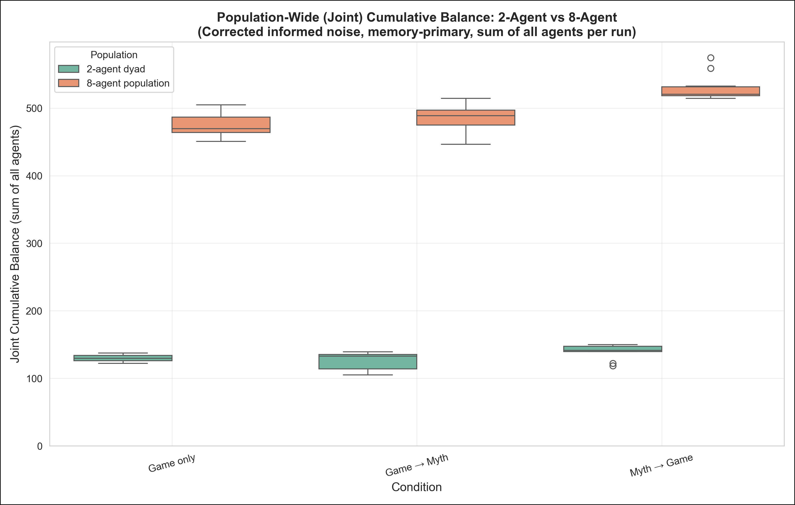
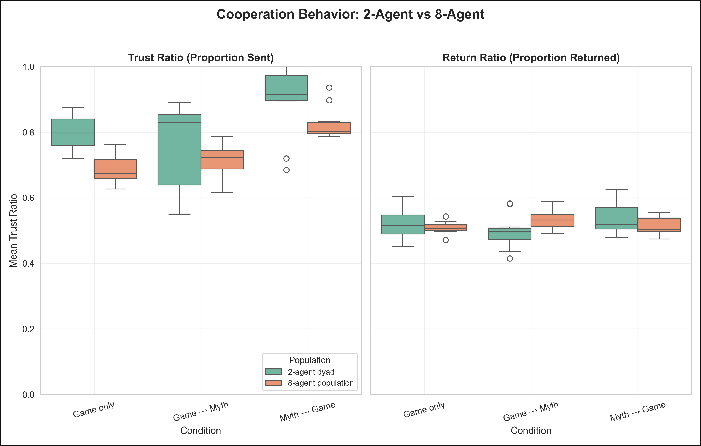
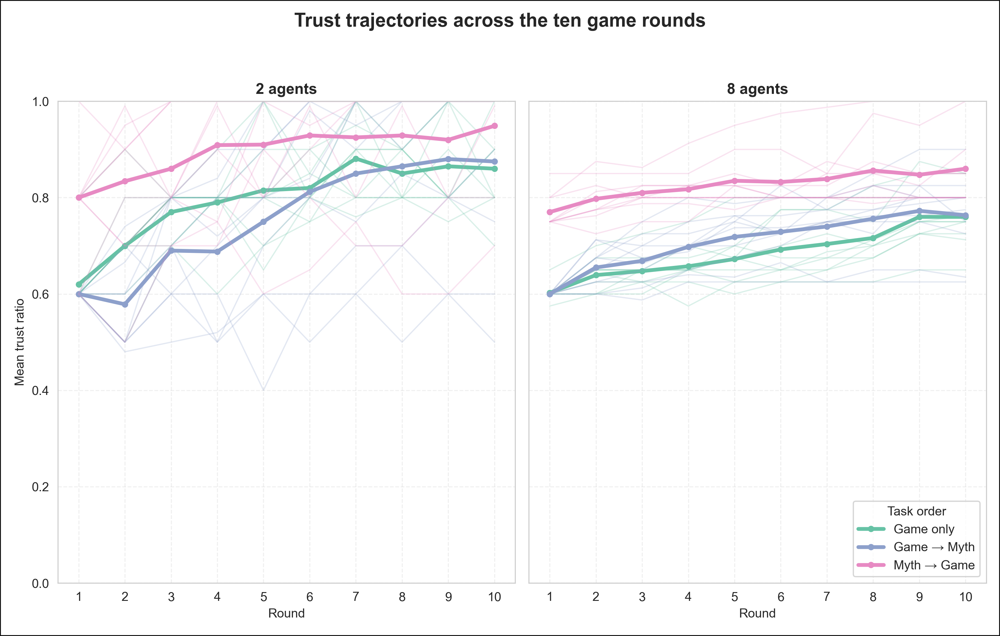
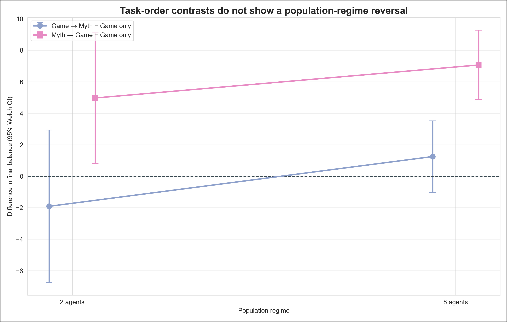
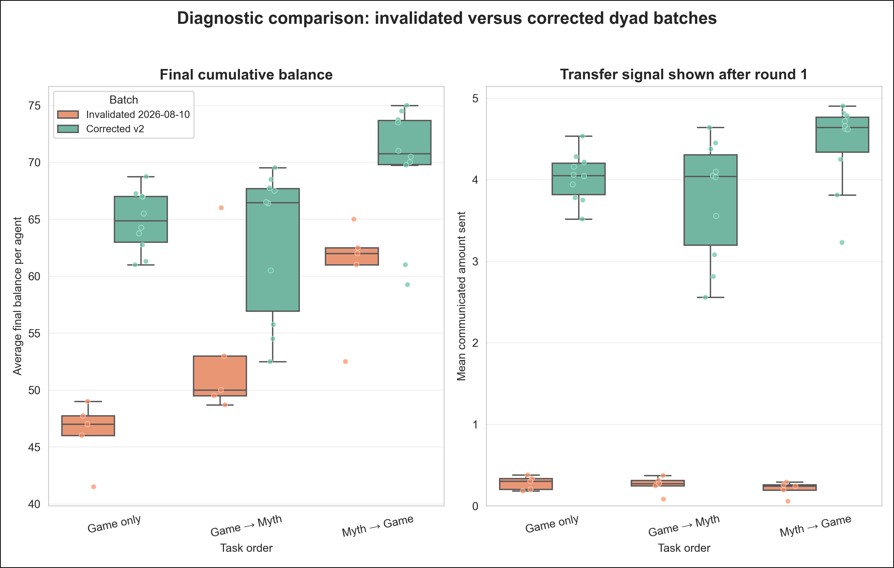

# Corrected informed-noise experiments: implementation and results update

**Status:** 60/60 confirmatory runs complete and protocol-audited
**Integration branch:** `codex/integrate-trust-game-updates`
**Analysis date:** 2026-08-13

## Executive summary

We fixed the dyad transfer-noise bug, made the myth-to-decision instruction
consistent across roles and population regimes, clarified the memory design,
hardened myth and provider retries, added reproducibility metadata and a strict
protocol audit, and implemented the first scripted-defector treatment.

We then completed a fresh non-defector rerun of the six main informed-noise
cells: 2 versus 8 agents crossed with game only, game→myth, and myth→game
(`n=10` independent runs per cell, 10 rounds per run). All 60 runs passed the
protocol audit: 5,000 accepted interactions, 5,000 LLM calls, 3,000 numerical
noise checks, no errors, no recovered retries, no forced responses, and no
protocol violations.

The corrected results change the earlier dyad conclusion:

- **Game→myth does not outperform game only in either population regime.** The
  estimate is −1.91 balance points in the 2-agent runs and +1.25 in the 8-agent
  runs; both confidence intervals include zero.
- **There is no detected population-regime interaction for game→myth versus
  game only.** The difference-in-differences is +3.16, 95% CI [−2.04, 8.36],
  `p=.218`.
- **Myth→game remains descriptively highest in both regimes.** The effect is
  large and multiplicity-robust in the 8-agent runs. It is suggestive in the
  dyads, but the dyad contrasts do not survive Holm correction across the six
  within-population balance tests.
- The task-order differences operate primarily through **how much senders
  entrust**, not through large changes in the fraction receivers return.

The safe interpretation is therefore a **population-regime comparison**, not a
pure population-size result. The 2-agent arm is a repeated dyad; the established
8-agent arm rotates anonymous partners and supplies a three-game history about
the current co-player. We have added cleaner fixed-pair and identity-isolation
configurations, but have not yet run those substantive batches.

## What we changed

### 1. Repaired the dyad communicated-transfer path

In later dyad rounds, the communicated send had previously been generated while
prompting the sender, before an actual send existed. The missing value fell back
to zero, noise was applied to that zero, and the resulting near-zero value was
cached and shown to the receiver. This affected every post-round-1 dyad transfer.

The corrected implementation now:

- generates the communicated send only when constructing the receiver prompt;
- requires the actual current send to exist first;
- raises on a missing transfer instead of silently substituting zero; and
- follows the same fail-closed contract already used by the 8-agent path.

The main implementation and regression coverage are in
[`games/trust_game_noisy.py`](../games/trust_game_noisy.py) and
[`tests/test_trust_game_noisy_transfer.py`](../tests/test_trust_game_noisy_transfer.py).

### 2. Made the myth-decision instruction consistent

We retained the instruction:

> Take any myths written in this session into account when making your decision.

A shared finalizer now appends it exactly once to every applicable current game
prompt: both roles, all rounds, game→myth and myth→game, and both the 2- and
8-agent code paths. This repairs its earlier omission from later-round 8-agent
prompts without duplicating it elsewhere. The selected prompt addition is saved
in run metadata.

### 3. Clarified rather than silently changed the memory design

- Agents' own accepted actions remain in their private conversation history.
- Game-only runs use chat-memory capacity 3; two-task runs use capacity 6 so
  that interleaved game and myth messages retain approximately three completed
  game rounds.
- In the established 8-agent regime, other-player information is supplied in a
  prompt block containing up to three prior games with the current co-player;
  the agent does not receive another agent's private conversation memory.
- The current six-cell comparison deliberately retains the established regimes:
  repeated dyads at 2 agents versus rotating anonymous partners with co-player
  history at 8 agents. The report labels this accurately instead of calling it
  a pure agent-count manipulation.

### 4. Added fail-closed myth-response validation

One smoke run revealed that a myth response could continue into text resembling
the next game prompt. The validator now detects multiple prompt-continuation
markers, rejects the response, retries once from clean memory, and fails the run
if the retry is also invalid. The rejected raw attempt remains available in the
audit trail but is never stored as the agent's myth or private memory.

This logic and its tests are in
[`src/myth_writer.py`](../src/myth_writer.py) and
[`tests/test_myth_response_validation.py`](../tests/test_myth_response_validation.py).

### 5. Hardened provider retries and provenance

- An unanswered user prompt is rolled back from private memory after an
  exhausted provider call, so a clean retry does not inherit a dangling prompt.
- The audit distinguishes accepted interactions from rejected/recovered attempts.
- Runs now record the provider route, resolved model, maximum output tokens,
  source commit and dirty state, config path and SHA-256, prompt regime, history
  windows, pairing mode, and seed fields.
- The confirmatory launcher requires a clean worktree, direct Anthropic routing,
  a fresh output directory, ten final JSONs per cell, and a successful audit
  before advancing to the next cell.

The reusable audit and launcher are
[`scripts/audit_v2_protocol.py`](../scripts/audit_v2_protocol.py) and
[`scripts/run_corrected_v2_confirmatory_20260812.sh`](../scripts/run_corrected_v2_confirmatory_20260812.sh).

### 6. Implemented the scripted-defector treatment

The 8-agent design can now assign two of eight agents to a deterministic
`forced_zero` policy. These agents make no LLM calls for game decisions and
always send or return zero, but their scripted prompt/response remains in their
private history. They still use the normal LLM myth-writing path, so their
cultural output can react to experience while game behavior remains fixed. The
treatment identity is hidden from agents in the planned primary cells.

The defector implementation is smoke-tested, but **no substantive defector
batch is included in the results below**.

### 7. Added cleaner causal follow-up configurations

Two unrun designs are ready:

- a 2×3 fixed-partner comparison of 2 agents versus four parallel fixed dyads
  at 8 agents, using unified prompts, hidden names, and no injected history; and
- an 8-agent rotating-population named-versus-anonymous identity test.

These are the appropriate next tests for separating agent count, partner
rotation, identity, and reputation information.

## Confirmatory rerun design

All six cells used Claude Sonnet 4.5 through direct Anthropic, temperature 0.8,
10 game rounds, informed bidirectional uniform ±$1 communication noise, and a
4,096-token output limit. There were ten runs per cell.

The saved `noise_seed` and `pairing_seed` fields are null in these six primary
cells. Despite an earlier intention to pair replicates, the completed cells are
therefore **not seed-paired**. All inferential results below correctly use
independent-group Welch tests. This does not invalidate the runs, but future
confirmatory launchers should fail if required seeds are absent.

## Results

Values are run-level mean ± sample SD.

| Population regime | Task order | Final balance | Trust ratio | Return ratio |
|---|---:|---:|---:|---:|
| 2-agent repeated dyad | Game only | 64.86 ± 2.67 | 0.797 ± 0.053 | 0.519 ± 0.044 |
| 2-agent repeated dyad | Game→Myth | 62.94 ± 6.50 | 0.759 ± 0.130 | 0.497 ± 0.054 |
| 2-agent repeated dyad | Myth→Game | 69.83 ± 5.47 | 0.897 ± 0.109 | 0.535 ± 0.048 |
| 8-agent rotating population | Game only | 59.26 ± 2.16 | 0.685 ± 0.043 | 0.509 ± 0.019 |
| 8-agent rotating population | Game→Myth | 60.51 ± 2.64 | 0.710 ± 0.053 | 0.537 ± 0.032 |
| 8-agent rotating population | Myth→Game | 66.33 ± 2.51 | 0.827 ± 0.050 | 0.512 ± 0.028 |

### Figure 1. Final cumulative balance

Myth→game has the highest mean final balance in both panels. Game→myth broadly
overlaps game only in both panels and is especially variable in the dyads. This
is the direct corrected replacement for the invalidated claim that game→myth
clearly improved dyad cooperation.

### Figure 2. Trust and return behavior

The ordering in final balance is mirrored by the trust ratio because larger
transfers create more group surplus under the 3× multiplier. Return ratios stay
close to one half in every corrected cell. The main behavioral difference is
therefore how much senders put into the cooperative interaction, not a large
shift in receivers' proportional reciprocity.

### Figure 3. Trust trajectories

Myth→game begins at a higher trust level and stays above the other conditions
on average. All conditions tend to increase trust across rounds. The thin dyad
trajectories also show why its cell-level estimates are less precise: between-run
variation is substantially larger than in the 8-agent population averages.

### Figure 4. Task-order contrasts

The game→myth-minus-game confidence interval crosses zero in both regimes. The
myth→game-minus-game estimate is positive in both. The apparent upward slopes
are not themselves significant interactions: for game→myth versus game, the
population-regime difference-in-differences is +3.16, 95% CI [−2.04, 8.36],
`p=.218`; for myth→game versus game it is +2.10, 95% CI [−2.47, 6.66], `p=.350`.

### Balance contrasts

| Population regime | Contrast | Difference [95% CI] | Unadjusted p | Holm p across six tests |
|---|---|---:|---:|---:|
| 2-agent dyad | Game→Myth − Game | −1.91 [−6.76, 2.93] | .407 | .527 |
| 2-agent dyad | Myth→Game − Game | +4.97 [0.82, 9.12] | .0227 | .0798 |
| 2-agent dyad | Myth→Game − Game→Myth | +6.88 [1.22, 12.54] | .0199 | .0798 |
| 8-agent population | Game→Myth − Game | +1.25 [−1.03, 3.52] | .263 | .527 |
| 8-agent population | Myth→Game − Game | +7.07 [4.86, 9.27] | <.001 | <.001 |
| 8-agent population | Myth→Game − Game→Myth | +5.82 [3.40, 8.24] | <.001 | <.001 |

Only the two 8-agent myth→game contrasts survive the conservative six-test Holm
correction. The dyad myth→game pattern is worth replicating, but it should be
described as suggestive rather than established from this batch.

### Figure 5. Why the earlier dyad result was invalidated

In the old dyad batch, receivers were shown a mean post-round-1 transfer of only
$0.21–$0.28 across conditions. In the corrected batch, the corresponding means
are $3.77–$4.44. The old game→myth-minus-game balance gap was +7.19; the corrected
estimate is −1.91. This figure is diagnostic rather than a causal bug ablation:
the old and new batches also differ in provider route, prompt details, memory
details, and sample size.

## Interpretation

The corrected evidence supports two claims:

1. **The previously reported dyad game→myth advantage was not reliable.** It
   came from a batch exposed to a broken transfer signal and does not reproduce
   after repair.
2. **Myth-first remains the strongest task order, especially in the 8-agent
   rotating-population regime.** The robust 8-agent result is consistent with
   earlier clean 8-agent batches, which had means of 60.55, 59.95, and 66.91 for
   game, game→myth, and myth→game respectively; the corrected means are 59.26,
   60.51, and 66.33.

The present data do **not** establish why the regimes differ. Agent count,
repeated versus rotating partners, anonymity, and the co-player history block
all differ together. Mechanistic claims about reputation or anonymity should
wait for the fixed-pair and identity-isolation experiments.

## Validation and reproducibility

- Unit/regression suite before launch: 34 tests passed.
- Full batch: 60/60 final runs.
- Protocol audit: 5,000 interactions, 5,000 LLM calls, 3,000 numerical noise
  checks, zero errors, zero recovered retries, zero forced responses, and zero
  audit issues.
- Execution commit recorded in every run: `9a972c36242818907361cac38f89d328727325f1`.
- Analysis is reproducible with
  [`scripts/analyze_corrected_v2_confirmatory.py`](../scripts/analyze_corrected_v2_confirmatory.py).
- Machine-readable run metrics, summaries, and contrasts are saved beside the
  figures in [`docs/figures/corrected_v2_confirmatory_20260812/`](figures/corrected_v2_confirmatory_20260812/).

The raw JSON tree remains under `data/json/` and is ignored by Git. Before this
becomes a paper result or is rerun elsewhere, the raw batch should be archived
in durable shared storage with checksums.

## Recommended next steps

1. Archive the 60 raw corrected JSONs and audit output in shared storage.
2. Run the fixed-pair 2-versus-8 design to isolate agent count from partner
   rotation, identity, and injected reputation history.
3. Run the named-versus-anonymous rotating 8-agent test if the reputation/
   anonymity mechanism remains theoretically important.
4. Start the scripted-defector pilot with 0 versus 2 defectors out of 8 across
   the three task orders, then analyze cooperation and myth content separately.
5. Make required pairing/noise seeds a fail-closed launcher condition before
   any future experiment described as paired.
