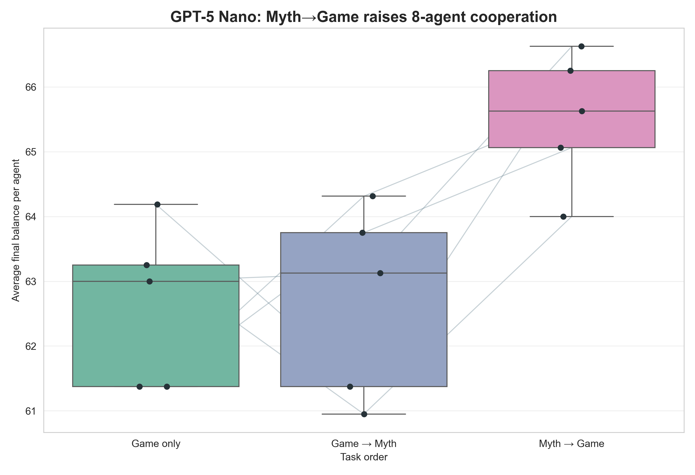
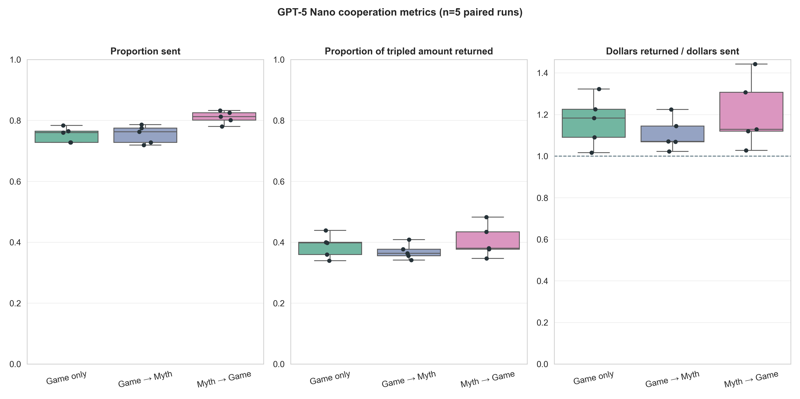
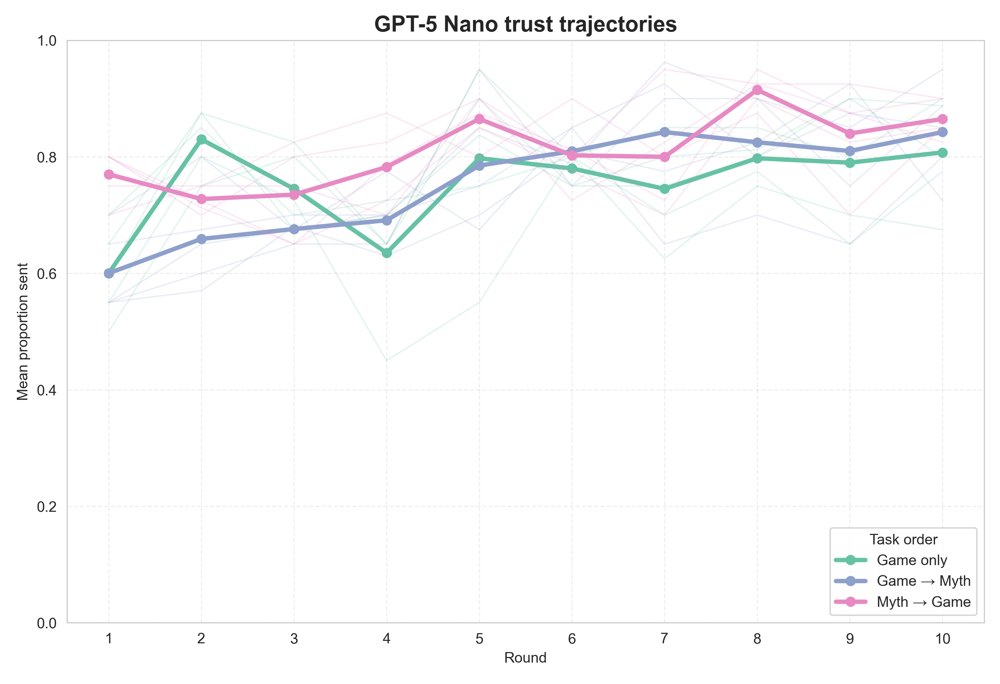

# GPT-5 Nano replication of the corrected 8-agent task-order effect

## Design

This exploratory replication used GPT-5 Nano in the corrected 8-agent rotating-
population protocol. It crossed the same three task orders used in the Sonnet
confirmatory batch: game only, game→myth, and myth→game. Each cell contains five
independent eight-agent runs of ten rounds.

The design holds the pairing schedule and signed communication-noise draws fixed
within each replicate across task orders. The five pairing/noise seed pairs are
202608200–202608204. Agents receive their own recent interactions through
private chat memory and a three-game prompt dossier about the current co-player;
co-player names are hidden. Communication noise is explicitly configured as
uniform U(−1,+1), clipped to the feasible action range and applied after both
sending and returning decisions.

The executable snapshot is commit `3a957f41`. All runs used the direct OpenAI
route and record a clean worktree in their metadata.

## Protocol audit

All 15/15 runs passed `scripts/audit_v2_protocol.py` jointly:

- 150 complete population-rounds and 600 completed dyads;
- 2,000 accepted LLM task responses and zero recovered or unrecovered retries;
- 1,200 numerical transfer-noise checks and zero bound violations;
- correct myth-decision instruction placement and memory behavior; and
- identical realized pairing schedules across task orders for each matched seed.

## Results

Values below are run-level means with 95% t intervals across the five independent
populations.

| Condition | Final balance per agent | Proportion sent | Proportion of tripled amount returned | Dollars returned / dollars sent |
|---|---:|---:|---:|---:|
| Game only | 62.64 [61.10, 64.17] | 0.753 [0.722, 0.783] | 0.387 [0.339, 0.435] | 1.168 [1.020, 1.315] |
| Game→Myth | 62.70 [60.87, 64.53] | 0.754 [0.717, 0.791] | 0.369 [0.338, 0.401] | 1.106 [1.008, 1.205] |
| Myth→Game | 65.51 [64.23, 66.80] | 0.810 [0.785, 0.836] | 0.404 [0.337, 0.471] | 1.205 [0.998, 1.413] |

Paired final-balance contrasts:

| Contrast | Difference | 95% paired CI | Raw p | Holm p (three contrasts) |
|---|---:|---:|---:|---:|
| Game→Myth − Game only | +0.07 | [−3.19, +3.32] | .958 | .958 |
| Myth→Game − Game only | +2.88 | [+1.09, +4.66] | .011 | .033 |
| Myth→Game − Game→Myth | +2.81 | [+0.92, +4.70] | .015 | .033 |

Final balance is a welfare measure and is algebraically determined by sending in
this game: returns redistribute resources within a dyad but do not change the
dyad's joint balance. The final-balance effect therefore corresponds exactly to
a 5.75 percentage-point increase in the proportion sent for myth→game versus
game only. No return-ratio contrast was detected at n=5.

## Interpretation

The cheap GPT model reproduces the central Sonnet ordering: myth→game is higher
than both game only and game→myth, whereas game→myth is essentially identical to
game only. The five paired differences for myth→game versus game only are all
positive. This is useful cross-model evidence that the ordering is not unique to
Claude Sonnet 4.5.

The result remains exploratory because n=5 is small and GPT-5 Nano is a single
additional model. The p values quantify this planned paired screen; they should
not be treated as definitive estimates or pooled with the Sonnet batch without
a model-level analysis.

The preceding Gemini 3.1 Flash-Lite smoke reached the sending ceiling in every
condition, making it uninformative about task-order differences under this
protocol.

## Cost and reproducibility

The 15 GPT runs used 4,570,644 input tokens and 238,113 output tokens, with no
reported reasoning tokens. At the recorded list-price rates, the estimated cost
was $0.324.

Reproduce the tables and figures with:

```bash
python3 scripts/analyze_crossmodel_signed_gpt_n5.py
```

Outputs are in `docs/figures/crossmodel_signed_gpt_n5_20260821/`.







## Recommended follow-up

The next causal experiment should manipulate information visibility in the
8-agent population while holding model, pairings, noise, identity cues, and
memory horizon fixed. Start with game-only own-history versus current-partner
dossier as a supported two-arm gate, then add a population-wide public ledger
arm after specifying how stable pseudonyms and noisy third-party observations
are represented. This separates direct partner reputation from genuinely
population-wide third-party reputation without conflating the two.
