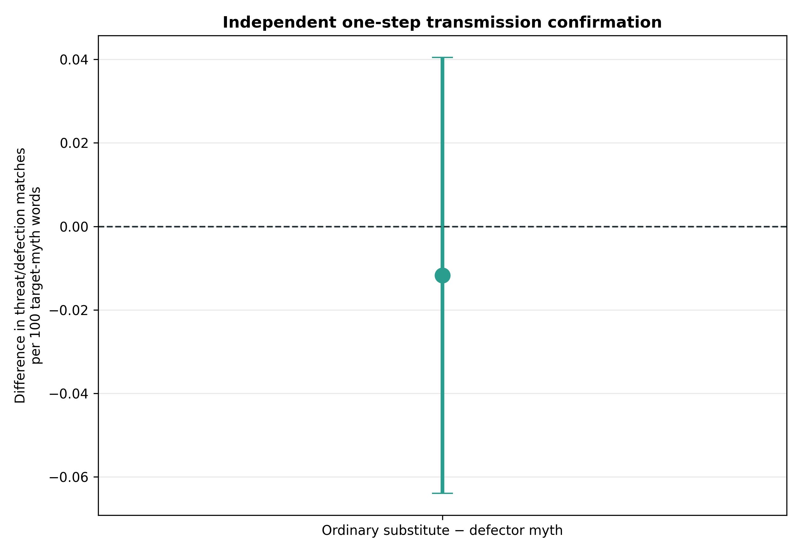
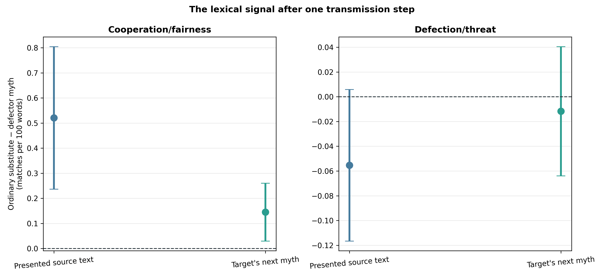
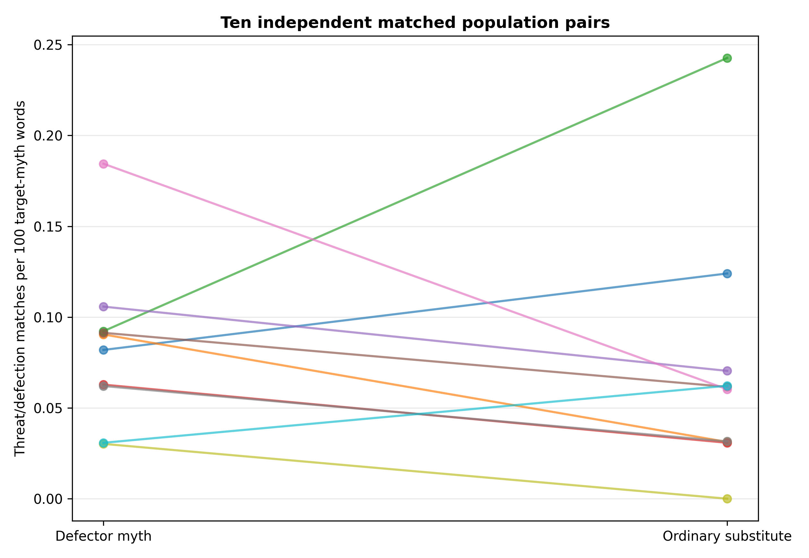
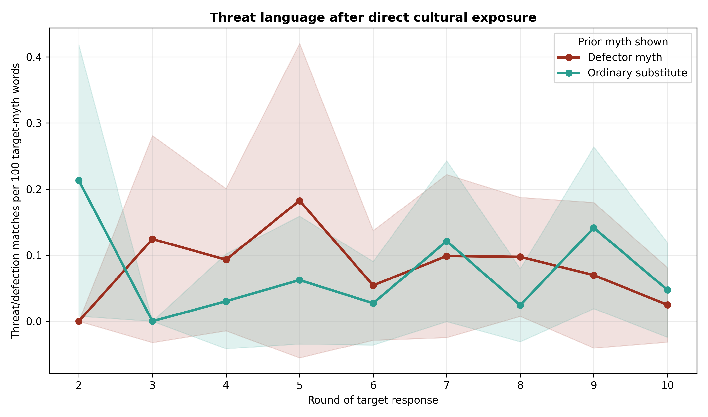

# Defector-myth circulation: independent Gemini confirmation

## Confirmatory question

The preceding five-pair screen suggested that threat-oriented language in a
hidden mechanical defector's myth survived one cultural transmission step.
This experiment independently repeated the same matched manipulation in ten
new Gemini 3.1 Flash-Lite population pairs. It asked whether replacing a
defector-authored myth with a natural ordinary-authored myth reduced
threat/defection language in the ordinary agent's immediately subsequent myth.

The protocol, seeds, fixed lexicons, acceptance gate, and sole primary outcome
were frozen in
`docs/defector_myth_circulation_gemini_confirmation_protocol_2026-08-21.md`
before these runs. Replicates 50–59 were independent of the screen replicates
45–49.

## Design and integrity

Both arms contained the same two of eight hidden mechanical defectors, who
always sent or returned zero without a game-decision LLM call but wrote their
own myths normally. The arms shared defector assignments, pairing schedules,
and signed-noise draws. They differed only when an ordinary agent's prior-round
partner was a defector:

- **Defector myth:** show that partner's actual defector-authored myth.
- **Ordinary substitute:** show a real ordinary-authored myth from the same
  prior population-round, without source labels.

All 20/20 populations passed the joint gate before outcome analysis:

- 3,200 accepted interactions from 2,800 Gemini calls and exactly 400 forced
  zero game responses;
- 1,600 exact signed-noise checks with no violations;
- complete schedules, decisions, myths, and exposure records;
- matched schedules, defector assignments, and direct-exposure opportunities
  within every population pair;
- every and only defector-to-ordinary exposure replaced in the intervention;
- prompt-level verification of every presented myth, with no original myth,
  author identity, defector label, or policy leakage after substitution; and
- no retries, provider failures, or response-boundary errors.

The earlier two-population smoke and five-pair screen are excluded.

## The frozen result did not replicate

The sole primary contrast was ordinary substitute minus defector myth for
threat/defection matches per 100 words in the directly exposed target's next
myth:

| Outcome | Estimate | 95% paired CI | p | Matched pairs |
|---|---:|---:|---:|---:|
| Target-myth threat density | −.0117 | [−.0639, +.0405] | .624 | 10 |

The confirmation rule required a negative estimate, an entirely negative 95%
interval, and `p<.05`. It was therefore **not confirmed**. Across all direct
targets, the threat lexicon matched 26 terms after defector myths and 22 after
ordinary substitutes—far smaller than the screen's 23-versus-five separation.
The matched standardized effect was small (`dz=−.16`).

This result supersedes the screen's claim that a one-step threat signal
transmits reliably. The screen result should be treated as a false positive or
an unstable seed-contingent pattern, not as established evidence of cultural
transmission.

## Secondary diagnostics

The source manipulation again changed the language that agents saw:

| Ordinary substitute − defector myth | Estimate | 95% paired CI | p |
|---|---:|---:|---:|
| Presented cooperation/fairness density | +.521 | [+.237, +.805] | .0025 |
| Presented threat/defection density | −.0554 | [−.1166, +.0058] | .0708 |

The next ordinary-authored myth contained more cooperation/fairness language
after an ordinary substitute (`+.145`, `[+.0297, +.260]`, unadjusted
`p=.0193`). This was a frozen secondary diagnostic, not the sole confirmatory
endpoint, and it did not produce a behavioral shift:

- directly exposed sender giving: `−.0267`, CI `[−.0886, +.0353]`, `p=.356`;
- directly exposed receiver return ratio: `−.00050`, CI
  `[−.0368, +.0358]`, `p=.976`;
- all ordinary senders: `−.00333`, CI `[−.0161, +.00943]`, `p=.569`; and
- population-wide ordinary threat language: `−.0174`, CI
  `[−.0590, +.0243]`, `p=.370`.

Gemini remained almost fully saturated in sending: ordinary agents sent .990
of their endowment after defector-myth circulation and .993 after ordinary
substitution. This design therefore provides little behavioral headroom even
though the language manipulation is detectable.

## Interpretation and decision

The independent evidence does not support reliable propagation of the
defector-specific threat lexicon. It does provide exploratory evidence that a
more cooperation-rich cultural input can make the next myth more
cooperation-rich, but this was not the pre-registered outcome and had no
observable game consequence under near-ceiling behavior.

We should not add more replicates to the same circulation contrast. A future
behavioral-transmission test would need a game or model with genuine decision
headroom and a manipulation whose semantic difference is fixed rather than
whatever natural myths happen to be available in a round.

## Reproducibility

Run:

```bash
python3 scripts/analyze_defector_myth_circulation_gemini_confirmation_n10.py
```

Outputs are in
`docs/figures/defector_myth_circulation_gemini_confirmation_n10_20260821/`.








