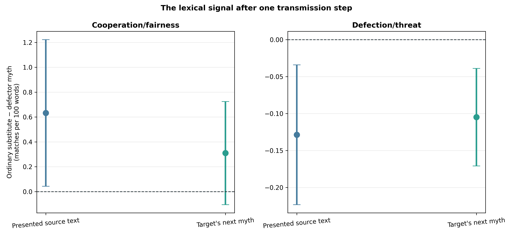
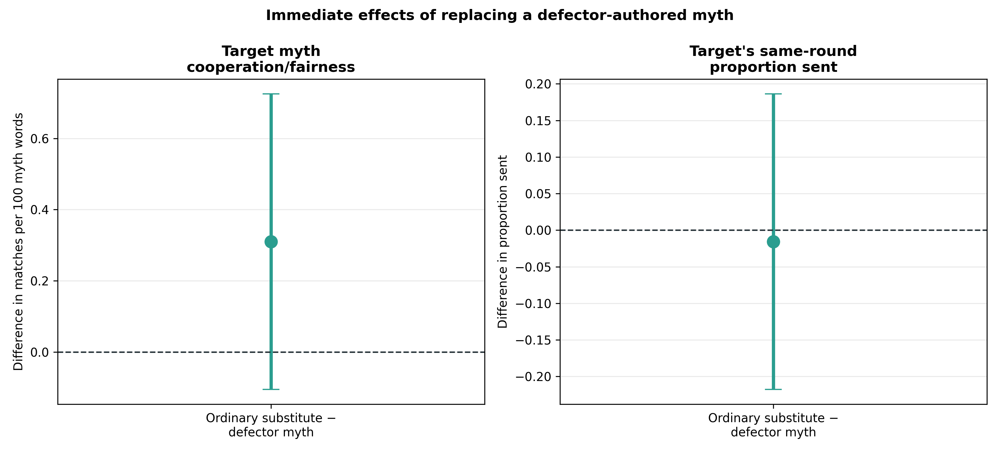
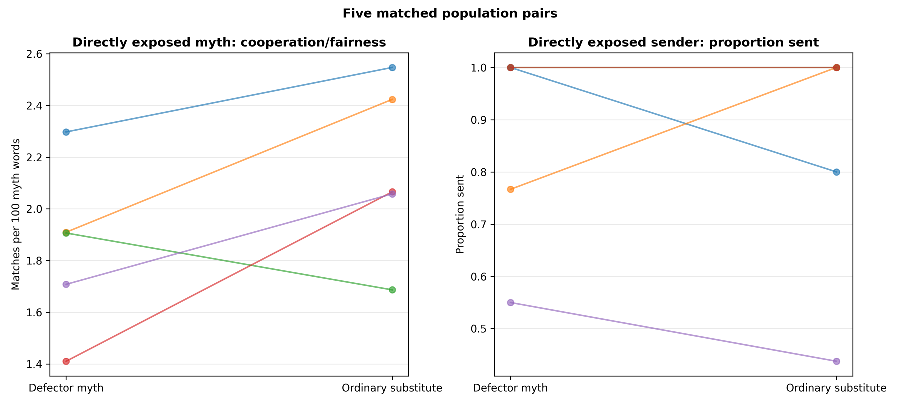
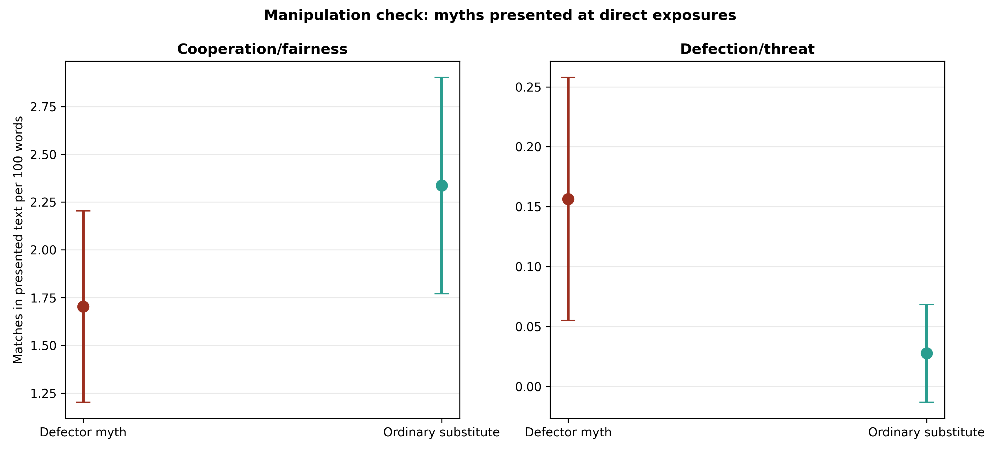
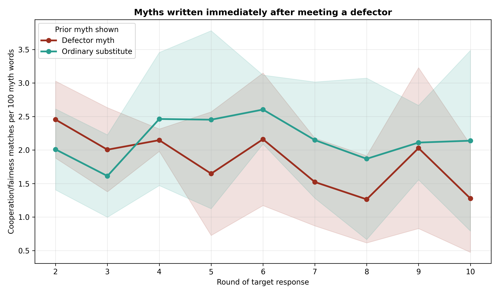

# Gemini defector-myth circulation mechanism screen

## Question and intervention

The independent defector experiment showed that mechanically constrained
Gemini agents write less cooperative and more threat-oriented myths after
being forced to send or return zero. This screen tested whether that signal is
transmitted to ordinary agents.

Five new matched Gemini 3.1 Flash-Lite populations were run in each of two
arms. Both contained the same two of eight hidden mechanical defectors and used
the same Myth→Game protocol, defector assignments, pairing schedules, and noise
draws. The only difference was what an ordinary agent saw in its next myth
prompt after having been paired with a defector:

- **Defector myth:** the prior partner's actual defector-authored myth, as in
  the original design.
- **Ordinary substitute:** a real ordinary-authored myth from the same prior
  population-round, selected deterministically without identifying its author.

Defectors wrote their own myths normally in both arms. Their game responses
remained mechanically fixed at zero without LLM calls. The intervention did
not change the number of prompts, calls, myths, game decisions, or memory
slots. The design and outcomes were frozen in
`docs/defector_myth_circulation_gemini_protocol_2026-08-21.md` before the runs.

## Acceptance gate

All 10/10 populations passed jointly before outcomes were analyzed:

- 1,600 accepted interactions from 1,400 Gemini calls and exactly 200 forced
  game responses;
- 800 exact signed-noise checks with no violations;
- identical schedules and defector assignments within matched replicates;
- 84 directly exposed ordinary-agent rounds in each arm, with exactly the same
  exposure and sender-opportunity counts within every matched pair;
- every and only defector-to-ordinary exposure substituted in the intervention
  arm;
- every recorded presented myth present in the intended current prompt, with
  the original defector myth absent after substitution;
- no author identity, defector label, or policy leakage; and
- eight explicit, successful myth-boundary retries and no unrecovered failures.

The preceding two-population live smoke test also passed but is excluded from
all analyses below.

## The manipulation changed the cultural input

At the 84 direct exposure events per arm, ordinary replacement myths contained
more cooperation/fairness language and less defection/threat language than the
defector-authored myths they replaced:

| Presented text contrast: ordinary substitute − defector myth | Estimate | 95% paired CI | p |
|---|---:|---:|---:|
| Cooperation/fairness matches per 100 words | +.633 | [+.043, +1.223] | .041 |
| Defection/threat matches per 100 words | −.129 | [−.223, −.034] | .019 |

This is an important manipulation check rather than an outcome: the experiment
successfully replaced the distinctive lexical signal with a natural
ordinary-authored input.

## Frozen outcomes

The two prespecified primary outcomes did not cross their Holm-adjusted
thresholds:

| Immediate target outcome: ordinary substitute − defector myth | Estimate | 95% paired CI | Raw p | Holm p |
|---|---:|---:|---:|---:|
| Cooperation/fairness density in target's next myth | +.310 | [−.105, +.725] | .107 | .214 |
| Same-round proportion sent by exposed target senders | −.0158 | [−.218, +.186] | .838 | .838 |

The cooperation-language estimate is in the predicted direction and moderately
large (`dz=.93`), but five population pairs leave it unresolved. Giving did not
move in the predicted direction and remains dominated by Gemini's near-ceiling
send behavior.

## A one-step threat signal appears to transmit

The prespecified secondary threat-language diagnostic was sharper. Ordinary
agents shown an ordinary substitute used `.105` fewer defection/threat matches
per 100 words in their immediately subsequent myths than when shown the
defector myth (95% paired CI `[−.171, −.039]`, unadjusted `p=.0115`,
`dz=−1.98`).

The effect is not merely the word *zero*. Across the 84 target myths in each
arm, the frozen threat lexicon matched 23 terms after defector-myth exposure
versus five after an ordinary substitute. The defector-myth arm included
*withhold* variants (nine matches), *betray* variants (four), *threat*
variants (three), and only two instances of *zero*, plus isolated punishment,
retaliation, distrust, exploitation, and selfishness terms. The presented
source texts show the same pattern: 27 threat matches in defector myths versus
five in the ordinary replacements.

The reduction is also visible when averaging across all ordinary-authored myths
in the population, not only immediate exposure events: `−.0411` threat
matches per 100 words (`[−.0664, −.0159]`, unadjusted `p=.0107`). In
contrast:

- population-wide ordinary-agent sending changed by only `−.0067`
  (`[−.0516, +.0383]`);
- population-wide ordinary cooperation-language density changed by `+.085`
  (`[−.316, +.487]`);
- directly exposed receiver return ratios changed by `−.0009`
  (`[−.0486, +.0468]`); and
- defector-authored post-round-one language did not reliably differ between
  arms, indicating that the source signal remained present while its
  circulation was manipulated.

## Interpretation

The best current reading is a separation between cultural and behavioral
transmission. Gemini's forced defection changes its own cultural output; the
negative/threat-oriented lexical component of that output then survives one
transmission step into the next ordinary agent's myth. Yet neither directly
exposed nor population-wide game behavior changed detectably in this screen.

This is stronger evidence than the earlier observational author comparison
because the source text shown to ordinary agents was experimentally
manipulated while the defection schedule was held fixed. It remains preliminary
because threat density was a predeclared secondary outcome, `n=5`, and the
transparent lexicon measures word use rather than complete semantic stance.
The intervention identifies defector-authored text relative to a natural
ordinary-authored replacement, not myth exposure versus no myth.

The next clean step is an independent new-seed confirmation in Gemini with
directly exposed target threat density as the sole primary outcome. A separate
harder game or non-ceiling model is needed to test whether transmitted culture
can change behavior; adding more Gemini replicates to the current near-ceiling
sending outcome is unlikely to be informative.

## Reproducibility

Run:

```bash
python3 scripts/analyze_defector_myth_circulation_gemini_n5.py
```

Outputs are in
`docs/figures/defector_myth_circulation_gemini_n5_20260821/`.










