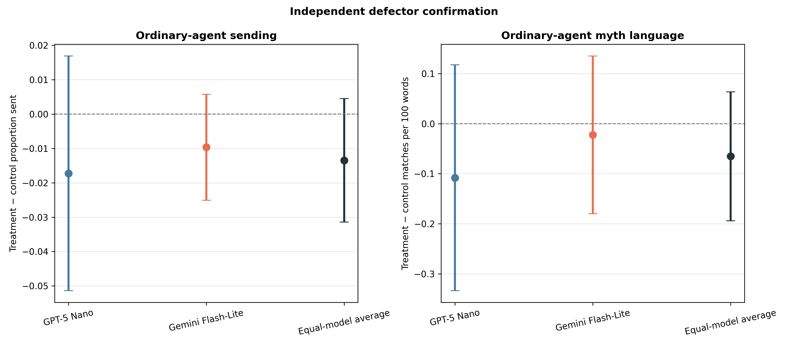
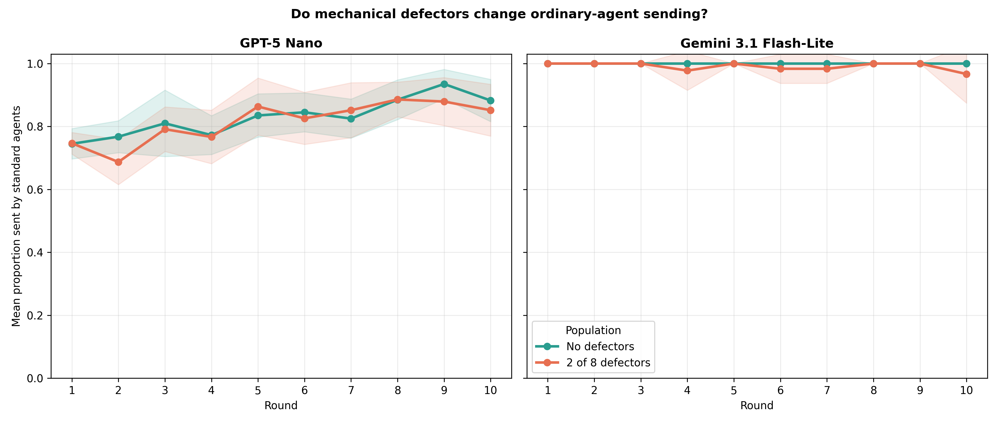
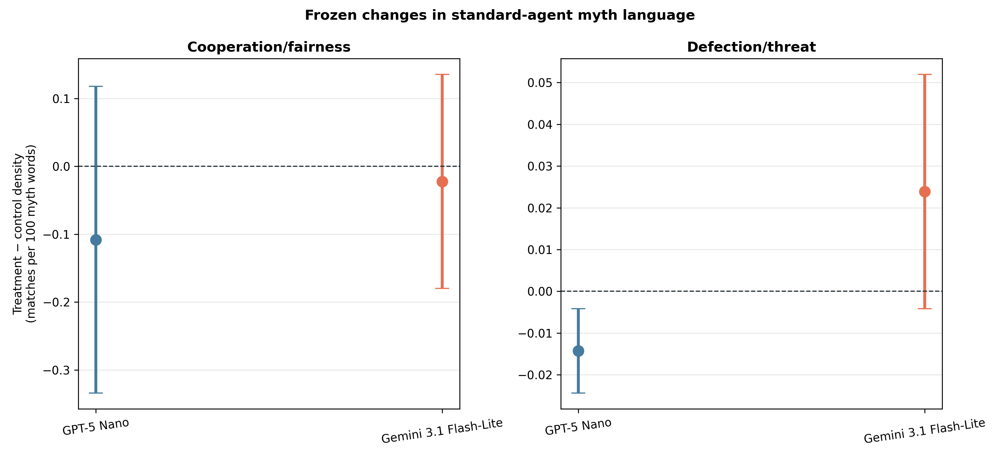
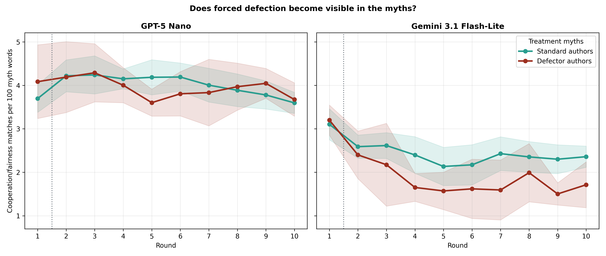

# Independent confirmation: Myth→Game with mechanical defectors

## What was tested

This was an independent, new-seed confirmation of the preceding cross-model
pilot. The protocol and two confirmatory outcomes were frozen before inspecting
replicate IDs 35–44; the earlier IDs 30–34 were excluded from all tests reported
here.

GPT-5 Nano and Gemini 3.1 Flash-Lite each ran ten matched populations with no
defectors and ten with two of eight (`25%`) mechanical defectors. Defectors
always sent and returned zero without an in-game LLM call, but wrote myths with
the same model and prompt as ordinary agents. Their type was hidden. All cells
used Myth→Game for ten rounds, balanced anonymous rotation, approximately three
rounds of private game-and-myth memory, informed signed `U(−1,+1)` transfer
noise, and matched pairing/noise seeds.

The frozen protocol is in
`docs/defector_myth_game_crossmodel_confirmation_protocol_2026-08-21.md`.

## Acceptance gate

All 40/40 populations passed jointly before outcome analysis:

- 400 complete population rounds, 1,600 dyads, and 3,200 myths;
- 6,400 accepted task responses: 6,000 LLM calls and exactly 400 forced game
  responses;
- 67 explicit, successful GPT boundary retries and no unrecovered failures;
- 3,200 exact transfer-noise checks with no violations;
- matched schedules, noise, and defector assignments across conditions and
  models; and
- no defector label or hidden agent identity leakage.

## Confirmatory results

The two broad population-spillover hypotheses were **not confirmed**.

| Frozen outcome | GPT treatment − control | Gemini treatment − control | Equal-model estimate | Holm-adjusted p | Verdict |
|---|---:|---:|---:|---:|---|
| Proportion sent by ordinary agents | −.0172 [−.0514, +.0169] | −.00967 [−.0251, +.00576] | −.01345 [−.03142, +.00451] | .258 | Not confirmed |
| Cooperation/fairness density in ordinary-authored myths | −.108 [−.334, +.118] | −.0223 [−.180, +.135] | −.0652 [−.194, +.0637] | .300 | Not confirmed |

Intervals are 95% paired intervals within model. The cross-model estimates give
the two models equal weight and use the frozen stratified Welch calculation.
Holm correction was applied across the two confirmatory tests.

The directions match the pilot, but both effects are small relative to their
uncertainty. The confirmation therefore does not support saying that two
hidden defectors cause a general collapse in ordinary-agent cooperation or a
broad loss of cooperation language in ordinary-authored myths under this
design.

The raw means make the behavioral result concrete:

| Model | No-defector ordinary sending | Two-defector ordinary sending |
|---|---:|---:|
| GPT-5 Nano | .8303 | .8130 |
| Gemini 3.1 Flash-Lite | 1.0000 | .9903 |

Gemini remains close to its full-send ceiling. Round-one differences were
negligible (`+.0017` GPT and exactly `0` Gemini), and no consistent separation
developed later. Ordinary agents also did not reliably send less to defectors
than to ordinary partners within treatment populations. Because partners are
anonymous when decisions are made, that comparison is not a targeted
punishment test.

Ordinary-agent final balances nevertheless fell by `$18.80` in GPT and `$21.73`
in Gemini. Those large losses are principally mechanical: zero-return receivers
keep sent resources and zero-send investors create no surplus. They must not be
described as evidence of a comparably large behavioral spillover.

## A narrower cultural effect independently replicated

The pilot's most distinctive secondary result replicated strongly in Gemini.
After the first forced game decision, Gemini defector-authored myths contained:

- `.571` fewer cooperation/fairness matches per 100 words than ordinary
  treatment myths (rounds 2–10, 95% CI `[−.778, −.364]`, unadjusted
  `p=.00015`); and
- `.0577` more defection/threat matches per 100 words (`[+.0293, +.0860]`,
  `p=.00128`).

There was no corresponding pre-treatment author difference in round 1:
cooperation density differed by `+.0958` and threat density by `−.0078`, with
both intervals spanning zero. The change therefore appears only after the
defectors' scripted zero action enters their individual game history. Across
all rounds, Gemini defector myths also invoked an explicit half/equal-split
rule `7.3` percentage points less often than ordinary treatment myths
(`[−11.7, −3.0]`, `p=.0042`).

GPT did not reproduce this author-specific effect. In rounds 2–10 its defector
authors differed from ordinary treatment authors by `−.0937` cooperation
matches (`[−.305, +.118]`) and `+.0355` threat matches
(`[−.0182, +.0892]`) per 100 words.

This supports a narrower, model-dependent claim: **for Gemini Flash-Lite,
mechanically constrained behavior becomes visible in the constrained agents'
own later cultural output.** It does not yet show that those myths causally
change other agents' behavior or language. Defector authors are reminded of
their own recent zero actions in the ordinary memory pathway, so the result is
best understood as behavior-to-culture imprinting rather than spontaneous
discovery of a hidden type.

The text outcomes use a transparent frozen word-stem lexicon rather than an LLM
judge. They measure lexical emphasis, not the full semantic stance of every
myth. The clean round-one comparison and independent post-treatment replication
make the Gemini pattern credible, while the cross-model disagreement limits
generalization.

## What this changes

The pilot's suggestion of a modest population-wide cascade should be retired:
the independent test did not confirm it. The more defensible finding is that
mechanical defectors impose large direct welfare losses, while hidden anonymous
populations remain behaviorally quite robust. Cultural adaptation is localized
and model-dependent: Gemini defectors narratively adapt to their forced
behavior, but that shift does not measurably propagate to ordinary authors or
ordinary-agent giving in this sample.

Simply adding more replicates to the same two-cell design is therefore not the
highest-value next step. The next causal experiment should manipulate whether
defector-authored myths enter circulation—for example, normal defector myths
versus suppressed or content-matched replacement myths—while keeping the
mechanical defection schedule fixed. That would test whether the cultural
signal itself affects ordinary agents, rather than only showing that defectors
write differently. A separate visible-identity design is needed to study
reputation or targeted punishment.

## Reproducibility

Run:

```bash
python3 scripts/analyze_defector_myth_game_crossmodel_confirmation_n10.py
```

Outputs are in
`docs/figures/defector_myth_game_crossmodel_confirmation_n10_20260821/`.








