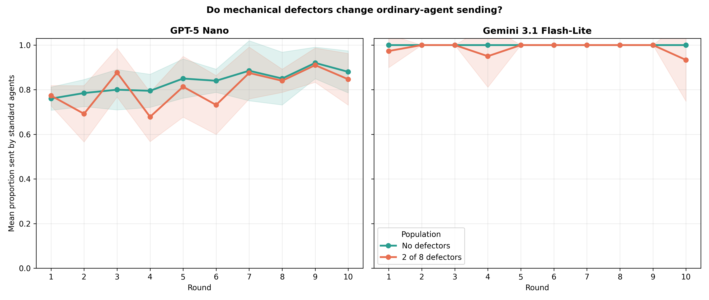
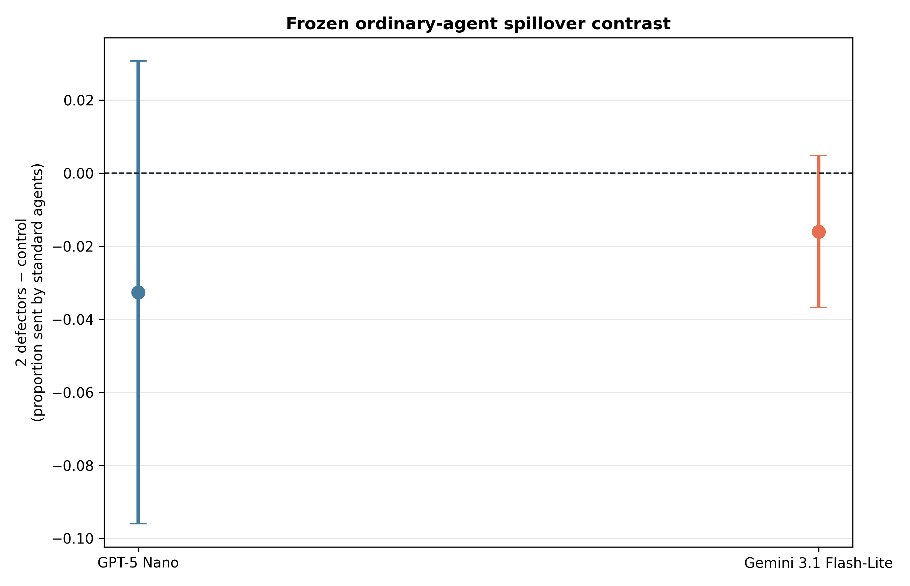
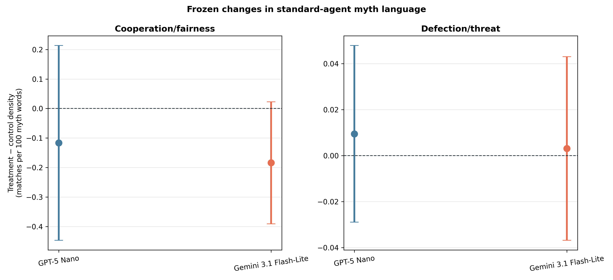
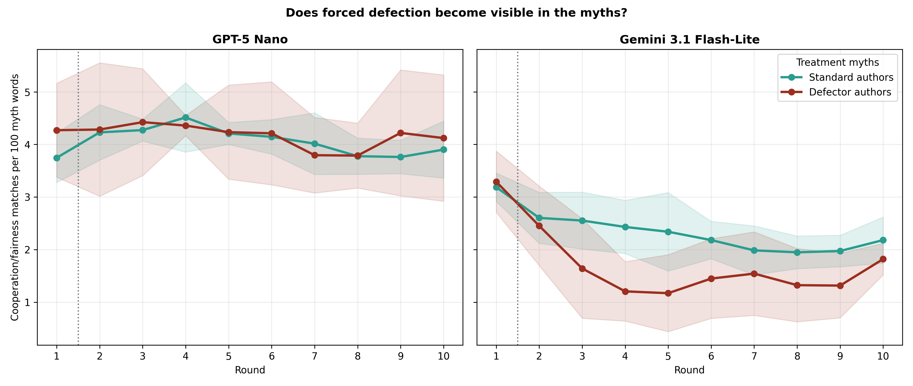

# Cross-model Myth→Game defector stress test

## Frozen question and design

This screen tested whether two mechanically noncooperative agents affect the
behavior and myths of ordinary agents in an eight-agent rotating population.
The design and text measures were frozen before outcomes in
`docs/defector_myth_game_crossmodel_protocol_2026-08-21.md`.

GPT-5 Nano and Gemini 3.1 Flash-Lite each ran five matched populations with no
defectors and five with two of eight defectors. The two defectors made no game-
decision LLM calls and always sent or returned zero, but wrote myths normally.
Their role was not disclosed in prompts; their scripted game exchanges remained
in private memory. All cells used Myth→Game, ten rounds, hidden names, balanced
rotating dyads, three-round private game-and-myth memory, informed signed
`U(−1,+1)` transfer noise, and matched pairing/noise seeds.

The no-defector cells are the causal controls for the defector treatment, not a
separate substantive baseline study.

## Acceptance gate

All 20/20 populations passed jointly before outcomes were inspected:

- 200 complete population rounds, 800 dyads, and 1,600 myths;
- 3,200 accepted task responses from 3,000 LLM calls and 200 forced game
  responses;
- exactly 20 forced responses in each treatment population and none in
  controls;
- 1,600 exact transfer-noise checks with no violations;
- matched schedules and treatment assignments across conditions and models;
- no hidden defector label or agent identity leakage; and
- 35 explicit, successful GPT myth-boundary retries and no unrecovered
  failures (Gemini required no retries).

## Ordinary-agent behavior

| Model | Condition | Standard-agent sent | Standard return ratio | Standard final balance | Population final balance |
|---|---|---:|---:|---:|---:|
| GPT-5 Nano | No defectors | .8365 [.811, .861] | .4008 [.349, .453] | 66.83 [65.59, 68.06] | 66.83 [65.59, 68.06] |
| GPT-5 Nano | 2 defectors | .8039 [.763, .845] | .3836 [.360, .407] | 48.79 [45.31, 52.27] | 55.15 [53.60, 56.69] |
| Gemini Flash-Lite | No defectors | 1.000 [1.000, 1.000] | .5308 [.515, .546] | 75.00 [75.00, 75.00] | 75.00 [75.00, 75.00] |
| Gemini Flash-Lite | 2 defectors | .9840 [.963, 1.005] | .5295 [.481, .578] | 54.70 [52.89, 56.51] | 61.90 [61.12, 62.68] |

### Frozen spillover contrast

Ordinary agents sent less when defectors were present in both models:

- GPT: `−.0326` of the endowment (95% paired CI `[−.0960, +.0307]`,
  `p=.226`, `dz=−.64`).
- Gemini: `−.0160` (`[−.0368, +.0048]`, `p=.099`, `dz=−.96`).

This is a consistent but unresolved direction at `n=5`: roughly 3.3 and 1.6
percentage points less sending by ordinary agents, respectively. Gemini left
its absolute ceiling in three of five treatment populations, so defectors do
create some behavioral headroom, but the model remained close to unconditional
maximum sending.

The effect did not exist before treatment experience in a clean way: round-one
differences were `+.013` for GPT and `−.027` for Gemini, both uncertain. The
trajectory differences appear after play begins, as a spillover account would
predict, but fluctuate considerably across rounds and populations.

Within treatment populations, ordinary agents did not send less to a defector
than to another ordinary agent (`+.022` GPT and `−.010` Gemini; both intervals
span zero). That is expected under hidden rotating identities: senders cannot
know that the current anonymous partner is a defector when choosing. Any
behavioral effect is population-level learning from bad experiences, not
targeted punishment.

Standard-agent and population balances fell sharply, but those contrasts are
mostly mechanical: defectors create no surplus on their sender turns and return
nothing on their receiver turns. They should not be presented as evidence of a
large behavioral collapse. The relevant behavioral spillover is the much
smaller change in ordinary-agent sending.

## Standard-agent myth language

The frozen transparent lexicons show a modest decrease in cooperation/fairness
language by ordinary agents in both models:

| Model | No-defector density | Defector-treatment density | Paired difference |
|---|---:|---:|---:|
| GPT-5 Nano | 4.173 | 4.057 | −.116 [−.446, +.213], p=.383 |
| Gemini Flash-Lite | 2.521 | 2.338 | −.184 [−.390, +.023], p=.069 |

Units are matched cooperation/fairness stems per 100 myth words. The direction
is consistent with cultural spillover, especially in Gemini, but neither
five-population interval excludes zero. Defection/threat density changed by
only `+.0094` GPT and `+.0031` Gemini, and the explicit half/equal-split rule
changed by less than 1.2 percentage points. The treatment is associated more
with a reduction in prosocial language than a broad rise in explicit threats
among ordinary authors.

## Do defectors write different myths?

Here the models diverge sharply.

GPT's defector-authored myths were not detectably different from ordinary
treatment myths: cooperation density was `+.114` higher overall
(`[−.170, +.397]`) and `+.068` in rounds 2–10 (`[−.207, +.343]`). Threat
density was slightly lower. GPT continued to write strongly prosocial myths
despite being mechanically forced to defect.

Gemini's treatment authors were similar before any forced action in round 1
(`+.104` cooperation-density difference, `[−.591, +.799]`). After the first
game, the mechanically constrained agents diverged:

- rounds 2–10 cooperation/fairness density: `−.697` versus ordinary treatment
  authors (`[−1.191, −.203]`, unadjusted `p=.017`);
- rounds 2–10 defection/threat density: `+.0979`
  (`[+.0039, +.1918]`, `p=.044`).

The timing is mechanistically coherent. The hidden role is absent from the
round-one myth prompt; subsequent myth prompts remind agents of their own prior
game behavior, including a forced zero. Gemini's culture reflects that
experienced behavioral constraint, whereas GPT's prosocial narrative remains
largely invariant. This cross-model difference is exploratory but more
scientifically distinctive than a simple welfare loss.

## Interpretation and next test

Two mechanical defectors do not trigger a large cooperation cascade under
anonymous rotation and Myth→Game. They produce a modest negative sending
spillover in both cheap models and a potentially meaningful reduction in
ordinary-agent prosocial myth language, but `n=5` leaves both effects
unresolved.

The strongest pilot signal is model heterogeneity in how forced behavior enters
culture. An independent new-seed extension should retain exactly this design
and test two predeclared claims: a negative defector effect on ordinary-agent
sending, and a post-round-one decline in cooperation-oriented myth language.
It should analyze the new extension separately from this pilot to avoid
optional-stopping claims.

## Reproducibility

Run:

```bash
python3 scripts/analyze_defector_myth_game_crossmodel_n5.py
```

Outputs are in
`docs/figures/defector_myth_game_crossmodel_n5_20260821/`.








