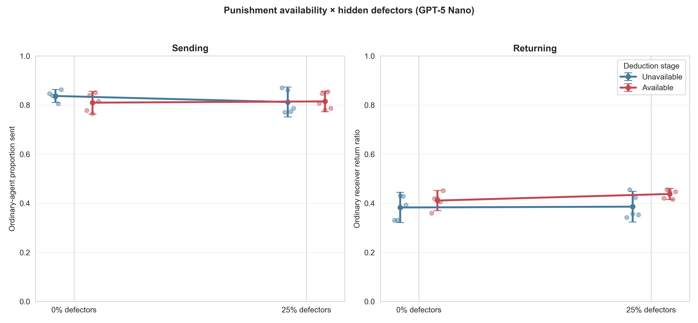
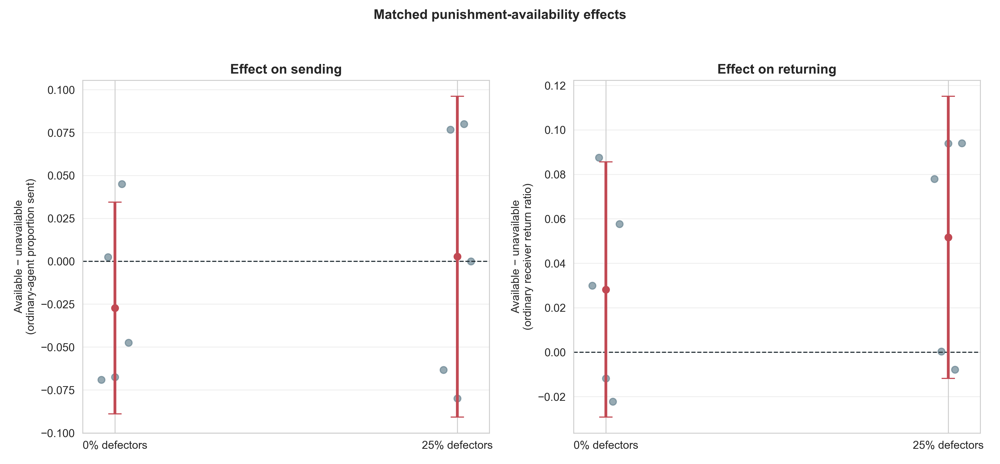
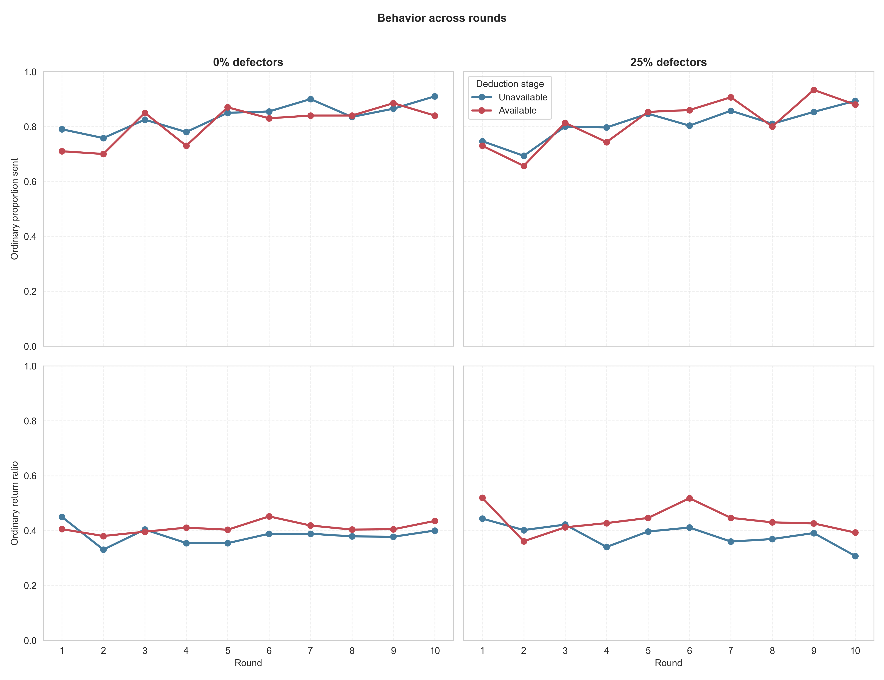
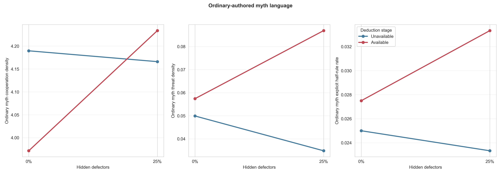

# Punishment availability × hidden defectors: GPT-5 Nano

## Result in one sentence

Making a costly deduction stage available did **not reliably increase
ordinary-agent sending**, did not produce a reliable defector-specific
interaction, and produced only a fragile suggestion of higher returning.
Together with the preceding finding that deductions were used almost
indiscriminately, the current mechanism should not be scaled as evidence of
selective norm enforcement.

## Design and provenance

This exploratory 2×2 comparison crossed:

- deduction stage unavailable versus available; and
- 0% versus 25% hidden mechanical defectors in an eight-agent population.

All cells used GPT-5 Nano, ten rotating Myth→Game rounds, anonymous balanced
pairings, signed informed `U(−1,+1)` noise applied after each transfer
decision, normal myth authorship by all agents, and a three-complete-round
memory-content horizon. In the available condition, senders could spend zero,
one, or two deduction points after seeing the communicated return; each spent
point cost one payoff unit and removed up to three from the receiver.

The previously accepted five-pair deduction-stage screen supplied the two
available cells. The two unavailable cells were frozen in
`docs/defector_punishment_factorial_gpt_n5_protocol_2026-08-21.md` before they
were run, but the available-cell outcomes had already been inspected. The
factorial is therefore exploratory, not confirmatory.

The first unavailable-stage batch exposed a launcher-level provenance gap:
the resumable runner had not copied the main runner's Git commit/config hash
into saved JSON. Its behavior-level audit passed, and the worktree was checked
clean before launch, but it was excluded before outcomes were opened. The
launcher was fixed and unit-tested in commit `649dbc34`; all ten unavailable
populations were then rerun. Every replacement file records that commit, a
single exact configuration hash, and `code_dirty=false`.

The joint audit of the 20 accepted populations passed:

- 200 complete population-rounds and 800 complete dyads;
- 4,000 accepted interaction records: 3,350 LLM responses, exactly 250 forced
  defector decisions, and 400 scripted deduction notices;
- 56 malformed responses explicitly recorded and recovered by retry, with no
  unrecovered provider or response-boundary errors;
- 1,600 exact signed-noise checks;
- matched schedules in all four cells and matched defector assignments in the
  two 25% cells; and
- no defector label, forced policy, hidden true transfer, or other privileged
  state leaked to ordinary agents.

## Behavioral results

Population means were:

| Deduction stage | Defectors | Ordinary proportion sent | Ordinary return ratio |
|---|---:|---:|---:|
| Unavailable | 0% | .8368 | .3827 |
| Available | 0% | .8095 | .4109 |
| Unavailable | 25% | .8120 | .3860 |
| Available | 25% | .8147 | .4377 |

The frozen paired contrasts were:

| Outcome | Contrast | Estimate | 95% paired CI | p |
|---|---|---:|---:|---:|
| Sent | Available − unavailable, 0% defectors | −.0273 | [−.0890, +.0344] | .287 |
| Sent | Available − unavailable, 25% defectors | +.0027 | [−.0908, +.0961] | .941 |
| Sent | Availability × defector interaction | +.0300 | [−.0125, +.0724] | .122 |
| Return | Available − unavailable, 0% defectors | +.0282 | [−.0292, +.0855] | .244 |
| Return | Available − unavailable, 25% defectors | +.0516 | [−.0118, +.1151] | .0866 |
| Return | Availability × defector interaction | +.0234 | [−.0641, +.1110] | .498 |

There is no evidence here that access to deductions raises sending. Returns
are directionally higher in both availability comparisons, especially with
defectors, but every interval includes zero. The interaction is small and
highly uncertain, so the data do not support a claim that punishment works
differently specifically because defectors are present.

The round trajectories tell the same story: sending rises over time in every
cell, while returning is somewhat higher in the available-stage runs but does
not cleanly separate throughout the experiment.







## Myth language

No secondary myth-language interaction was reliable:

| Ordinary-authored myth outcome | Availability × defector interaction | 95% CI | p |
|---|---:|---:|---:|
| Cooperation/fairness density | +.286 | [−.609, +1.180] | .425 |
| Threat/defection density | +.0446 | [−.0620, +.151] | .310 |
| Explicit half-return rule | +.0075 | [−.0529, +.0679] | .748 |

The available-stage myths naturally referred to the deduction institution,
but the earlier screen showed that this was mainly literal mechanism echo,
not a reliably stronger punitive norm.



## Post-hoc sensitivity

After the accepted analysis was complete, the excluded first unavailable
batch was opened as a strictly labeled sensitivity check. It gave the same
qualitative conclusion and weaker return effects:

| Outcome | Available − excluded unavailable, 0% | Available − excluded unavailable, 25% | Interaction |
|---|---:|---:|---:|
| Sent | −.0193 | −.0233 | −.0041 |
| Return | +.0121 | +.0149 | +.0028 |

All six sensitivity intervals included zero. This batch cannot replace the
provenance-bearing data, but it suggests that the accepted +.052 return point
estimate is sampling-sensitive rather than a stable defector-specific effect.

## Interpretation and next decision

The code and accounting now work as intended. The scientific limitation is
the model's use of the institution: ordinary senders spent deductions in 90.9%
of opportunities, including 68/76 cases in which the visible return was at
least half. They did not spend more toward defectors than ordinary receivers.

The combined evidence therefore supports **routine, indiscriminate use of a
salient action**, not selective punishment of free riders. The possibility of
a weak general increase in returning is worth noting, but it is not stable
enough to justify a larger population rerun of the same prompt.

Before another full simulation, the next efficient step is a small mechanism-
comprehension calibration: present the same model with controlled high- and
low-return decision states and test whether deduction responds monotonically
to the observed return under the current neutral wording. If it does not, vary
only the clarity that spending is optional and costly, freeze the variants,
and select a formulation based on calibration rather than on desired
cooperation outcomes. A new-seed 2×2 population confirmation is warranted only
after the sanction behaves as a selective response in that calibration.

## Reproducibility

Run:

```bash
python3 scripts/analyze_defector_punishment_factorial_gpt_n5.py
```

Tables and figures are in
`docs/figures/defector_punishment_factorial_gpt_n5_20260821/`.
