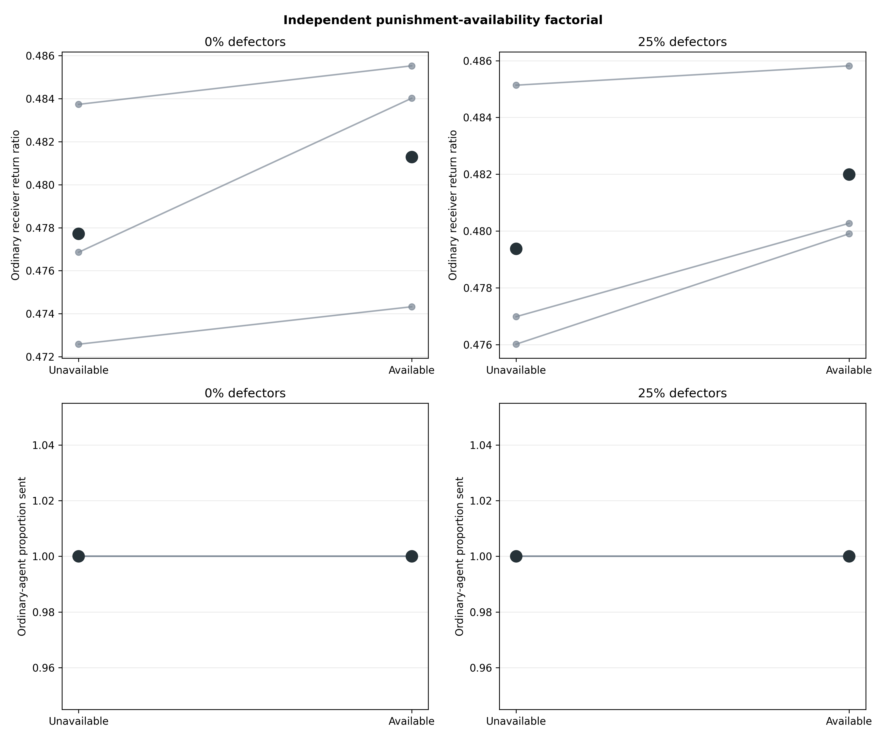
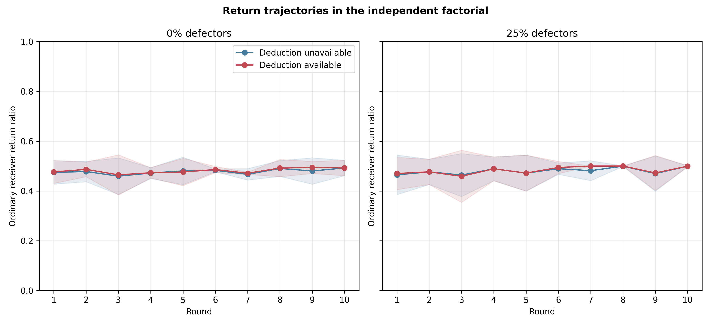
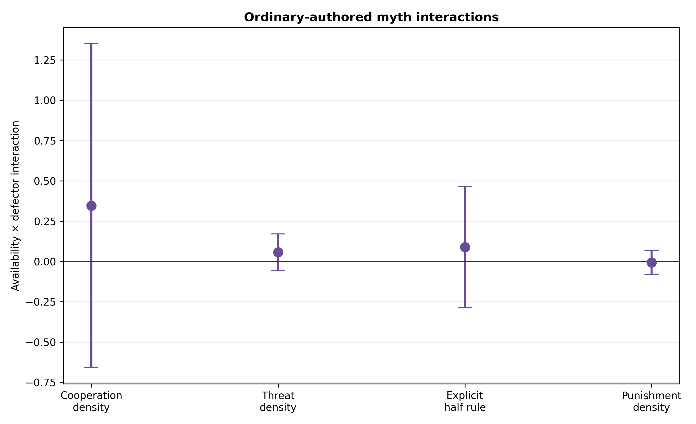

# Gemini 3.7 punishes defectors selectively but does not reproduce return crowding

## Result in one sentence

In a frozen 12-population screen, Gemini 3.7 Flash spent the maximum deduction
on every mechanical defector and nothing on every ordinary receiver, yet
deduction availability did not reduce returning and all ordinary senders still
gave the full endowment.

## Design and integrity

Three matched population quadruplets crossed deduction availability with 0%
versus 25% hidden mechanical defectors. Every population used eight agents,
ten Myth→Game rounds, balanced anonymous rotation, three complete rounds of
private game-and-myth memory, and informed signed `U(-1,+1)` communication
noise applied after the true decisions. Mechanical defectors wrote myths
normally but always sent, returned, and deducted zero without an in-game model
call.

The model was Gemini 3.7 Flash through the direct Google API at its default
medium thinking level. The frozen protocol and escalation thresholds were
committed before any population outcome was generated.

All 12 populations passed the joint audit:

- 120 complete population-rounds, 480 dyads, and 960 myths;
- exactly 2,400 accepted interactions: 2,010 Gemini calls, 150 forced defector
  actions, and 240 scripted deduction notices;
- 960 exact post-decision signed-noise checks;
- zero retries or unrecovered failures; and
- correct model, thinking, prompt, memory, action-policy, schedule, seed,
  defector-assignment, and clean provenance records.

## Behavior

Population-level means were:

| Deduction stage | Defectors | Ordinary proportion sent | Ordinary receiver return ratio |
|---|---:|---:|---:|
| Unavailable | 0% | 1.000 | .4777 |
| Available | 0% | 1.000 | .4813 |
| Unavailable | 25% | 1.000 | .4794 |
| Available | 25% | 1.000 | .4820 |

Every ordinary sender gave the full `$5` in every cell. Mechanical defection
therefore did not create behavioral headroom in sending.



The available-minus-unavailable return effect in defector populations was
`+.00262` (95% paired CI `[-.00162, +.00685]`), with all three matched
differences positive. The availability-by-defector interaction was `-.00094`
(`[-.00843, +.00654]`). Neither approached the frozen `-.025` crowding
threshold. The return trajectories overlap throughout the ten rounds.



This is a small screen rather than an equivalence test, but it strongly rejects
scaling the same design in search of the sizeable negative return effect seen
in Gemini 3.1 Flash-Lite. The point estimate is tiny and in the opposite
direction in all three defector pairs.

## Selective punishment survives the live population

The controlled calibration generalized perfectly. In the available 25%-
defector populations, ordinary senders spent both points in all `25/25`
opportunities against mechanical defectors. They spent nothing in all `65/65`
opportunities against ordinary receivers. Control populations likewise had
zero deductions in `120/120` opportunities. No deduction followed any of the
112 visible returns at or above one half.

The defector-minus-ordinary contrasts were therefore exactly `+2.0` deduction
points and `+1.0` probability in each of the three populations. This is clear
evidence that Gemini 3.7 understood and used the institution as selective
sanctioning rather than as a generally salient extra action.

## Why the Flash-Lite behavioral effect did not generalize

Gemini 3.7 adopted an unusually rigid fair-return rule. Among 370 ordinary-
receiver decisions with a positive receipt, `280` (75.7%) returned exactly
half of the noisy amount shown in the prompt and `327` (88.4%) were within half
a cent of it. Only one choice was meaningfully below half; the remaining 42
deviations were above half.

This leaves little above-half generosity for punishment availability to crowd
out. In Flash-Lite, the institution shifted choices from more-than-half toward
exactly half. In Gemini 3.7, approximately half of the visible receipt was
already the dominant policy in every cell. The cross-model difference is thus
behaviorally interpretable rather than an implementation failure: the same
mechanism generated perfectly selective targeting but met a stronger baseline
fairness attractor.

## Myths

The cultural response was descriptive because `n=3`. In defector populations,
making deductions available raised ordinary-authored cooperation density from
`2.04` to `2.61` matches per 100 words and threat density from `.130` to `.210`;
explicit half-rule prevalence rose from `.628` to `.800`. Punishment terms were
absent when the institution was unavailable and appeared at `.0266` matches
per 100 words when it was available. Cooperation and threat both increasing is
consistent with myths framing sanctions as protection of a cooperative norm,
not simply becoming more hostile.

None of the availability-by-defector myth interactions was resolved in this
small screen.



The earlier Flash-Lite finding that defector-authored myths became less
cooperative and more threatening did not cleanly generalize. Across rounds
2–10, Gemini 3.7 defector authors used fewer explicit half rules than ordinary
authors when punishment was unavailable in all three populations, but the
cooperation and threat differences were mixed and their intervals were wide.

## Frozen decision

The live targeting gate passed, but both return-crowding gates failed. The
precommitted action is therefore **do not scale this population design**. The
scientific conclusion is model-specific: selective punishment generalizes
across Gemini Flash versions, while its downstream effect on generosity does
not.

A higher-value follow-up would change the strategic problem enough to create
behavioral headroom—for example, a harder multiplier/payoff structure—rather
than purchase more replicates of a condition in which every sender chooses the
ceiling and receivers overwhelmingly return half.

## Cost and reproducibility

The 12 populations used 4,825,762 input tokens, 243,346 visible output tokens,
and 302,145 thinking tokens. Estimated list-price cost was `$5.66`.

Run:

```bash
python3 scripts/analyze_defector_punishment_gemini37_n3.py
```

Audit records, decisions, contrasts, myth analyses, token accounting, and
figures are in
`docs/figures/defector_punishment_gemini37_n3_20260823/`.
