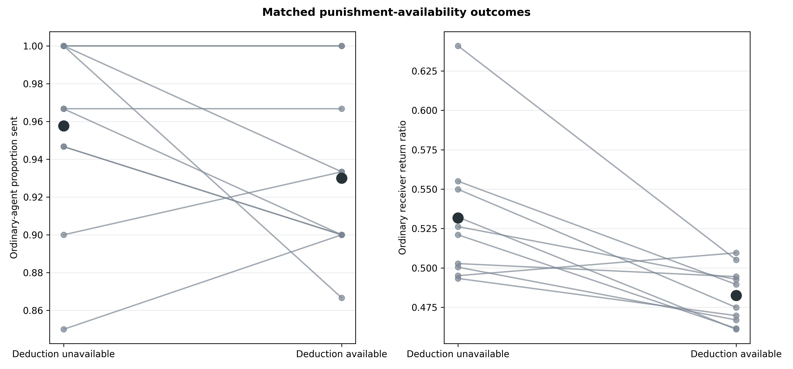
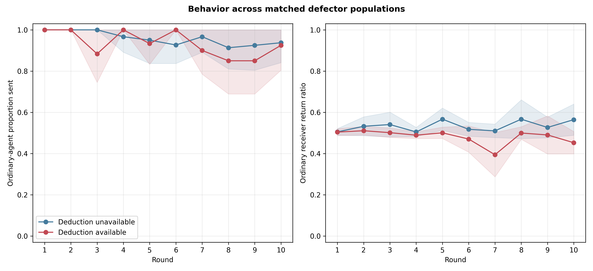
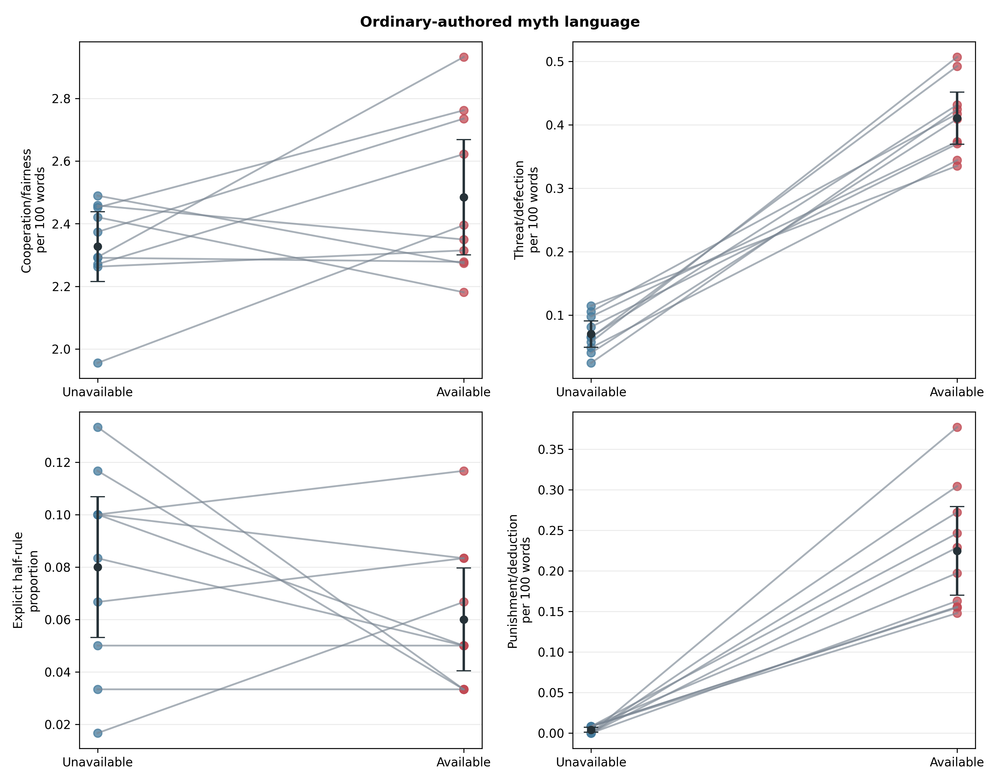

# Punishment availability lowers Gemini returns: matched exploratory screen

## Why this follow-up was run

After Gemini's selective punishment mechanism independently confirmed, its ten
25%-defector populations showed somewhat lower sending than earlier
no-punishment Gemini populations. That comparison used different seeds and was
not causal. The cheapest informative follow-up was therefore to run only the
punishment-unavailable cells for the same replicates 70–79 and pair them with
the completed punishment-available populations.

This analysis was frozen before the new off-stage calls, but it remains
exploratory: the on-stage outcomes had already been observed when the follow-up
was selected.

## Design and integrity

Both arms used Gemini 3.1 Flash-Lite, eight agents, ten Myth→Game rounds, 25%
hidden mechanical defectors, balanced anonymous rotation, normal myth writing,
three prior complete rounds of individual memory, and informed `U(−1,+1)`
noise applied after true sends and returns. Replicate pairs shared the exact
role/partner schedule, defector assignment, pairing seed, and noise seed.

The treatment was the presence of the two-point sender deduction stage and its
associated prompt, post-game decision/notice, and payoff consequences. The off
arm had no deduction rules or post-game exchange. Memory capacities were six
off and nine on, preserving the same three-round content horizon in each arm.

All 20 populations passed the joint audit:

- 200 population-rounds and 800 dyads;
- 4,000 accepted interaction records and 3,100 Gemini calls;
- exactly 500 forced defector actions and 400 deduction notices;
- 1,600 exact post-decision signed-noise checks;
- zero retries or response-boundary failures;
- matched schedules, assignments, and exogenous seeds; and
- correct memory, actions, balances, prompts, clean provenance, and no hidden-
  state or identity leakage.

## Sending was lower but unresolved

| Ordinary-agent outcome | Unavailable | Available | Available − unavailable | 95% CI | Holm p |
|---|---:|---:|---:|---:|---:|
| Proportion sent | .9577 | .9300 | −.0277 | [−.0668, +.0115] | .145 |
| Receiver return ratio | .5317 | .4826 | −.0491 | [−.0792, −.0191] | .00988 |

Sending differences were negative in five pairs, positive in two, and zero in
three. The estimate is compatible with a moderate reduction but does not clear
the frozen statistical or consistency rule.



## Returning fell consistently

Return ratios were lower with punishment available in nine of ten matched
populations. The round-one means were essentially identical (.5057 on versus
.5064 off; difference −.00076), before histories diverged. Each of the nine
later round-level differences was negative, reaching −.110 in round ten.

The raw return choices suggest a post-hoc mechanism. Ordinary receivers in the
available arm chose exactly `$7.50` 65 times versus 38 off; the unavailable arm
more often chose `$8` (47 versus 30) or `$10` (22 versus five). Five available-
arm receivers returned zero, versus none off. Because the usual received amount
was `$15`, punishment appears to move the model toward exact half—the minimally
salient fair return—while crowding out above-half generosity. This was not a
pre-specified mediator and needs independent testing.

The result is not a denominator artifact. The outcome is actual returned divided
by actual received, computed only for ordinary receivers with positive receipts;
paired schedules and observational noise seeds were identical.



## Myth language became institution-focused and more adversarial

| Ordinary-authored myth outcome | Unavailable | Available | Difference | 95% CI |
|---|---:|---:|---:|---:|
| Cooperation/fairness density | 2.327 | 2.484 | +.158 | [−.059, +.374] |
| Threat/defection density | .070 | .411 | +.341 | [+.288, +.393] |
| Explicit half/equal-return rule | .080 | .060 | −.020 | [−.054, +.014] |
| Punishment/deduction density | .004 | .225 | +.221 | [+.164, +.277] |
| Punishment/deduction presence | .008 | .387 | +.378 | [+.296, +.460] |

The punishment-language increase partly reflects literal description of the
announced institution. The threat/defection lexicon overlaps with punishment
terms, but its rise was broader: across nearly equal word totals, *betrayal*
matches rose from 18 off to 119 on, *threat* from four to 72, *withhold* stems
from 15 to 29, and explicit *punish* stems from zero to 70. All ten population
pairs had higher threat and punishment densities in the available arm.

These are descriptive treatment effects in defector populations. Without new
no-defector cells, they cannot show whether defectors interact with the
institution or whether merely announcing punishment creates an adversarial
cultural frame.



## Interpretation and next decision

The costly deduction stage works as a selective sanction, but this exploratory
screen provides no evidence that it improves cooperation. Instead, it lowered
return generosity by about five percentage points and strongly altered the
cultural vocabulary. A plausible interpretation is motivational crowding or
anchoring: once a formal sanction exists, returning exactly half becomes a
sufficient compliance target rather than a floor for generosity. The delayed
trajectory and return-choice distribution fit that account, but do not prove it.

The frozen escalation rule passed because the Holm-adjusted return result was
below .05. The next experiment is a fully independent, new-seed 2×2:

- deduction available versus unavailable; and
- 0% versus 25% hidden mechanical defectors.

Its confirmatory outcomes should be the availability main effect and the
availability×defector interaction on ordinary receiver return ratio. Sending
and myth measures should be secondary. This distinguishes a general
institutional crowding effect from one that depends on exposure to defectors.

## Reproducibility

Run:

```bash
python3 scripts/analyze_defector_punishment_gemini_availability_matched_n10.py
```

Tables, audit records, escalation decision, term counts, and figures are in
`docs/figures/defector_punishment_gemini_availability_matched_n10_20260822/`.
