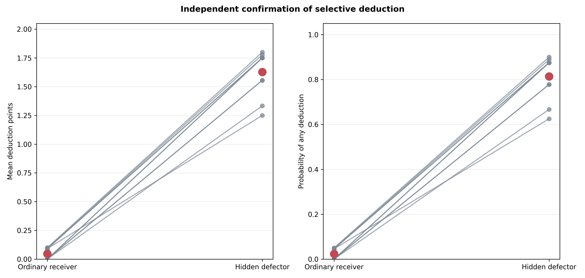
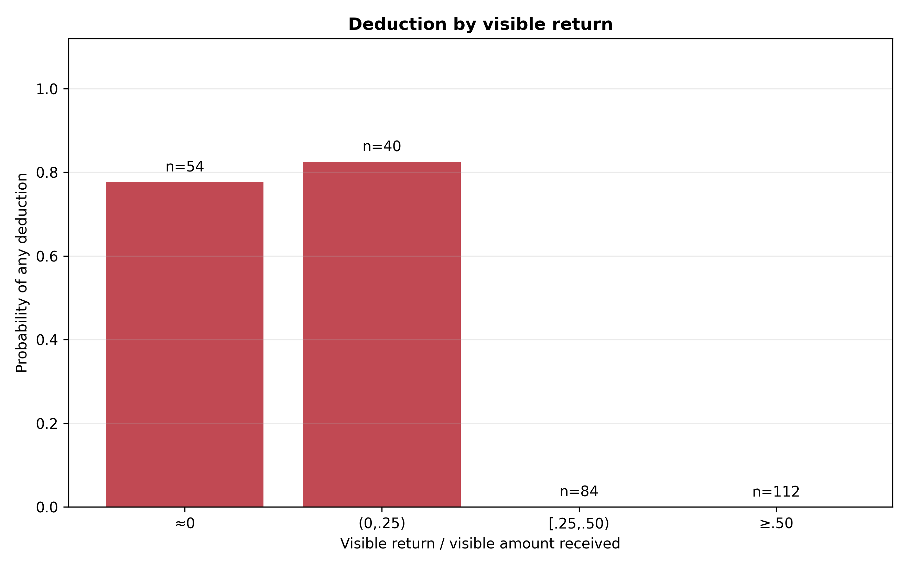
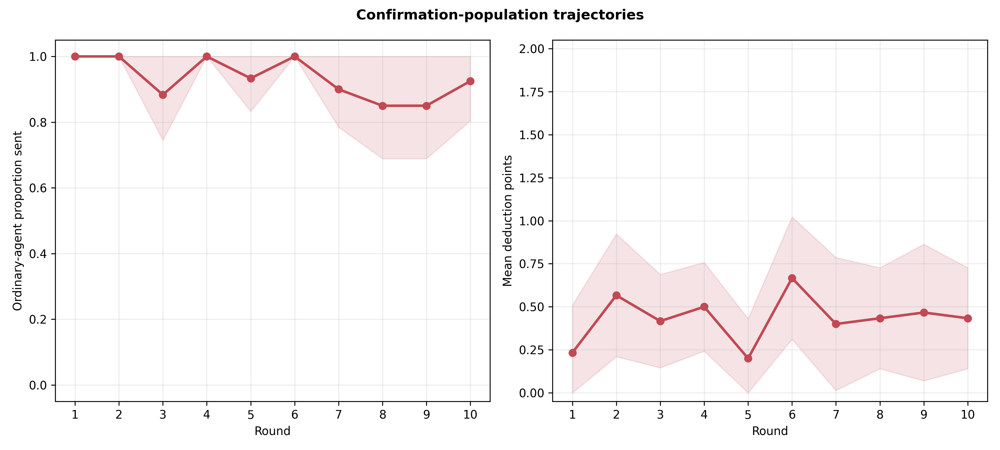
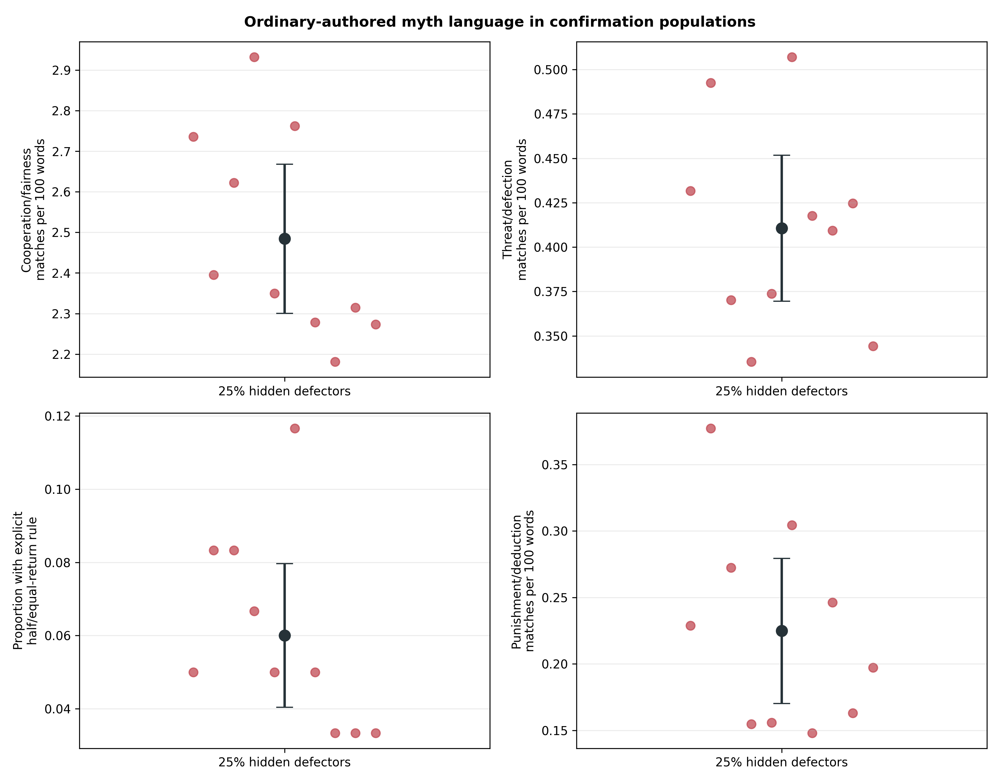

# Gemini selectively punishes defection: independent population confirmation

## Result in one sentence

The independent ten-population confirmation succeeded: under the unchanged
neutral deduction wording, Gemini 3.1 Flash-Lite ordinary agents almost always
sanctioned visibly non-returning partners and almost never sanctioned partners
who returned, reproducing the earlier three-population pilot with new seeds.

## Frozen design and integrity

The confirmation used ten new eight-agent, ten-round Myth→Game populations,
each containing two hidden mechanical defectors. All agents wrote myths
normally. Mechanical defectors always sent, returned, and deducted zero without
game-decision LLM calls. Ordinary senders could spend up to two optional
deduction points after the return; each point cost one payoff unit and removed
up to three from the receiver. Agents saw only noisy communicated transfers,
with informed `U(−1,+1)` noise applied after the true send and return.

The run, analysis, and thresholds were frozen before calls. All 10/10
populations passed the joint audit:

- 100 complete population-rounds and 400 dyads;
- 2,400 accepted interaction records: 1,700 Gemini responses, exactly 300
  forced defector decisions, and 400 scripted deduction notices;
- 800 exact post-decision signed-noise checks;
- zero retries or response-boundary errors;
- exact deduction costs, 1:3 target losses, payoff floors, and balances;
- every mechanical defector game and deduction action zero, but every defector
  myth call normal; and
- correct memory, model, prompt, hidden-role boundary, and clean embedded
  commit/config provenance, with no identity or privileged-state leakage.

## Transparent structural amendment

Before reading any deduction outcome, the prewritten analyzer stopped because
the protocol had assumed every population would have exactly eight defector-
receiver and 22 ordinary-receiver opportunities. The balanced scheduler fixes
30 ordinary-sender opportunities per population, but the receiver-role split
varies slightly with the frozen defector assignments.

An amendment committed before outcome analysis recorded the schedule-derived
counts: 86 defector-target and 214 ordinary-target opportunities. It changed
only that structural assertion. No data were removed or reweighted, and the
co-primary tests, Holm correction, effect thresholds, restraint threshold,
and outcome-order lock remained unchanged.

## Selective punishment confirmed

Both co-primary within-population contrasts independently replicated:

| Defector receiver − ordinary receiver | Estimate | 95% CI | Holm p | Frozen minimum |
|---|---:|---:|---:|---:|
| Mean deduction points | +1.580 | [+1.443, +1.718] | 1.82×10⁻⁹ | +.50 |
| Probability of any deduction | +.790 | [+.721, +.859] | 1.82×10⁻⁹ | +.25 |

The pooled descriptive rates show the size of the separation:

| Receiver type | Opportunities | Any deduction | Mean points spent |
|---|---:|---:|---:|
| Ordinary | 214 | 5/214 (2.34%) | .0467 |
| Hidden mechanical defector | 86 | 70/86 (81.4%) | 1.628 |

Every one of the ten population-specific target contrasts was positive. The
defector-target any-deduction rate ranged from 62.5% to 90%; ordinary-target
rates ranged from 0% to 5%.



## The mechanism tracks visible behavior, not hidden identity

The defector role and true transfer were never shown. Gemini therefore could
not identify a designated type; it could only respond to the communicated
return. That response was sharply restrained:

- zero deductions in all 112 opportunities with a visible return ratio of at
  least .5;
- zero deductions in all 84 opportunities with a visible ratio from .25 up
  to .5;
- deductions in 42/54 opportunities with a visible ratio approximately zero;
  and
- deductions in 33/40 opportunities with a positive ratio below .25.

The five punished ordinary receivers had each visibly returned exactly zero.
Thus, the result is best described as selective sanctioning of observed
defection. Hidden mechanical defectors create many controlled instances of
that behavior; the model is not detecting their unobserved experimental role.



## Secondary behavior remains descriptive

Across the ten defector populations, ordinary agents sent a mean .930 of their
endowment (95% CI [.897, .963]) and ordinary receivers returned .483 of what
they received ([.470, .495]). Both remain cooperative, although sending has
more headroom than in the three-population pilot.

These treatment-only results cannot show whether making punishment available
caused cooperation or whether defectors reduced it. The confirmation was
deliberately efficient for the within-population targeting mechanism; it had no
new no-defector or punishment-unavailable counterfactual.



## Myth language

The 600 ordinary-authored myths were strongly cooperation-oriented. At the
population level they averaged 2.484 cooperation/fairness matches per 100
words (CI [2.301, 2.668]), .411 threat/defection matches ([.370, .452]), and
.225 punishment/deduction matches ([.170, .279]). The strict explicit
half/equal-return detector matched 6.0% of myths ([4.0%, 8.0%]); punishment
vocabulary appeared in 38.7% of individual myths.

These are descriptive levels, not treatment effects. Because all confirmation
populations contained defectors and the deduction institution, the data do not
separate language caused by defectors from language caused by merely announcing
the institution.



## Interpretation and next experiment

The scientific result is now considerably stronger than the pilot: the same
model policy survived full cultural histories, anonymity, rotating partners,
signed observational noise, and ten independent population seeds. It is also
model-specific. GPT-5 Nano used the identical current wording almost
indiscriminately, whereas Gemini used it as a low-return-contingent sanction.

What remains unknown is whether this selective sanction *causes* cooperation
or changes cultural content. The clean next step is a frozen Gemini 2×2 with
new seeds:

- deduction stage available versus unavailable; and
- 0% versus 25% hidden defectors.

That factorial should use enough behavioral headroom to avoid a ceiling. Its
primary outcomes should be ordinary-agent sending and returning; targeting is
now a validated manipulation check. Myth cooperation, threat, explicit-return,
and punishment language can be pre-specified secondary cultural outcomes.

## Reproducibility

Run:

```bash
python3 scripts/analyze_defector_punishment_gemini_confirmation_n10.py
```

Tables, audit records, gate decisions, and figures are in
`docs/figures/defector_punishment_gemini_confirmation_n10_20260821/`.
