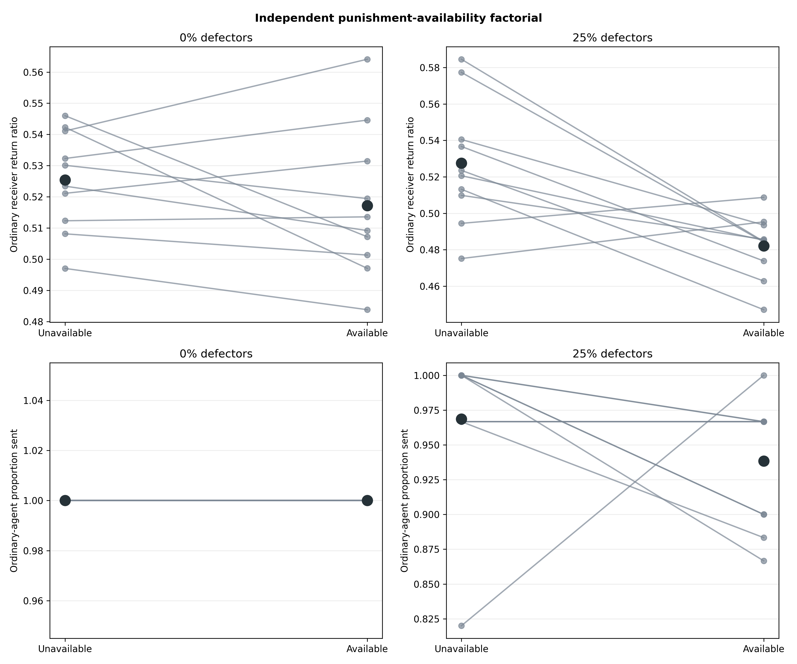
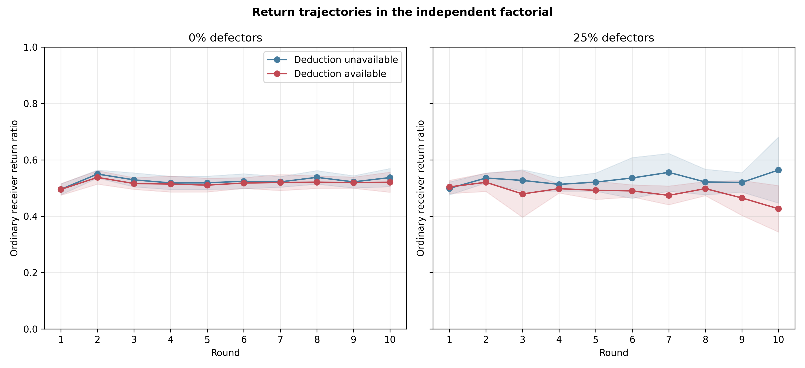
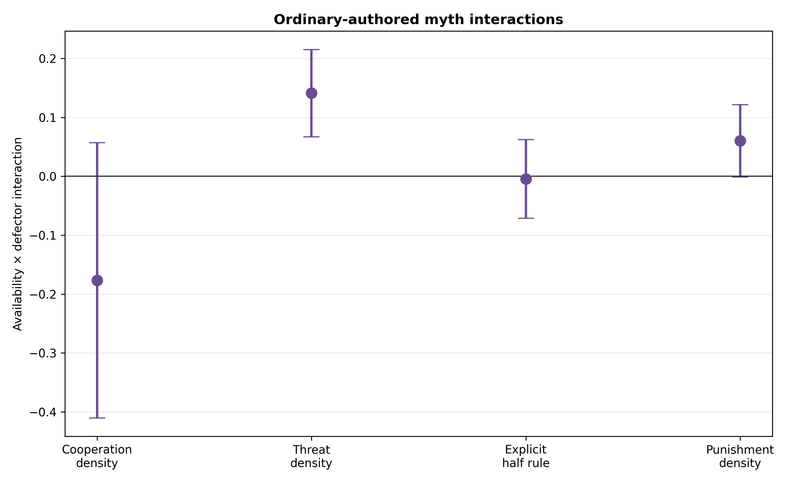

# Punishment reduces generosity specifically after defector exposure

## Result in one sentence

In a fully independent Gemini 3.1 Flash-Lite factorial, costly deductions were
highly selective but did not increase cooperation: making them available
lowered ordinary receivers' return ratios specifically in populations exposed
to hidden defectors, independently confirming the preceding exploratory screen.

## Frozen design and integrity

The experiment crossed deduction availability with zero versus two hidden
mechanical defectors in an eight-agent population. Ten matched new-seed
quadruplets (replicates 80–89) produced 40 populations. All cells used ten
Myth→Game rounds, anonymous balanced rotation, three complete rounds of private
game-and-myth memory, and informed signed `U(-1,+1)` noise applied after the
true send and return decisions.

The protocol and two primary tests were frozen before any of these outcomes
were inspected. All 40 populations passed the joint audit:

- 400 population-rounds, 1,600 dyads, and 3,200 myths;
- 8,000 accepted interactions from 6,700 Gemini calls, exactly 500 forced
  defector actions, and 800 scripted deduction notices;
- 3,200 exact post-decision noise checks;
- no retries, boundary failures, hidden-state leakage, or accounting errors;
- matched schedules, seeds, and defector assignments within quadruplets; and
- clean embedded code/config provenance.

## Both primary claims confirmed

| Frozen contrast on ordinary receiver return ratio | Estimate | 95% paired CI | Holm p | Decision |
|---|---:|---:|---:|---|
| Available - unavailable, 25% defectors | -.0455 | [-.0743, -.0166] | .0121 | Confirmed |
| Availability x defector interaction | -.0373 | [-.0718, -.0027] | .0373 | Confirmed |

The direct effect was negative in eight of ten defector-population pairs
(`dz=-1.13`). The availability effect without defectors was only `-.0082`
(`[-.0237,+.0073]`, `p=.261`). Defectors therefore strengthened the negative
institutional effect by 3.73 percentage points rather than merely coinciding
with a general punishment effect.

Population-level means were:

| Deduction stage | Defectors | Ordinary proportion sent | Ordinary return ratio |
|---|---:|---:|---:|
| Unavailable | 0% | 1.000 | .5254 |
| Available | 0% | 1.000 | .5172 |
| Unavailable | 25% | .9687 | .5276 |
| Available | 25% | .9383 | .4821 |

Sending did not yield a resolved availability effect in defector populations
(`-.0303`, `[-.0935,+.0328]`, `p=.305`). Control sending was exactly at ceiling
in both availability arms. The evidence therefore supports a return-generosity
effect, not a general cooperative benefit or collapse.



## Selective punishment remained a strong manipulation check

In available, 25%-defector populations, ordinary senders punished hidden
defectors in 72/84 opportunities (85.7%; mean 1.714 of two points) but ordinary
receivers in only 6/216 (2.8%; mean .051). All six ordinary-receiver deductions
followed a visibly zero return. No deduction occurred in any of 116
opportunities with a visible return ratio of at least one half.

The defector role and true transfers were hidden. The model was therefore
responding selectively to communicated behavior rather than privileged type
information.

## The effect developed through experience

Round one showed no negative defector-cell effect (`+.0053`). The available
arm became less generous in later rounds, with a `-.1373` gap in round ten.
This temporal pattern weighs against a purely immediate wording effect and
points toward accumulated game history, changing myth content, or both.

The raw choices also shifted toward minimal fairness. In defector populations,
the available arm produced 72 exact `$7.50` returns versus 46 when unavailable,
but only 30 versus 53 `$8` returns and five versus 20 `$10` returns. Six zero
returns occurred with punishment available versus none without it. Because the
usual receipt was `$15`, access to punishment appears to make exact half a
compliance target while crowding out above-half generosity. This choice-pattern
diagnostic was post hoc and is not itself a confirmed mediator.



## Cultural language became more adversarial

Punishment availability increased punishment/deduction language in ordinary-
authored myths with and without defectors. Its effect on the broader frozen
threat/defection lexicon was stronger with defectors: `+.3605` matches per 100
words in defector populations versus `+.2195` in controls, an interaction of
`+.1410` (`[+.0667,+.2152]`, unadjusted `p=.0020`). The change included
*betrayal*, *threat*, *withholding*, and *zero*, not only literal descriptions
of the deduction stage.

There was no corresponding explicit half-rule interaction. Cooperation-
language and punishment-density interactions were directionally negative and
positive respectively but had intervals spanning zero. These text outcomes
are secondary transparent-lexicon measures and do not establish mediation.



## Interpretation and next test

The economic mechanism succeeds as targeted punishment but fails as a
cooperation-enhancing institution in this model and setting. The independent
factorial supports a narrower crowding result: after exposure to defectors,
formal sanctions reduce generous returning above the salient half-return norm.
It does not support saying that punishment helps sending.

The cheapest causal follow-up is a controlled trustee-decision calibration
that crosses deduction availability with cooperative versus defector-exposed
game history and neutral versus adversarial myth content, while holding the
current receipt and all payoff information fixed. This can distinguish an
immediate institutional prompt effect from memory- and myth-mediated effects
before another costly population experiment.

## Reproducibility

Run:

```bash
python3 scripts/analyze_defector_punishment_gemini_factorial_confirmation_n10.py
```

Audit records, frozen decisions, contrasts, trajectories, term counts, token
usage, and figures are in
`docs/figures/defector_punishment_gemini_factorial_confirmation_n10_20260822/`.
