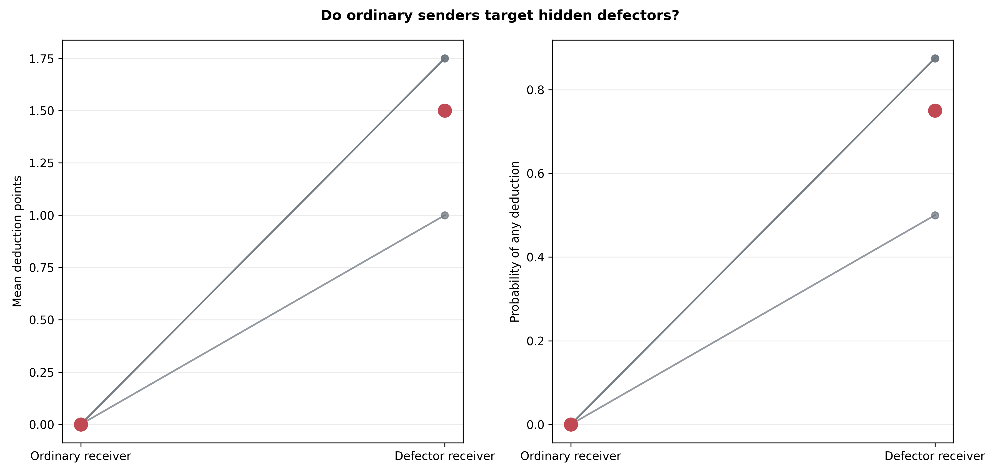
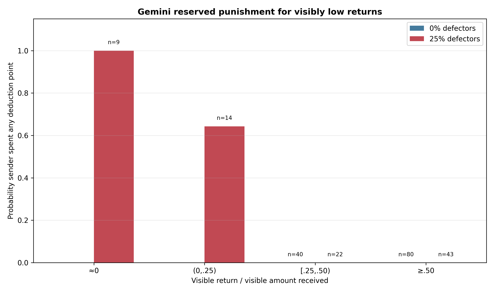
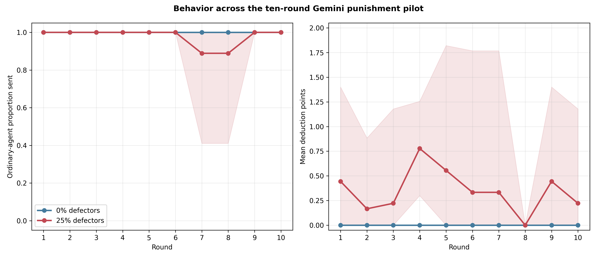
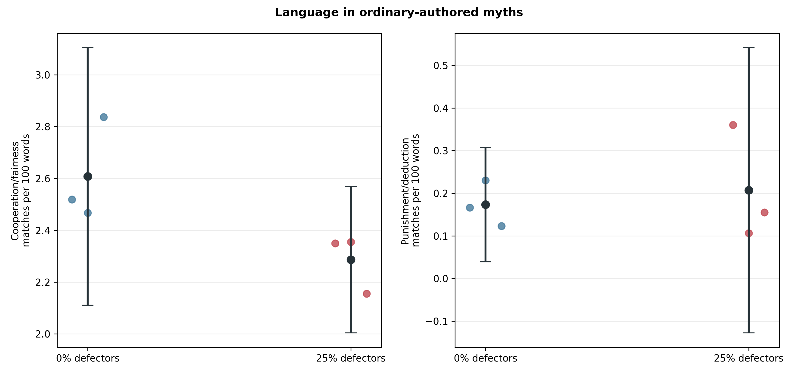

# Gemini selectively punishes hidden defectors: population pilot

## Question and design

This frozen pilot asked whether Gemini 3.1 Flash-Lite's selective deduction
policy in controlled prompts survives complete Myth→Game population histories
and signed transfer noise. It compared three matched pairs of eight-agent,
ten-round populations with 0% versus 25% hidden mechanical defectors. All
agents could spend up to two deduction points after a return; each point cost
the sender one payoff unit and removed up to three from the receiver.

Mechanical defectors wrote myths normally but always sent, returned, and
deducted zero without game-decision LLM calls. Agents were told only that
communication noise might slightly change visible amounts. The noise remained
`U(−1,+1)`, applied after each true send and return. Replicate 69 was a live
two-population smoke and is excluded; the report covers the frozen substantive
replicates 66–68.

## Integrity

All 6/6 substantive populations passed the acceptance audit:

- 60 complete population-rounds and 240 dyads;
- 1,440 accepted interaction records: 1,110 Gemini responses, exactly 90
  forced defector decisions, and 240 scripted deduction notices;
- 480 exact signed-noise checks, all applied after the true decision;
- exact deduction costs, 1:3 receiver losses, payoff floors, and balances;
- every defector send, return, and deduction equal to zero, while all defector
  myth calls remained normal;
- matched schedules and noise seeds across paired conditions; and
- no retries, response-boundary errors, hidden-role leakage, or dirty/missing
  execution provenance.

The nine-exchange memory capacity retained three complete prior
Myth→Game→deduction/notice rounds, as intended.

## The frozen mechanism gate passed

The mechanism outcomes were opened before cooperation and myth outcomes. In
the 25%-defector populations, ordinary senders behaved selectively:

| Receiver type | Opportunities | Any deduction | Mean points spent |
|---|---:|---:|---:|
| Ordinary | 66 | 0/66 (0%) | 0.00 |
| Hidden defector | 24 | 18/24 (75%) | 1.50 |

The defector-minus-ordinary contrasts were +1.50 points and +.75 probability.
Across replicates 66–68, defectors were punished in 50%, 87.5%, and 87.5% of
their opportunities; ordinary receivers were never punished in any replicate.

The model was also restrained after cooperation: it spent zero points in all
43 treatment opportunities where the visible return ratio was at least .5.
All four pre-specified descriptive thresholds passed:

| Frozen criterion | Threshold | Observed | Result |
|---|---:|---:|---|
| Defector − ordinary mean spending | ≥ .50 | +1.50 | Pass |
| Defector − ordinary any-deduction probability | ≥ .25 | +.75 | Pass |
| Any deduction toward defectors | ≥ .50 | .75 | Pass |
| Any deduction after a visible half-return | ≤ .25 | .00 | Pass |

These were pilot selection rules, not confirmatory hypothesis tests. The
population-level paired target contrasts happen to have `p=.0267` with `n=3`,
but that p-value must not be treated as confirmation after a go/no-go screen.





## Cooperation remained near ceiling

Only after the gate decision was recorded were behavioral outcomes inspected:

| Ordinary-agent outcome | 0% defectors | 25% defectors | Paired difference | 95% CI |
|---|---:|---:|---:|---:|
| Proportion sent | 1.000 | .978 | −.022 | [−.118, +.073] |
| Receiver return ratio | .504 | .505 | +.001 | [−.050, +.053] |

This small pilot does not show a cooperation effect. Sending was at or near
the maximum in both arms, leaving little room for punishment to increase it.
The experiment establishes that Gemini used the institution selectively in
these seeds, not that punishment improved cooperation.



## No clear myth-language shift

Ordinary-authored myths remained highly cooperation-oriented. Relative to
control, the treatment point estimates were −.321 cooperation/fairness
matches per 100 words, +.059 threat matches, and +.034 punishment matches;
all intervals were wide and crossed zero. Punishment vocabulary appeared in
31.7% of ordinary control myths and 33.3% of ordinary treatment myths.

Much of that vocabulary directly described the announced institution
(*deduction*, *punish*, and *punishment* were the most common matches). With
only three populations per arm, this is a descriptive null, not evidence that
selective punishment has no cultural effect.



## Interpretation and next decision

Unlike GPT-5 Nano, Gemini did not treat deduction as a routine affordance. It
used the unchanged neutral wording to distinguish true-zero defectors under
noisy observation from ordinary partners returning approximately half. The
full-population result agrees with the prior controlled calibration and clears
the frozen pilot gate.

The next step is an independent new-seed confirmation of the targeting and
high-return-restraint outcomes. That confirmation should be analyzed against
its own frozen criteria before examining cooperation or myths. Because the
current game produces ceiling sending, a later study of whether punishment
*causes* cooperation will also need a design with behavioral headroom; it
should not be inferred from this mechanism pilot.

## Reproducibility

Run:

```bash
python3 scripts/analyze_defector_punishment_gemini_n3.py
```

Tables, the four gate decisions, and figures are in
`docs/figures/defector_punishment_gemini_n3_20260821/`.
