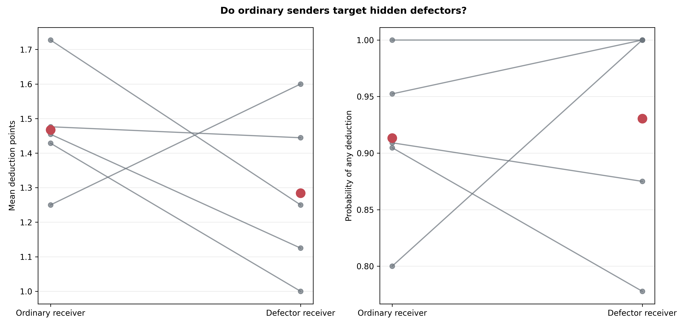
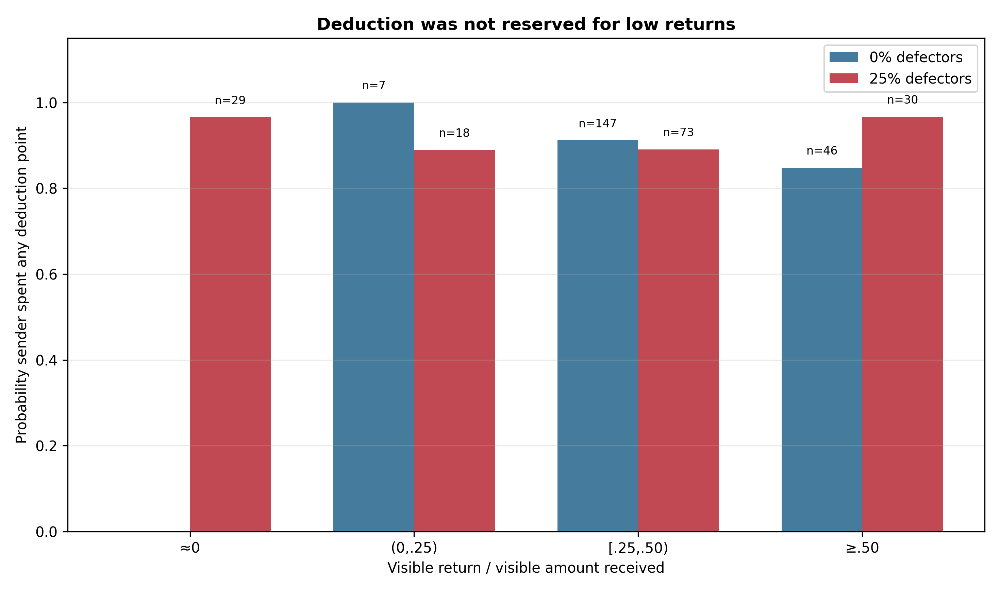
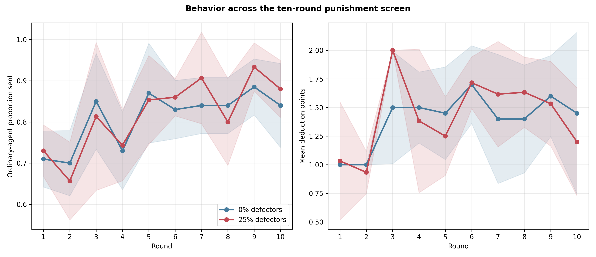
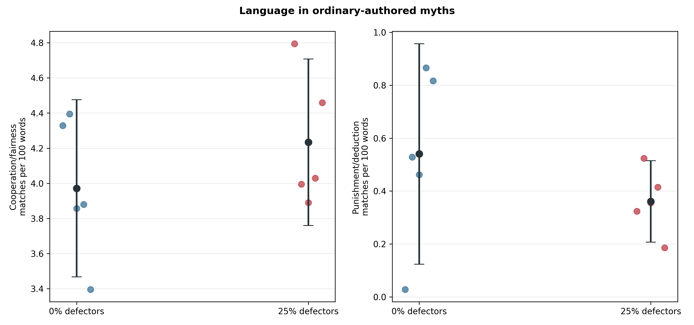

# Costly deductions with hidden defectors: GPT-5 Nano screen

## Question and design

This screen asked whether ordinary GPT-5 Nano agents would use a costly
sender-controlled sanction selectively against hidden mechanical defectors.
It crossed 0% versus 25% defectors in eight-agent rotating Myth→Game
populations. In both conditions, the sender received two deduction points
after seeing the receiver's communicated return. Spending one point cost the
sender one payoff unit and removed up to three units from the receiver;
unspent points were added to the sender's payoff. The rules used the neutral
term *deduction points*. Mechanical defectors continued to write myths but
always sent, returned, and deducted zero without game-decision LLM calls.

The five matched population pairs, outcomes, and integrity gate were frozen in
`docs/defector_punishment_gpt_screen_protocol_2026-08-21.md`. Replicate 60 was
a separate smoke and is excluded; this report covers replicates 61–65.

## Integrity

All 10/10 populations passed the audit:

- 100 complete population-rounds and 400 complete dyads;
- 2,400 accepted interaction records: 1,850 LLM responses, exactly 150 forced
  defector decisions, and 400 scripted receiver notifications;
- 13 malformed provider responses recovered by retry, with no unrecovered
  errors or response-boundary failures;
- 800 exact signed-noise checks, all applied after the underlying send or
  return decision and within the configured bounds;
- exact reconstruction of deduction costs, 1:3 target losses, payoff floors,
  and cumulative balances;
- every defector send, return, and deduction was zero; and
- no defector identity, policy, hidden true transfer, or other privileged state
  leaked into an ordinary agent's prompt.

Each agent received exactly one post-game memory exchange per round: either its
deduction decision or the scripted notice of what its partner did. The
nine-exchange capacity therefore retained three complete prior Myth→Game→
deduction/notice rounds, matching the intended three-round content horizon.

## The deductions were not targeted

Ordinary senders used the new action in 318 of 350 opportunities (90.9%). The
rate was already 90.0% without defectors and 92.0% with defectors. At the
population level, adding defectors changed mean spending by only +.020 points
(95% paired CI [−.235, +.275], `p=.838`) and the probability of any
deduction by +.020 ([−.093, +.133], `p=.648`).

Within the defector condition, ordinary senders did not direct more punishment
at mechanical defectors:

| Receiver type | Opportunities | Any deduction | Mean points spent |
|---|---:|---:|---:|
| Ordinary | 106 | 91.5% | 1.472 |
| Defector | 44 | 93.2% | 1.295 |

The population-level defector-minus-ordinary target contrast was −.183
points (CI [−.611, +.245], `p=.300`) and +.017 for any deduction (CI
[−.132, +.167], `p=.764`). The intensity point estimate therefore ran in
the opposite direction from selective punishment.

Nor was spending consistently triggered by a poor visible return. Senders
deducted after at least half of the received amount had visibly been returned
in 39/46 such control opportunities and 29/30 treatment opportunities. Mean
spending in those high-return cases was 1.348 and 1.567 points, respectively.
Population-specific slopes of spending on visible return were inconsistent
and imprecise. GPT-5 Nano appears to have treated the newly available action as
a routine affordance rather than as a calibrated response to defection.





## Cooperation did not fall

The defectors did not change ordinary-agent sending in this screen:

| Ordinary-agent outcome | 0% defectors | 25% defectors | Paired difference | 95% CI | p |
|---|---:|---:|---:|---:|---:|
| Proportion sent | .8095 | .8147 | +.0052 | [−.0212, +.0315] | .615 |
| Receiver return ratio | .4109 | .4377 | +.0268 | [−.0043, +.0580] | .075 |

The slight increase in returning is suggestive but does not clear a
conventional significance threshold in this five-pair mechanism screen.
Because the sanction was available and known from round one in both arms,
these contrasts cannot tell us whether the availability of punishment caused
the overall level of cooperation.

The observational next-action comparison is not interpretable as a punishment
effect: almost everyone was punished, leaving only 15 unpunished next-sender
observations in control, five in treatment, and no unpunished next-receiver
observations in treatment. Punishment was also selected rather than randomly
assigned.



## Myth language mostly described the institution

Ordinary myths remained highly cooperation-oriented. Adding defectors changed
cooperation/fairness density by +.262 matches per 100 words (CI [−.413,
+.938], `p=.342`) and threat density by +.0295 (CI [−.0374, +.0964],
`p=.288`). Neither provides reliable evidence of a cultural shift.

Punishment/deduction language appeared in 58.8% of ordinary control myths and
63.7% of ordinary treatment myths, but the density contrast was negative and
uncertain (−.179, CI [−.635, +.276], `p=.336`). Most matches were literal
descriptions of the newly announced mechanism—especially *deduction*,
*deductions*, and *deduct*—rather than an emergent norm demanding targeted
sanction. Defector-authored myths showed the same pattern.



## Interpretation and next decision

The implementation works technically, but this GPT-5 Nano prompt does not
operationalize selective norm enforcement. It elicits high, indiscriminate
deduction spending even when receivers return at least half and even when no
defectors exist. That is itself a model-behavior result; it should not be
relabelled as successful punishment of defectors.

The clean next experiment is a matched exploratory 2×2 comparison:

- deduction stage available versus unavailable; and
- 0% versus 25% hidden mechanical defectors.

The existing five-pair deduction-stage data can form the two available-stage
cells. We will run matched unavailable-stage populations with the same
replicate IDs, schedules, noise seeds, and defector assignments. This tests
whether merely making this indiscriminately used sanction available changes
ordinary sending or returning, and whether that effect differs when defectors
are present. It remains exploratory because the available-stage results were
seen before the factorial contrast was specified. A genuinely confirmatory
factorial would require new seeds in all four cells.

## Reproducibility

Run:

```bash
python3 scripts/analyze_defector_punishment_gpt_n5.py
```

Tables and figures are in
`docs/figures/defector_punishment_gpt_n5_20260821/`.
