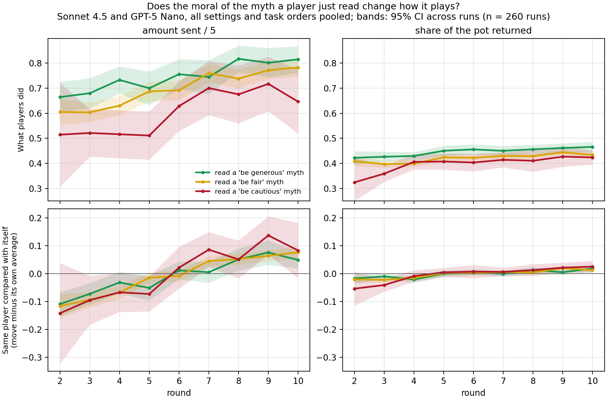

# Send and return by the moral of the myth a player read (2026-10-07)

Simple main-text figure for the claim "language passes between agents, but
behaviour barely does". Ed asked (2026-10-07) for average send and return over
rounds for the three moral labels instead of the appendix grids
(`linguistic_analysis_n10_20261001/moral_behaviour_by_label_split_*.png`).

**What it shows.** Each line is the moral of the latest myth a player was shown
before it played (judge: GLM-5.2; be generous / be fair / be cautious).

- **Top row, what players did.** Players who had just read a generous myth sent
  more (averaged over decisions: 0.75 of the endowment) than those who read a fair one (0.68)
  or a cautious one (0.60). Returns barely differ (0.45 / 0.43 / 0.40).
- **Bottom row, the same player compared with itself.** Each move minus that
  player's own average move in that role. Here the three lines lie on top of
  each other. A player does not send more in the rounds after it reads a
  generous myth than in the rounds after it reads a cautious one.

So the gap in the top row comes from *who* reads which myth, not from the myth
changing the reader. The gap holds inside each model (GPT investors send
0.56 / 0.65 / 0.71 after cautious / fair / generous myths, Sonnet 0.67 / 0.71 /
0.78), so it is about the run and partner a player has: for example, 27% of the
generous myths shown came from Gemini partners, against none of the cautious
ones. This is the behaviour-transfer claim: it barely happens. Only 9% of
players see both a generous and a cautious myth in one run, and the
cautious-vs-fair interval below is wide, so "barely" fits; "no effect" would
overclaim for cautious myths.

**Matching test.** Agent-within-run + round fixed effects, own last move
(`linguistic_analysis_n10_20261001/moral_carryover_models.csv`; the shown-myth rows
are refitted into `carryover_test_shown_label.csv` here; all settings,
"own + shown label, own lag"): shown generous vs fair −0.004 sent/5
(95% CI −0.021 to 0.012, p = 0.62); shown cautious vs fair +0.007
(−0.031 to 0.045, p = 0.72); returns +0.001 and +0.003, both p > 0.5. That model includes Gemini players
(300 runs; 6,718 send and 5,561 return decisions); the figure leaves them out.

**Sample and choices.** September informed negative-only runs at n = 10 per
cell (`LINGUISTIC_DATASET=september_n10`). Sonnet 4.5 and GPT-5 Nano only;
Gemini 3.7 Flash is left out because it sends and returns at the ceiling
whatever it reads. 2- and 8-agent, homogeneous and mixed, both task orders are
pooled (260 runs; sent: 5,528 decisions, returns: 4,797). Lines are means over
runs, each run averaged first; bands are 95% t-intervals across runs. Round 1
has no shown myth; round 2 holds only myth→game runs. Descriptive.

The frontier version is in `../moral_send_return_simple_frontier_20261007/`.

Reproduce (no API calls):

    LINGUISTIC_DATASET=september_n10 python3 analyses/plot_moral_send_return_simple.py
    LINGUISTIC_DATASET=september_n10 python3 analyses/linguistic_provenance.py --output docs/figures/moral_send_return_simple_20261007
