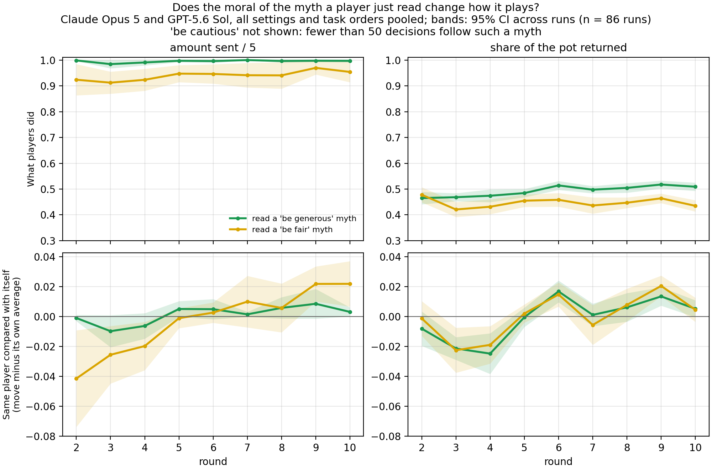

# Frontier models: send and return by the moral of the myth a player read (2026-10-07)

The frontier version of `../moral_send_return_simple_20261007/`. Same script and
layout: one line per moral of the latest myth a player was shown before it
played (judge: GLM-5.2).

**What it shows.**

- **Top row, what players did.** Players who had just read a generous myth sent
  more than those who read a fair one (averaged over decisions: 0.996 vs 0.946
  of the endowment) and returned more (0.50 vs 0.44).
- **Bottom row, the same player compared with itself.** The two lines mostly
  overlap. In rounds 2–4 the "fair" line sits a little lower for sends (about
  −0.03 against 0), and the two lines meet from round 5 on.

The top-row gap is mainly about which model wrote the myth and which model is
reading. 74% of the generous myths shown were written by Opus 5, while 73% of
the fair ones were written by GPT-5.6 Sol. Opus sends close to everything
whatever it reads (1.00 / 0.99 / 1.00 after cautious / fair / generous myths).

**Matching test.** Agent-within-run + round fixed effects, own last move, all
frontier families, 106 runs (`carryover_test_shown_label.csv`). Shown generous
vs fair: +0.003 sent/5 (95% CI −0.005 to 0.011, p = 0.47); returns −0.001
(−0.007 to 0.005, p = 0.68).

**No "be cautious" line.** Frontier myths are almost never cautious. Only 39
decisions in 18 runs follow a cautious myth, and 87% of those cautious myths
were written by Sol. The test's cautious-vs-fair interval is wide (sends −0.032,
CI −0.118 to 0.054). Don't draw conclusions about cautious myths from the
frontier models.

**Sample and choices.** These are the main frontier runs: the homogeneous runs
from 2026-09-18 plus the mixed runs from 2026-09-28 (`LINGUISTIC_DATASET=frontier`).
The figure uses Claude Opus 5 and GPT-5.6 Sol. Gemini 3.1 Pro is left out
because it sends at the ceiling (0.99) whatever it reads. 2- and 8-agent,
homogeneous and mixed, both task orders pooled: 86 runs, 1,310 send and 1,308
return decisions. Lines are means over runs, each run averaged first; bands are
95% t-intervals across runs. Points built on fewer than 5 runs are hidden.
Round 1 has no shown myth. Descriptive.

Reproduce (no API calls; also writes provenance.json):

    LINGUISTIC_DATASET=frontier python3 analyses/plot_moral_send_return_simple.py
