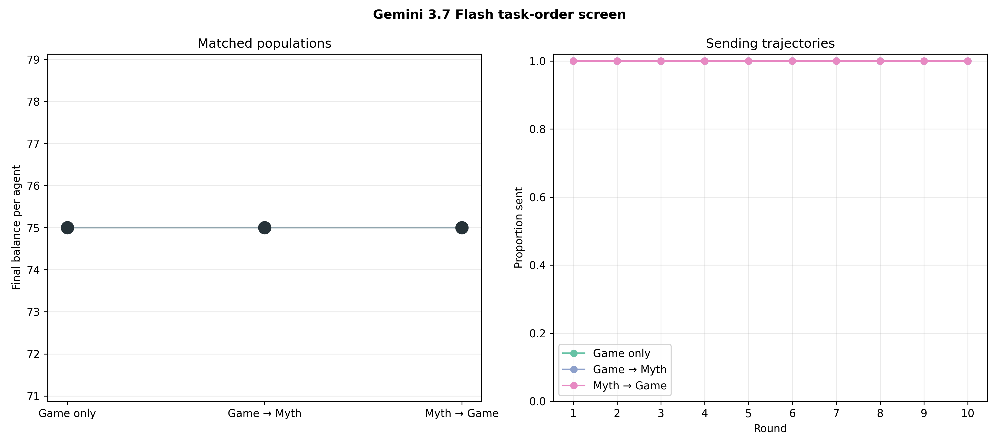

# Gemini 3.7 Flash is completely ceiling-limited in the baseline game

## Result in one sentence

Google's newest capable Flash model sent the full `$5` in all 360 sender
decisions across Game only, Game→Myth, and Myth→Game, so the corrected standard
game cannot identify a task-order effect for this model.

## Why this screen was run

Gemini 3.1 Flash-Lite had previously reached the sending ceiling in the
eight-agent baseline. Gemini 3.7 Flash is Google's latest and most capable
general Flash model, so this frozen screen asked whether the stronger model
showed enough behavioral variation for an informative robustness test.

Three matched populations were run per task order. All used eight anonymous
agents, ten balanced rotating rounds, private three-game memory, and informed
signed `U(-1,+1)` communication noise applied after the true decisions. The
same pairing and noise seeds were used across task orders within replicate.
Gemini 3.7 ran through the direct Google API with its documented default
`medium` thinking level. Its deprecated sampling parameters were not sent.

## Integrity

All nine final populations passed the joint audit:

- 90 complete population-rounds and 360 dyads;
- exactly 1,200 accepted Gemini calls: 240 Game-only and 480 in each myth
  condition;
- 720 exact post-decision signed-noise checks;
- zero recovered or unrecovered response-boundary errors in accepted runs;
- exact memory, prompt, task-order, model, thinking, and provider metadata;
- matched schedules and exogenous seeds; and
- clean embedded code/config provenance.

The first attempted Game-only run failed in round ten after a request exceeded
the historical 120-second timeout. It has no accepted final file and is
excluded. An outcome-blind amendment raised and recorded the timeout to 300
seconds; the same replicate was rerun from the beginning. A separate resumable-
filename bug was also caught and regression-tested before the multi-run batch;
partial duplicate checkpoints are excluded by suffix. Neither correction
changed a prompt, seed, outcome, or decision threshold.

## Results

| Condition | Final balance per agent | Proportion sent | Receiver return ratio | Full sends |
|---|---:|---:|---:|---:|
| Game only | 75.00 | 1.000 | .4731 | 120/120 |
| Game→Myth | 75.00 | 1.000 | .4733 | 120/120 |
| Myth→Game | 75.00 | 1.000 | .4733 | 120/120 |

All matched final-balance and sending differences were exactly zero. Return
ratios differed by less than .0003 and were essentially reproduced across
task orders by the matched seeds. Each condition produced the maximum possible
joint balance of `$600` per population.



This is not evidence that myths have no effect on Gemini 3.7. The outcome is
structurally uninformative because the model already adopts the maximally
cooperative sender action without a myth. Greater model capability did not
create useful behavioral headroom; it strengthened the ceiling problem.

## Frozen decision and next step

The frozen rule correctly says **do not expand the baseline task-order
comparison**. More replicates cannot distinguish conditions when every sender
choice is identical.

The next useful tests are deliberately harder:

1. a controlled deduction calibration, which cheaply determines whether
   Gemini 3.7 uses punishment selectively at fixed visible returns; and
2. a small matched 0%-versus-25%-defector Myth→Game stress test, which checks
   whether experienced defection creates behavioral headroom and whether the
   behavior-to-culture imprint observed in Flash-Lite generalizes.

Only if one of those screens produces interpretable variation should a larger
Gemini 3.7 population experiment be run.

## Cost and reproducibility

The nine accepted populations used 2,701,462 input tokens, 122,254 visible
output tokens, and 179,497 thinking tokens. At the model's introductory list
price, estimated accepted-run cost was `$3.16`.

Run:

```bash
python3 scripts/analyze_gemini37_flash_task_order_n3.py
```

Audit records, summaries, contrasts, the frozen decision, token accounting,
and the figure are in
`docs/figures/gemini37_flash_task_order_n3_20260823/`.
