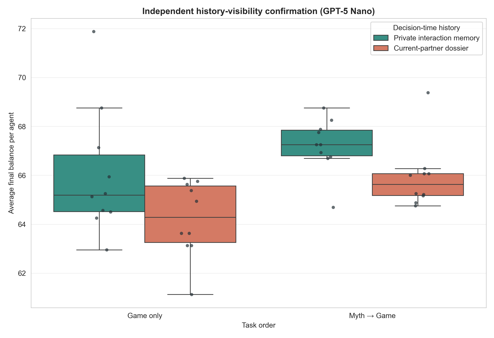
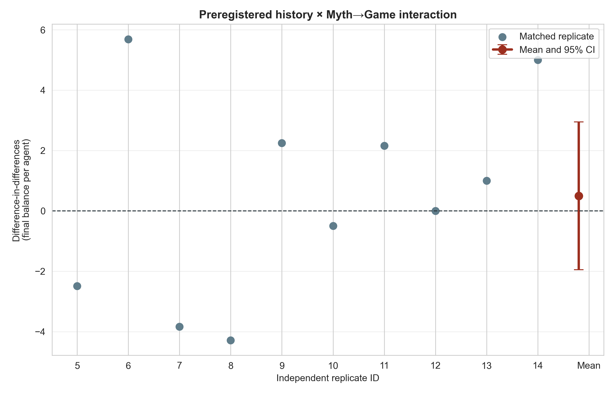
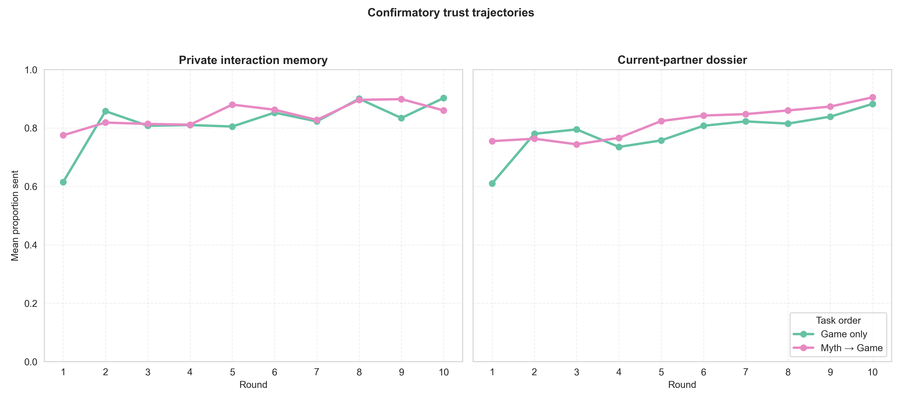

# Independent GPT-5 Nano history-visibility confirmation

## Frozen question

An exploratory `n=5` screen suggested that giving agents an explicit dossier
about the current co-player lowered cooperation in Game only but not in
Myth→Game. Before generating new outcomes, we froze an independent `2 × 2`
confirmation using unused replicate IDs 5–14.

The factors were:

- private interaction memory versus the same memory plus the current
  co-player's previous three games; and
- Game only versus Myth→Game.

All cells used GPT-5 Nano, 8 agents, 10 rounds, anonymous balanced rotating
dyads, matched pairing/noise seeds, and informed signed `U(−1,+1)` noise after
both decisions. The independent eight-agent population is the analysis unit.

The preregistered primary test was the paired final-balance interaction:

`(dossier − private | Myth→Game) − (dossier − private | Game only)`.

The frozen protocol is in
`docs/history_visibility_confirmatory_protocol_2026-08-21.md`.

## Completion and audit

All 40/40 independent populations passed the expanded audit jointly:

- 400 complete population-rounds and 1,600 completed dyads;
- 4,800 accepted task responses across 4,842 total provider attempts;
- 42 explicit recovered myth retries and zero unrecovered failures;
- 3,200 transfer-noise checks with no bound violations; and
- identical realized schedules across the four cells for each matched seed.

Rejected attempts were retained in the audit but rolled back before memory;
none entered the accepted myth corpus.

## Results

Cell means and 95% t intervals across `n=10` populations:

| Decision-time history | Task order | Final balance/agent | Proportion sent | Return ratio |
|---|---|---:|---:|---:|
| Private interaction memory | Game only | 66.03 [64.17, 67.90] | .821 [.783, .858] | .417 [.407, .427] |
| Private interaction memory | Myth→Game | 67.22 [66.42, 68.01] | .844 [.828, .860] | .383 [.363, .404] |
| Current-partner dossier | Game only | 64.22 [63.11, 65.33] | .784 [.762, .807] | .391 [.364, .418] |
| Current-partner dossier | Myth→Game | 65.90 [64.95, 66.86] | .818 [.799, .837] | .385 [.355, .414] |

### Primary result: interaction not confirmed

The preregistered difference-in-differences was `+0.50` final-balance units per
agent (95% CI `[−1.95, +2.94]`, `p=.655`, paired Cohen's `dz=.15`). The wide
replicate-level variation spans both positive and negative values. The
exploratory claim that Myth→Game specifically eliminates the dossier penalty is
therefore not supported by this independent batch.

### Secondary contrasts

- Dossier − private memory in Game only: `−1.81` (`[−3.93, +0.30]`,
  `p=.084`).
- Dossier − private memory in Myth→Game: `−1.32` (`[−2.28, −0.35]`,
  `p=.013`).
- Myth→Game − Game only under private memory: `+1.18`
  (`[−0.93, +3.30]`, `p=.237`).
- Myth→Game − Game only under the partner dossier: `+1.68`
  (`[+0.39, +2.98]`, `p=.017`).

These four tests are secondary and unadjusted. Their pattern is more consistent
with two approximately additive tendencies than with an interaction: the
partner dossier lowers sending, while Myth→Game raises it. Final balance and
proportion sent encode the same welfare effect by construction. Return ratios
do not show the same pattern and do not determine joint welfare.

## Interpretation and next test

The strongest defensible conclusion is now narrower than the exploratory one:

1. Explicit information about the current partner's recent games tends to
   reduce cooperation in GPT-5 Nano populations, consistent with targeted
   retaliation or negative-reputation use.
2. Myth→Game improves cooperation under the current-partner dossier in this
   batch, reproducing the direction of the earlier task-order result.
3. There is no evidence that Myth→Game's effect is uniquely caused by, or
   specifically buffers, partner-history visibility.

The next visibility experiment should be a separately specified public
population-ledger arm. It must define stable pseudonyms, whether third-party
records expose actual or communicated/noisy transfers, the number of past
rounds shown, and how the current co-player maps onto the ledger. That arm tests
population-wide reputation and third-party sanctioning rather than merely
adding more of the current-partner dossier.

## Cost and reproducibility

The selected confirmation used 9,387,901 input tokens and 489,245 output
tokens, with no reported reasoning tokens. Under the recorded rates, estimated
list-price cost was `$0.665`.

Reproduce with:

```bash
python3 scripts/analyze_history_visibility_confirmation_gpt_n10.py
```

Outputs are in
`docs/figures/history_visibility_confirmation_gpt_n10_20260821/`.






