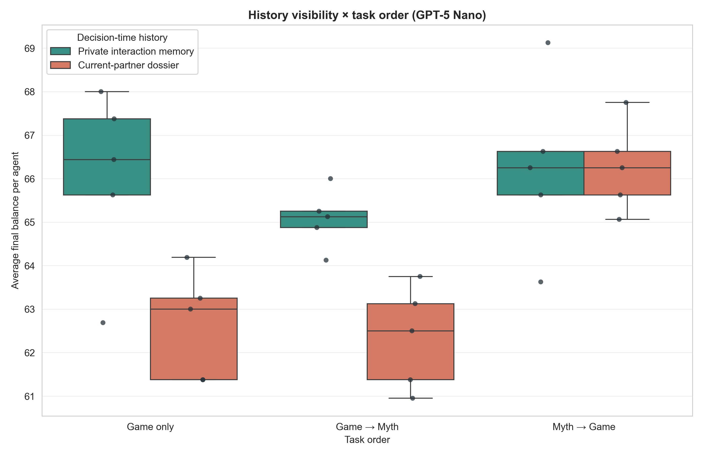
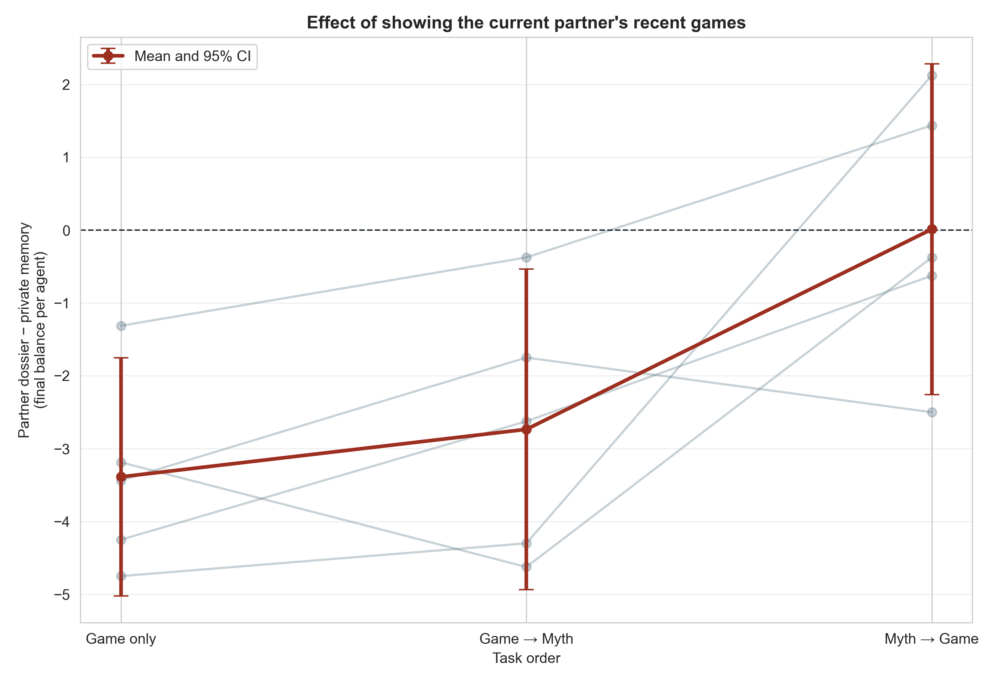
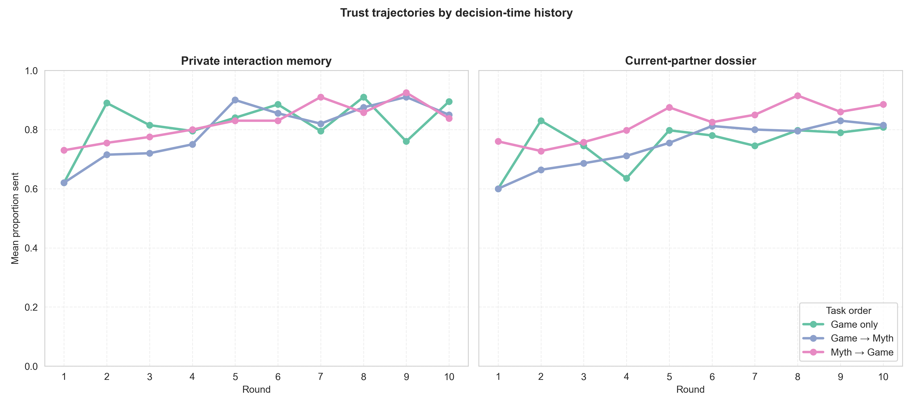

# GPT-5 Nano history-visibility × task-order factorial

## Question and design

This exploratory `2 × 3` experiment asks whether giving an agent an explicit
three-game dossier about its current co-player changes cooperation, and whether
that effect depends on when myths are written. The two decision-time history
conditions are:

- **Private interaction memory:** no synthetic history block is injected. The
  agent still retains its own last three rounds of game/myth interaction in its
  private conversation memory, including what it personally observed.
- **Current-partner dossier:** the same private memory plus a prompt block
  summarizing the current co-player's last three games, including interactions
  the focal agent may not have personally observed.

Each history condition is crossed with Game only, Game→Myth, and Myth→Game.
Every cell has five independent 8-agent populations. Pairing schedules and
signed `U(−1,+1)` communication-noise draws are matched by replicate across all
six cells. Names are hidden and all other substantive settings are held fixed.

## Output-boundary discovery and repair

The first GPT runs revealed two distinct provider-compliance failures. Some
game calls returned malformed decision shapes, and some myth calls returned
decision JSON such as `{"send": 5}` instead of a story. The earlier audit
checked numerical and contextual integrity but did not reject the latter as an
accepted myth.

The code now validates both task boundaries before committing a response to
private memory. Rejected attempts are retained in the audit trail, rolled back
from chat memory, and retried under a bounded output-only clarification. The
clarification does not add a cooperation norm; it only asks for prose beginning
with `Myth:` and forbids send/return JSON or a game-prompt continuation.

The selected analysis dataset contains valid originals plus exact-seed clean
replacements. All 30/30 selected runs passed the expanded joint audit:

- 300 complete population-rounds and 1,200 completed dyads;
- 4,000 accepted task responses across 4,019 total provider attempts;
- 19 explicit recovered myth retries and zero unrecovered errors;
- 2,400 transfer-noise checks with no bound violations; and
- identical realized pairing schedules across all six matched cells.

Contaminated and aborted files remain preserved locally for diagnosis but are
excluded from inference.

## Results

Values are run-level means with 95% t intervals across five independent
populations. Final balance is a welfare measure algebraically determined by
sending; returns redistribute resources within a dyad.

| Decision-time history | Task order | Final balance/agent | Proportion sent | Return ratio |
|---|---|---:|---:|---:|
| Private interaction memory | Game only | 66.03 [63.45, 68.60] | .821 [.769, .872] | .399 [.353, .445] |
| Private interaction memory | Game→Myth | 65.08 [64.23, 65.92] | .802 [.785, .818] | .375 [.342, .407] |
| Private interaction memory | Myth→Game | 66.25 [63.79, 68.71] | .825 [.776, .874] | .355 [.338, .372] |
| Current-partner dossier | Game only | 62.64 [61.10, 64.17] | .753 [.722, .783] | .387 [.339, .435] |
| Current-partner dossier | Game→Myth | 62.34 [60.88, 63.80] | .747 [.718, .776] | .362 [.344, .379] |
| Current-partner dossier | Myth→Game | 66.26 [64.99, 67.53] | .825 [.800, .851] | .405 [.339, .471] |

The explicit partner dossier reduced final balance relative to private memory
in Game only by `−3.39` per agent (95% paired CI `[−5.02, −1.75]`, raw
`p=.0045`, Holm `p=.0136`). The corresponding Game→Myth estimate was `−2.74`
(`[−4.94, −0.53]`, raw `p=.026`, Holm `p=.052`). In Myth→Game the dossier
effect was essentially zero: `+0.01` (`[−2.26, +2.28]`, `p=.989`).

Within the current-partner-dossier regime, Myth→Game exceeded Game only by
`+3.63` (`[+2.45, +4.80]`, raw `p=.0010`, Holm `p=.0031`) and Game→Myth by
`+3.92` (`[+1.38, +6.47]`, raw `p=.0129`, Holm `p=.0257`). Under private
interaction memory, none of the three task orders separated at `n=5`.

The planned difference-in-differences asks whether Myth→Game changes the
effect of the partner dossier relative to Game only. Its estimate is `+3.40`
per agent (95% CI `[+0.70, +6.10]`, raw `p=.025`; Holm across the two myth-order
interactions `p=.050`).

## Interpretation

The leading mechanism is not that partner information is generically
cooperation-enhancing. In this screen, an explicit current-partner record
appears to facilitate targeted retaliation, lowering sending in Game only and
Game→Myth. A myth immediately before the decision removes that penalty and
restores the high-cooperation level seen under private memory. This is
consistent with a normative/cultural buffer against retaliatory use of
reputation information.

This remains exploratory: `n=5`, one model, and a borderline multiplicity-
adjusted interaction. It does not yet test a population-wide public ledger or
third-party punishment. The next confirmatory step should preregister the
Game-only versus Myth→Game `2 × 2`, increase independent populations, and then
add a separately specified population-ledger arm.

## Reproducibility

Run:

```bash
python3 scripts/analyze_history_visibility_factorial_gpt_n5.py
```

Tables and figures are in
`docs/figures/history_visibility_factorial_gpt_n5_20260821/`.






