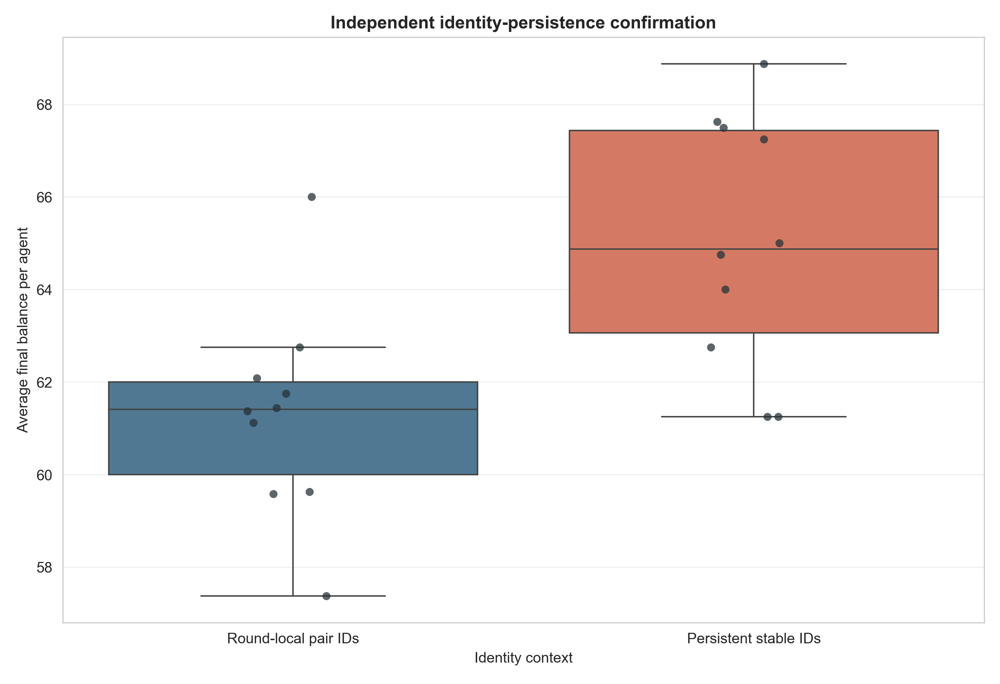
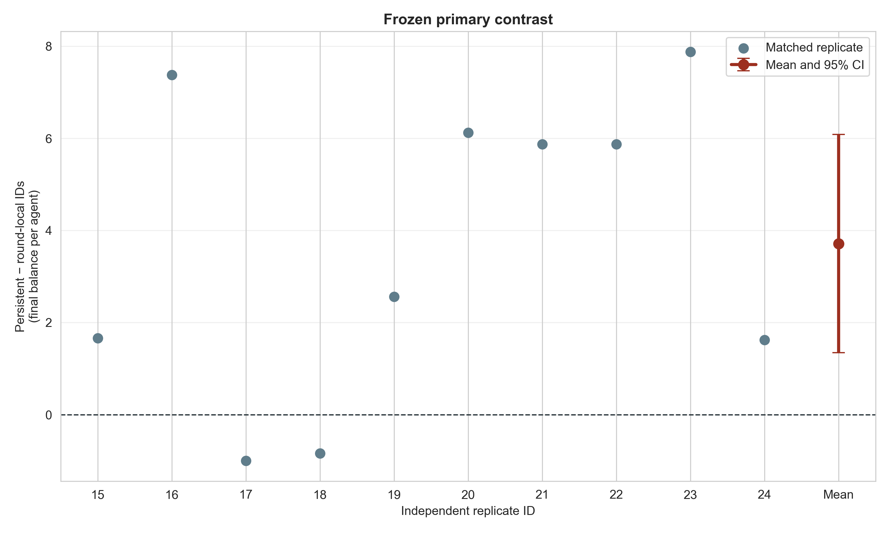
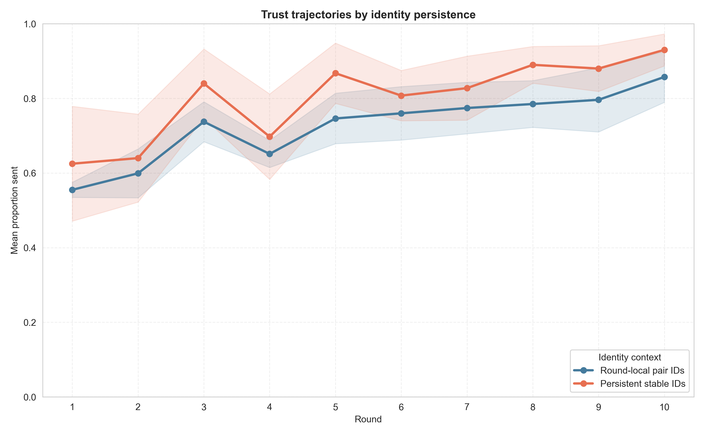

# GPT-5 Nano independent identity-persistence confirmation

## Frozen question and design

This experiment independently tested the exploratory hypothesis that persistent
partner identities reduce cooperation in an eight-agent population. The
protocol and directional decision rule were frozen before any outcomes were
inspected in
`docs/identity_persistence_confirmation_protocol_2026-08-21.md`.

Twenty new Game-only populations were assigned to two matched arms:

- **Persistent stable IDs:** each agent and current co-player received stable
  `Member A`–`Member H` codes that remained fixed across rounds.
- **Round-local pair IDs:** the same four-bullet prompt position used `Member
  Self` and `Member Other`, explicitly reassigned every round and unable to
  identify agents over time.

Neither arm received a population ledger, partner dossier, or synthetic
history block. Both retained the agent's own prior three game exchanges in its
private chat memory. All other settings were identical: GPT-5 Nano, eight
agents, ten rounds, balanced rotating dyads, informed signed `U(−1,+1)` noise
after both decisions, temperature .8, and matched unused seeds for replicate
IDs 15–24.

The frozen primary contrast was `persistent stable IDs − round-local pair IDs`
on average final balance per agent. The hypothesis was to be confirmed only if
the paired 95% interval excluded zero in the predicted negative direction.

## Acceptance gate

All 20/20 populations passed the joint audit before outcomes were analyzed:

- 200 complete population rounds and 800 completed dyads;
- 1,600 accepted decisions with no retries or unrecovered failures;
- 1,600 exact transfer-noise checks with no violations;
- identical pairing and noise schedules in each matched pair;
- the correct identity context in every applicable prompt; and
- no stable `Member` or hidden `Agent` identity leakage in the round-local arm.

## Results

| Condition | Round-1 sent | Final balance/agent | Proportion sent | Return ratio | Returned/sent |
|---|---:|---:|---:|---:|---:|
| Round-local pair IDs | .555 [.535, .575] | 61.31 [59.69, 62.93] | .726 [.694, .759] | .355 [.326, .384] | 1.062 [.980, 1.144] |
| Persistent stable IDs | .625 [.471, .779] | 65.03 [63.07, 66.98] | .801 [.761, .840] | .290 [.257, .324] | .924 [.853, .995] |

### Frozen primary verdict

Persistent IDs raised rather than lowered final balance by `+3.71` per agent
(95% paired CI `[+1.35, +6.08]`, `p=.00625`, paired `dz=1.12`). All ten
matched point estimates were available; eight were positive and two were
slightly negative. The interval is wholly in the direction opposite the frozen
hypothesis.

The identity-persistence-depresses-cooperation hypothesis is therefore **not
confirmed and is directionally contradicted in this independent experiment**.
The earlier five-population pattern should be treated as an unstable
exploratory result, not as evidence that stable identity explains the public-
ledger reduction.

### Secondary outcomes

The final-balance effect is exactly mirrored in sending, because transfers
create the joint surplus in this game. Persistent IDs increased mean proportion
sent by `.0743` (`[+.0269, +.1217]`, unadjusted `p=.00625`). Their advantage
was only `.070` in round one (`[−.087, +.227]`, `p=.341`) and became more
consistent over repeated rounds, which is compatible with learning or
relationship formation rather than a resolved initial framing effect.

Receiver behavior moved in the other direction. Persistent IDs reduced the
mean return ratio by `.0647` (`[−.1085, −.0209]`, unadjusted `p=.00868`) and
returned/sent by `.138` (`[−.246, −.031]`, `p=.0171`). These returns redistribute
resources between partners and do not determine joint final balance. The
pattern suggests persistent identity may support greater sending even while
receivers return a smaller fraction, but that mechanism remains exploratory.

## Interpretation and implications

The clean confirmation rules out the simple claim that persistent partner
identity reliably triggers retaliation and lowers cooperation in GPT-5 Nano.
In these new populations, stable identity instead supported substantially more
sending across repeated encounters. One plausible mechanism is relationship-
specific trust or the prospect of future reciprocity; the present experiment
does not isolate that mechanism.

This also means the lower cooperation in the earlier stable-ID and public-
ledger screen cannot safely be attributed to identity persistence. It may have
been sampling variation, an interaction with the precise public-record
framing, or another feature of those exploratory arms. The honest conclusion
is that the identity mechanism is seed-sensitive across small screens and that
the independent, preregistered evidence points in the opposite direction.

The next useful scientific step is not another prompt variant. It is to test
whether the positive stable-identity effect replicates in a second model and,
if it does, to cross identity persistence with myth timing or public history in
a powered factorial design.

## Reproducibility

Run:

```bash
python3 scripts/analyze_identity_persistence_confirmation_gpt_n10.py
```

Outputs are in
`docs/figures/identity_persistence_confirmation_gpt_n10_20260821/`.






