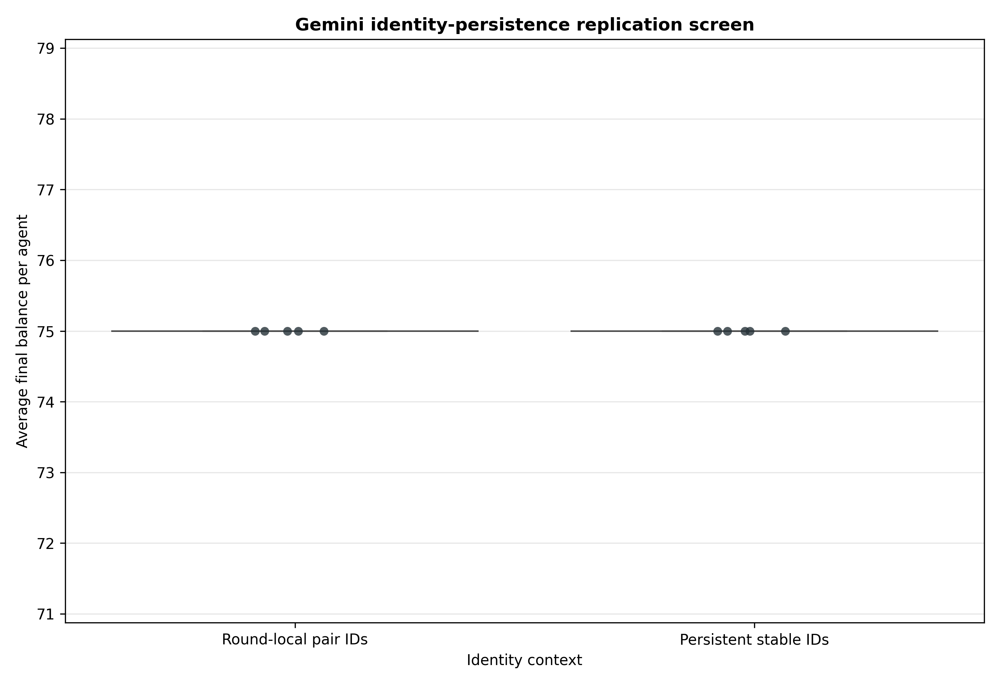
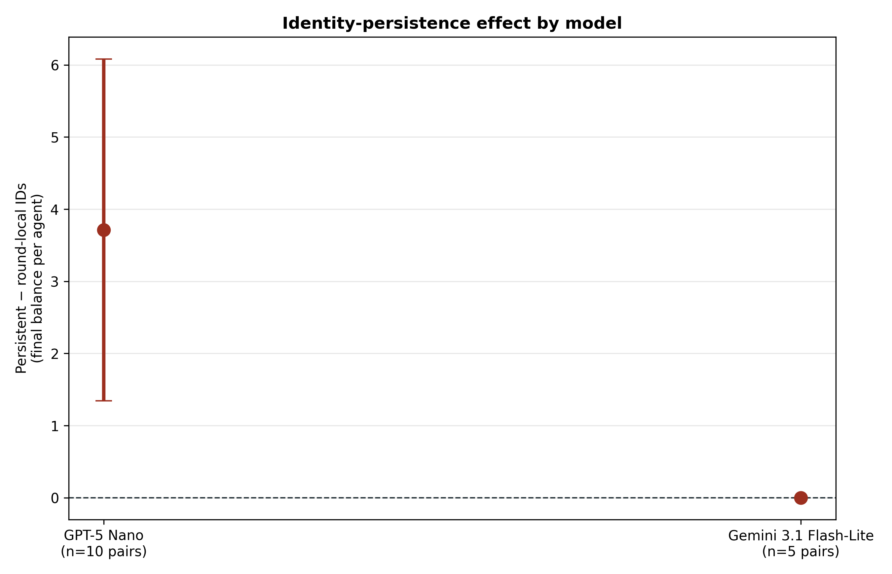
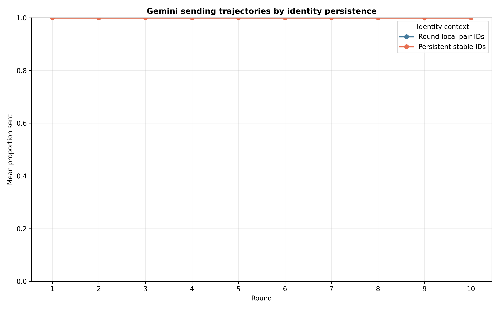

# Gemini identity-persistence replication screen

## Frozen question and design

This new-seed screen asked whether the positive stable-identity effect from the
independent GPT-5 Nano confirmation generalizes to Gemini 3.1 Flash-Lite. The
protocol was frozen before generating outcomes in
`docs/identity_persistence_gemini_screen_protocol_2026-08-21.md`.

Five matched eight-agent populations per arm received either persistent stable
`Member A`–`Member H` identities or round-local `Member Self`/`Member Other`
labels. Neither condition received a ledger, partner dossier, or synthetic
history block; both retained their own prior three game exchanges in private
chat memory. The experiment otherwise exactly reused the GPT confirmation
parameters: ten rounds, balanced rotating dyads, signed informed
`U(−1,+1)` noise after both decisions, temperature .8, and matched unused seeds
for replicate IDs 25–29.

## Acceptance gate

All 10/10 populations passed jointly before outcome analysis:

- 100 complete population rounds and 400 completed dyads;
- 800 accepted decisions with no retries or unrecovered failures;
- 800 exact noise checks with no violations;
- identical schedules in all five matched pairs;
- correct identity context in every applicable prompt; and
- no stable Member or hidden Agent identity leakage in the round-local arm.

## Results: complete sender ceiling

| Condition | Round-1 sent | Final balance/agent | Proportion sent | Return ratio | Returned/sent |
|---|---:|---:|---:|---:|---:|
| Round-local pair IDs | 1.000 | 75.00 | 1.000 | .4786 [.4733, .4838] | 1.4357 [1.4200, 1.4514] |
| Persistent stable IDs | 1.000 | 75.00 | 1.000 | .4782 [.4725, .4840] | 1.4347 [1.4176, 1.4519] |

Gemini sent the full `$5` in every sender decision in every round of all ten
populations. Consequently, every population reached the same maximum
send-dependent final balance of `75.00`, and the frozen persistent-minus-
round-local contrast was exactly zero in all five matched pairs.

The primary outcome has no sampling variance, so an ordinary paired t statistic
is undefined; the analysis records the descriptive interval as `[0, 0]` and a
neutral `p=1` convention. This should not be interpreted as precise evidence
that identities have no effect. It is a ceiling-limited test with no behavioral
room for the identity manipulation to change sending.

Receiver behavior was almost identical as well. Persistent minus round-local
return ratio was `−.00033` (95% paired CI `[−.00144, +.00079]`, unadjusted
`p=.465`). Both arms returned about 47.8% of the tripled amount, or about 1.435
times the original amount sent. This reinforces the previously observed
"return about half" focal rule, while showing that Gemini's sender policy is
far more saturated than GPT-5 Nano's under this prompt.

## Frozen interpretation

The screen neither supports a cross-model replication nor shows a cross-model
reversal. It is **unresolved because Gemini 3.1 Flash-Lite is at a complete
sending ceiling**. Increasing `n` with the same model and payoff prompt would
not solve the problem: more identical maximum-send observations add no
information about the identity contrast.

The useful cross-model result is therefore model heterogeneity in baseline
behavior. GPT-5 Nano left meaningful variation for identity context and showed
`+3.71` final-balance units for stable IDs; Gemini adopted unconditional full
sending under both contexts. Any further Gemini mechanism test needs a design
that avoids this ceiling—for example a harder social dilemma, stronger
temptation to withhold, or defectors—rather than simply more replicates.

## Reproducibility

Run:

```bash
python3 scripts/analyze_identity_persistence_gemini_n5.py
```

Outputs are in
`docs/figures/identity_persistence_gemini_n5_20260821/`.






