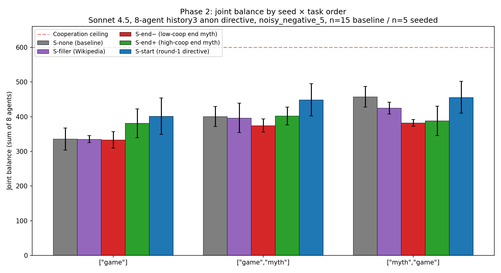

# Phase 2 — Myth Transplant Ablation: Team Brief

**TL;DR.** We pre-inserted a "fake prior myth" into each Claude Sonnet 4.5 agent's memory before round 1, then watched 8-agent populations play a 10-round trust game. The seed myth produces a large effect on cooperation (often >1 standard deviation), but **the direction of the effect depends on the task order**. Round-1 directive parables are the best carriers; round-10 myths that have drifted into game-rule descriptions are worse; anti-cooperative myths *suppress* cooperation. See plot 01.

Full design + numbers in `docs/memory_transplant_ablation_design.md §17`.

---

## 1. The main result (plot 01)



> `data/phase2/plots/01_cell_means.png`

Mean joint balance across all 8 agents per cell. Std-error bars. Red dashed line = cooperation ceiling ($600).

| Seed condition       | `["game"]`         | `["game","myth"]`  | `["myth","game"]`  |
|---                   |---                 |---                 |---                 |
| **S-none (baseline, n=15)** | 335.5 ±32.0    | 400.5 ±28.9        | 457.6 ±29.8        |
| S-start (n=5)        | **401.7 (+66)**    | **448.4 (+48)**    | 455.8 (−2)         |
| S-end+ (n=5)         | 380.9 (+45)        | 401.8 (+1)         | 388.2 (−69)        |
| S-end− (n=5)         | 333.0 (−3)         | 374.6 (−26)        | 382.1 (−75)        |
| S-filler (n=5)       | 335.2 (0)          | 396.3 (−4)         | 424.6 (−33)        |

Δ vs S-none in parentheses; **bold** = z ≥ +1.96 (significant lift over baseline).

What to read out of this:
- In `["game"]`-only runs, cooperative myth seeds clearly **lift** cooperation.
- In `["myth","game"]` runs, most seeds **suppress** cooperation — pre-injecting a myth disrupts the agent's own free choice of round-1 myth, which turns out to be more important than the seed's content.
- **Round-1 baseline directive myths (S-start) are the best carrier across task orders.**
- Length-matched non-narrative filler (Wikipedia paragraphs) does *nothing* in `["game"]` — so the lift from real myths isn't a "more tokens" warm-up artifact.

---

## 2. Setup

### 2.1 Population & game
- **Model:** Claude Sonnet 4.5 (direct Anthropic API).
- **8 agents per run, 10 rounds.** Randomized dyadic pairing per round, balanced so every agent ends up as sender 5× and receiver 5×.
- **Trust game.** Endowment $5, multiplier 3x. Sender chooses how much to send (0–$5); receiver gets 3× that amount; receiver chooses how much to return.
- **Noise:** `noisy_negative_5` — communicated amounts are reduced by a uniform draw from [0, $5]. Picked from a pilot so the no-seed baseline lands at ~80% of cooperation ceiling, off-ceiling enough to detect both lifts and suppressions.
- **Persona:** neutral (no behavioral system-prompt addition).

### 2.2 Anonymity & history visibility
- **`show_agent_names: false`** — opponents are referred to as "your current co-player", never named.
- **`history_policy: "self_and_coplayer"`** with both windows set to 3 — each agent's round prompt includes:
  - "Your last 3 game(s): …" — the agent's own three most recent dyad outcomes
  - "Your current co-player's last 3 game(s): …" — the same for whoever they're paired with this round
- The history block is constructed fresh from the simulation's central log each round; it is *not* drawn from the agent's chat memory.

### 2.3 Agent memory
There are two distinct "memories" each round:

1. **Chat memory (`agent.messages`).** Standard sliding window of the agent's prior LLM messages. With `memory_capacity = 3`, the agent keeps system prompt + the last 6 messages (≈ 3 conversational turns). Older messages are silently dropped.
2. **History-block memory (the prompt text itself).** The "Your last 3 games" block described above. This is generated from `sim_data.conversation_history` and inserted into the round-N user prompt as text. It survives even if the chat memory has rolled over.

The two are largely independent. Chat memory captures *what the agent generated*; the history block captures *what happened in the game ledger*.

### 2.4 The myth injection mechanism

A "seeded" run differs from a baseline run in exactly one way: **before round 1 begins**, every agent's `messages` list is initialised with three entries instead of one.

```
Baseline agent.messages at run start:
  [system: <trust game rules + multi-agent setting>]

Seeded agent.messages at run start:
  [system: <trust game rules + multi-agent setting>,
   user:   <directive myth-writing prompt>,
   assistant: <SEED MYTH TEXT>]
```

The fake `user` turn is the literal directive prompt the agent would have seen if it had been asked to write a myth (see §2.5). The `assistant` turn is the seed — making it look to the model as if *it had previously written this myth*.

**This is a one-shot injection, not a per-round repeat.** From round 1 onward, the agent runs normally. Standard chat-memory truncation kicks in around round 2–4 (depending on task order) and the seed scrolls out. After that, the seed's effect persists only indirectly:

- through the agent's own round-1 output (which was influenced by seeing the seed and which is now in chat memory itself),
- and through whatever effect that round-1 behaviour had on the *history-block* the agent sees in later rounds.

There is **no M1-style memory-wipe-each-round mechanism** in Phase 2. That was tried in Phase 1 (§16) and dropped here because it conflicts with the new `history_policy` (§17.1 in the design doc).

### 2.5 Seed types and where they come from

Each run uses a single seed string; all 8 agents in that run see the same seed. We tested 5 conditions:

| Seed | Source | Example opening |
|---|---|---|
| **S-none** | no seed (baseline) | — |
| **S-start** | round-1 directive myth from a top-quartile baseline run | `# The Tale of the Flowing Spring\n\nIn ancient times, there lived a guardian of a sacred spring …` |
| **S-end+** | round-10 directive myth from a top-quartile baseline run | `Myth: In the Hall of Eternal Mirrors, eight wanderers received five golden coins each dawn. Coins placed in the Amplifying Well would triple and flow to another's hands. …` |
| **S-end−** | round-10 directive myth from a bottom-quartile baseline run | `Myth: In the Chamber of Second Chances, the Oracle watched eight merchants navigate webs of memory and shifting partnerships. …` |
| **S-filler** | length-matched Simple English Wikipedia paragraphs | `Nitrogen is a nonmetal chemical element. The atmosphere contains 78 % nitrogen by volume. …` |

Source pool: the 15 noisy `["myth","game"]` baseline runs we built at the start of Phase 2. Top quartile and bottom quartile by *joint balance* of all 8 agents in the source run. Five distinct seeds per type, drawn from five distinct source runs. Filler is concatenated Simple English Wikipedia first-paragraphs, padded to roughly match the ~200-word length of the real myths.

LLM-judge cooperativeness scores (Sonnet 4.5 self-judge, 0–10):
- S-start: **10.0** (all five)
- S-end+: **8.2** mean
- S-end−: **8.6** mean — *higher* than S-end+ (matches a Phase 1 finding: agents in failing runs write more aspirational myths)
- S-filler: **0.0**

### 2.6 Prompts used (verbatim)

System prompt (every agent every run):
```
You are an agent participating in a multi-task experiment. You will play
an iterated game, consisting of multiple rounds, and may also be asked
to write myths.

GAME:
The game consists of two roles: sender and receiver. In each round, you
will play the role of either the sender or the receiver. …

When you are the SENDER:
- You receive $5 each round
- You decide how much to SEND to the RECEIVER ($0-$5)
- Amount sent is multiplied by 3x
- Receiver decides how much to RETURN
- You keep: $5 - sent + returned
- Receiver keeps: received - returned
- Response format: {'send': <amount>}

When you are the RECEIVER:
- Sender receives $5
- Sender decides how much to SEND to you ($0-$5)
- Amount sent is multiplied by 3x
- You decide how much to RETURN
- Sender keeps: $5 - sent + returned
- You keep: received - returned
- Response format: {'return': <amount>}

MYTH WRITING:
You may also be asked to write short myths (stories) on various topics.
When writing myths, follow the instructions provided in each prompt.

IMPORTANT: Provide your decision in the correct JSON format.
```

A multi-agent preamble is appended:
```
MULTI-AGENT SETTING:
- There are 8 agents in this run.
- Each round, all agents are paired into dyads from the full pool.
  Pairings are randomized, but the schedule balances sender and
  receiver roles across the run.
- You play one sender-receiver game with your paired opponent each round.
- Your role may repeat across consecutive rounds, but by the end of the
  run every agent will have acted as sender and receiver equally often
  when the round count allows it.
- Agent names are hidden in this run.
- Your paired opponent is referred to as your current co-player.
```

Round-1 game prompts (no history shown yet):
```
Round 1: This round, you are the SENDER. You have $5. How much do you
send? (0-5)
```
```
Round 1: This round, you are the RECEIVER. This round, the other player
(the sender) sent $<X>, that is <Y>% of its total endowment. You
receive $<3X>. How much do you return? (0-<3X>)
```

Round-N (N≥2) game prompts contain the history block:
```
Round <N>

History before this round:
Your last 3 game(s):
- Round <r-3> against your current co-player, as SENDER: sent $A, it
  became $3A, received $B back, payoff $X.
- Round <r-2> against another agent, as RECEIVER: …
- Round <r-1> against …
Your current co-player's last 3 game(s):
- Round <r-3> against another agent, as RECEIVER: …
- …

Your total earnings across all rounds are $<Z>.

This round, you are the SENDER against your current co-player. You have
$5. How much do you send? (0-5)
Respond exactly as JSON: {'send': <amount>}
```

The directive myth prompt (used both for the **fake injection** before round 1 and for any in-run myth-writing turns):
```
Write a 200-word myth. You may choose any mythic setting, characters, or
symbols.
In this session, this myth and the game you are playing with the other
agent are connected. Write a myth that reflects how the game should be
played, drawing on the game you have been playing up to this point.
```

Later-round myth-writing prompt (only used in `["game","myth"]` and `["myth","game"]` after round 1):
```
Here is the myth you wrote in the previous round:
<last_myth>

Here is the myth the other agent wrote in the previous round:
<other_agent_myth>

Write your own myth. Use your previous myth as inspiration, but adapt it
in your own way. The myth should reflect how the game should be played,
drawing on the game you have been playing up to this point.
```

### 2.7 Task orders

Three orderings of "game" and "myth-write" within each round:

- **`["game"]`** — agents only play the game, no myth-writing during the run. The injected seed is the *only* myth the agent ever has in its memory. Most direct test of "does the seed lift cooperation?".
- **`["game","myth"]`** — each round: play first, then write a myth.
- **`["myth","game"]`** — each round: write a myth first, then play. This is the configuration the existing 5-run `sonnet45_8agent_myth_directive_history3_anon_r10_n5` baseline used, so it matches your team's existing "normal" runs.

We ran every seed × every task order at n=5, plus n=15 no-seed baselines per task order. 60 seeded + 45 baseline + 1 smoke = 106 runs total.

---

## 3. What this means for the team

- **The seed manipulation has real effects.** It's not a marginal nudge; effect sizes are routinely 1–3 standard deviations.
- **Task order is a primary moderator.** "Does the myth carry cooperation?" doesn't have a single answer; it depends on whether the agent is allowed to write its own myth before playing.
- **The agent's own first myth is part of the carrier.** Suppressing the agent's free choice of round-1 myth (by pre-injecting a different one) often *hurts* cooperation in `["myth","game"]` even when the injected myth is judged maximally cooperative.
- **Cooperativeness ratings of the myth text are correlated with cooperation outcomes** (Spearman ρ = +0.52 / +0.41 / +0.15 across the three task orders) **but the correlation isn't tight.** Form (parable vs game-rule description) seems to matter too — S-start parables consistently beat S-end+ game-rule-descriptive myths even when the judge rates them similarly.
- **For our cleanest experimental knob:** the round-1 directive parable (S-start) is the most reliable lift across task orders. Round-10 myths are *not* refined carriers; they're degraded ones.

Open follow-ups are in `docs/memory_transplant_ablation_design.md §17.6.8`.

---

*All raw data: `data/json/noise_experiments/phase2_baseline/` and `data/json/noise_experiments/phase2_seeded/`. Analysis: `data/phase2/`. Plots: `data/phase2/plots/`. Scripts: `scripts/phase2_*.py`. Cell runner: `experiments/run_phase2_seeded_cells.py`.*
