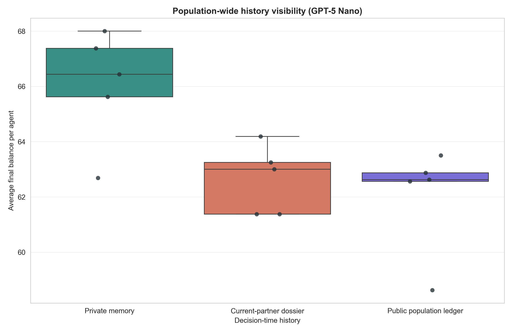
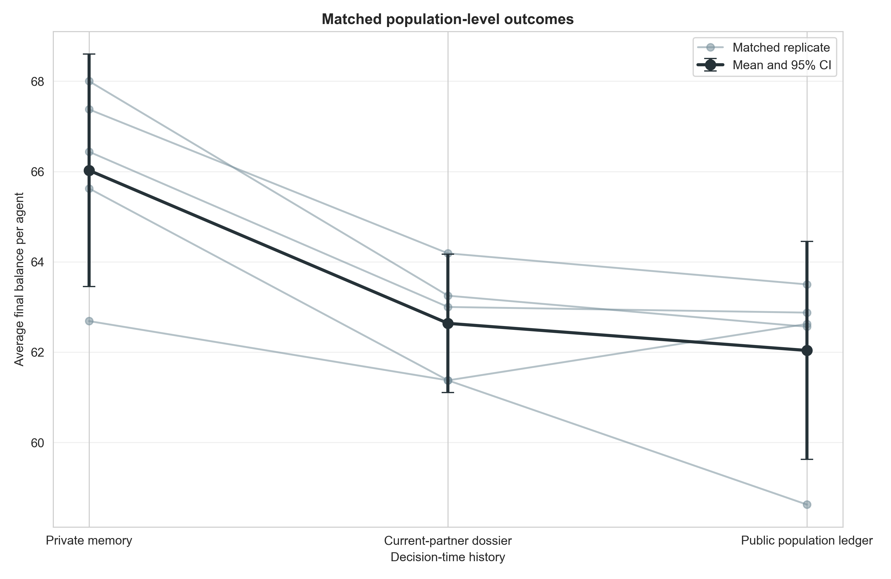
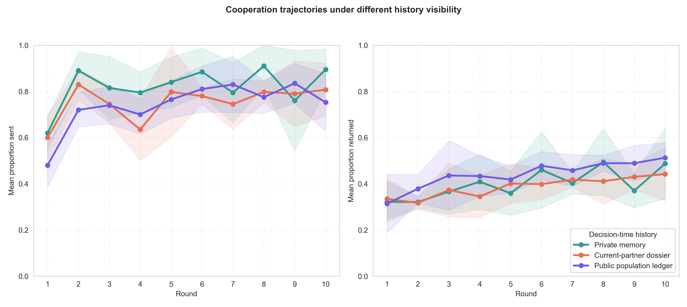

# GPT-5 Nano public population-ledger screen

## Question and design

This exploratory screen asks whether population-wide interaction visibility
supports cooperation in the rotating eight-agent trust game. It compares three
game-only decision-time history conditions:

- **Private memory:** agents retain their own last three game exchanges in
  private conversation memory; no synthetic history block is added.
- **Current-partner dossier:** the same private memory plus the current
  co-player's previous three games, including third-party encounters.
- **Public population ledger:** the same private memory plus a shared record of
  all four dyads in each of the previous three population rounds. Agents have
  stable neutral pseudonyms (`Member A` through `Member H`), and the current
  co-player is identified by pseudonym.

The public ledger contains only communicated/noisy sends and returns. It never
exposes the hidden true value of a transfer. Every current game prompt in a
given round contains the same ledger snapshot; myth prompts are outside this
game-only screen.

All three arms use GPT-5 Nano, five independent eight-agent populations, ten
rounds, anonymous balanced rotating dyads, three-round private chat memory,
and informed signed `U(−1,+1)` noise after both decisions. Pairing schedules
and noise draws are matched by replicate across arms.

## Completion and audit

All 15/15 selected populations passed the joint expanded audit:

- 150 complete population-rounds and 600 completed dyads;
- 1,200 accepted LLM decisions with no retries or unrecovered failures;
- 1,200 transfer-noise checks with no bound violations;
- identical realized pairing schedules across matched arms; and
- exact reconstruction of every public-ledger prompt from the communicated
  transfers saved in prior rounds, including correct stable IDs and current-
  partner mappings.

The ledger auditor checks exact text, not merely the number of history rows, so
true transfers cannot silently enter this treatment.

## Results

Run-level means and 95% t intervals across five independent populations:

| Decision-time history | Final balance/agent | Proportion sent | Return ratio |
|---|---:|---:|---:|
| Private memory | 66.03 [63.45, 68.60] | .821 [.769, .872] | .399 [.353, .445] |
| Current-partner dossier | 62.64 [61.10, 64.17] | .753 [.722, .783] | .387 [.339, .435] |
| Public population ledger | 62.04 [59.62, 64.45] | .741 [.692, .789] | .441 [.401, .481] |

Paired final-balance contrasts:

- Current-partner dossier minus private memory: `−3.39` per agent (95% CI
  `[−5.02, −1.75]`, raw `p=.0045`, Holm `p=.0136`).
- Public ledger minus private memory: `−3.99` (`[−7.20, −0.77]`, raw
  `p=.0261`, Holm `p=.0523`).
- Public ledger minus current-partner dossier: `−0.60`
  (`[−2.39, +1.19]`, `p=.404`).

Because total population welfare in this trust game is determined by sending,
the final-balance and proportion-sent contrasts are mathematically equivalent.
The ledger did not depress returning: its return ratio was 5.4 percentage
points higher than the partner dossier (`[+0.8, +10.0]`, raw `p=.031`; Holm
`p=.094` across the three return-ratio comparisons). Returns redistribute
resources within dyads and therefore do not explain the welfare difference.

## Round-one diagnostic

The public-ledger arm already sent less in round 1, when no prior ledger rows
existed: `.480` versus `.620` under private memory and `.600` under the partner
dossier. The paired public-minus-private round-one difference was `−.140`
(`95% CI [−.242, −.038]`, post-hoc unadjusted `p=.019`). All five matched
replicates were negative.

This is scientifically informative but limits the mechanism claim. The arm is
a **public-monitoring package**: stable pseudonyms, the knowledge that
transfers are publicly observed, and the subsequent population records. Its
effect cannot be attributed solely to learning from the ledger because the
anticipatory/framing component operates before records exist.

## Interpretation and next tests

At `n=5`, population-wide information does not increase cooperation relative
to private memory and looks very similar to a current-partner dossier. A
plausible interpretation is that explicit reputation information promotes
conditionality or retaliation at least as much as reputational reward. The
round-one result also leaves open prompt framing, identity salience, or
anticipated monitoring as causes.

This is exploratory, one-model evidence. The two most informative follow-ups
are:

1. cross the public-ledger arm with Myth→Game, using the same matched seeds, to
   test whether a pre-decision cultural signal raises cooperation under public
   monitoring; and
2. add a stable-pseudonym/no-ledger control to distinguish identity and
   monitoring framing from behavioral information in the ledger itself.

## Cost and reproducibility

The 15 selected game-only runs used 1,200 calls. Under the recorded GPT-5 Nano
rates, their estimated combined list-price cost was `$0.079`.

Reproduce with:

```bash
python3 scripts/analyze_population_ledger_gpt_n5.py
```

Outputs are in
`docs/figures/population_ledger_gpt_n5_20260821/`.






