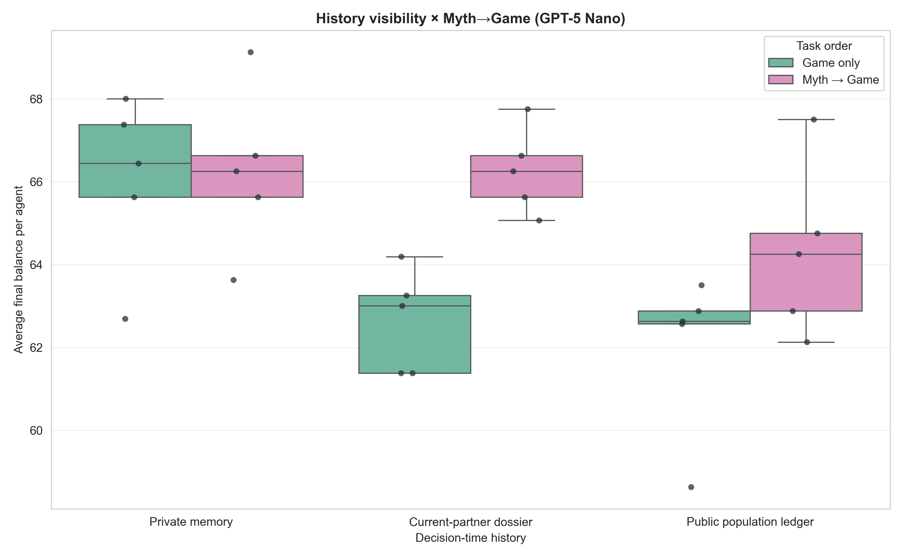
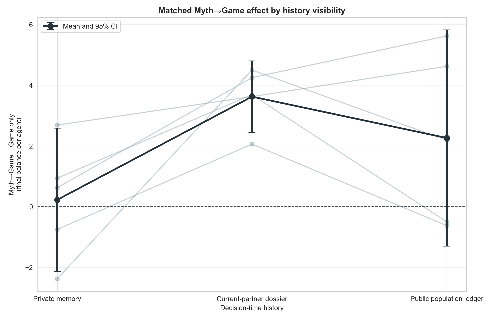
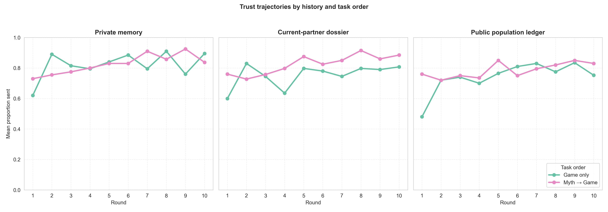

# GPT-5 Nano public ledger × Myth→Game extension

## Frozen question and design

After completing the game-only public-ledger screen, we prospectively froze a
matched five-population Myth→Game extension. The primary exploratory contrast
was:

`Myth→Game − Game only | public population ledger`.

The new cell uses GPT-5 Nano, eight agents, ten rounds, balanced rotating
dyads, stable `Member A`–`Member H` pseudonyms, and a shared ledger containing
the communicated/noisy transfers from all dyads in the previous three
population rounds. Noise is informed signed `U(−1,+1)` after both decisions.
The two-task memory capacity is six task exchanges, preserving the same three-
round private-memory horizon as the game-only capacity of three.

The frozen protocol is in
`docs/population_ledger_myth_game_protocol_2026-08-21.md`.

## Acceptance gate

All five new populations passed the expanded audit jointly with their five
matched public-ledger Game-only populations:

- 100 complete population-rounds and 400 completed dyads;
- 1,200 accepted task responses, with no retries or unrecovered failures in
  these ten public-ledger runs;
- 800 send/return noise checks with no bound violations;
- exact reconstruction of every ledger row and stable-ID mapping; and
- identical realized pairing schedules across each matched seed.

The broader `3 × 2` analysis reuses the already-audited clean private-memory
and current-partner-dossier cells. Exact-seed replacements are used wherever a
previous GPT response failed the myth boundary.

## Results

Run-level means and 95% t intervals across five independent populations:

| Decision-time history | Game only | Myth→Game | Matched Myth→Game effect |
|---|---:|---:|---:|
| Private memory | 66.03 [63.45, 68.60] | 66.25 [63.79, 68.71] | +0.23 [−2.13, +2.58] |
| Current-partner dossier | 62.64 [61.10, 64.17] | 66.26 [64.99, 67.53] | +3.63 [+2.45, +4.80] |
| Public population ledger | 62.04 [59.62, 64.45] | 64.30 [61.72, 66.88] | +2.26 [−1.30, +5.82] |

### Frozen primary contrast

Myth→Game raised average final balance by `+2.26` per agent under the public
ledger (95% paired CI `[−1.30, +5.82]`, `p=.152`, paired Cohen's `dz=.79`).
The point estimate is moderately large, but the interval is wide and two of
five matched populations did not improve. The result is directional rather
than statistically resolved at `n=5`.

Mean proportion sent rose from `.741` to `.786`, the behaviorally equivalent
effect. Mean return ratio also rose from `.441` to `.493` (`+5.2` percentage
points, `p=.118`); returns do not determine total welfare.

### Secondary interactions

The public-ledger Myth→Game effect did not differ clearly from either existing
history condition:

- public ledger versus private-memory task effect: `+2.04`
  (`[−1.41, +5.49]`, `p=.176`);
- public ledger versus partner-dossier task effect: `−1.36`
  (`[−4.39, +1.66]`, `p=.279`).

These interactions reuse previously observed comparison cells and are not an
independent confirmation.

## Trajectory diagnostic

Under the public ledger, Myth→Game sent `.760` versus `.480` in round 1, before
any ledger rows existed. That first-round gap accounts for `1.40` of the
`2.26` final-balance difference (about 62%). The two trajectories are much
closer over rounds 2–10.

The most defensible interpretation is therefore not that myths clearly improve
agents' use of public behavioral records. Rather, a myth immediately before
play appears to counter the low-cooperation response to the public-monitoring
frame at the outset. Later ledger-dependent effects are smaller and variable.

## Conclusion and next test

The public-ledger Myth→Game estimate is positive and consistent with the wider
pattern that cultural priming can raise cooperation when explicit reputation
information is present, but this five-population extension is underpowered and
does not identify a ledger-specific interaction.

The next mechanistic arm should retain stable neutral pseudonyms while showing
no population ledger. Comparing it with both private memory and the public
ledger will tell us whether the round-one drop is driven by identity/framing or
by the anticipated public-monitoring component. A larger independent
confirmation should wait until that treatment bundle is decomposed.

## Reproducibility

Run:

```bash
python3 scripts/analyze_population_ledger_myth_game_gpt_n5.py
```

Outputs are in
`docs/figures/population_ledger_myth_game_gpt_n5_20260821/`.






