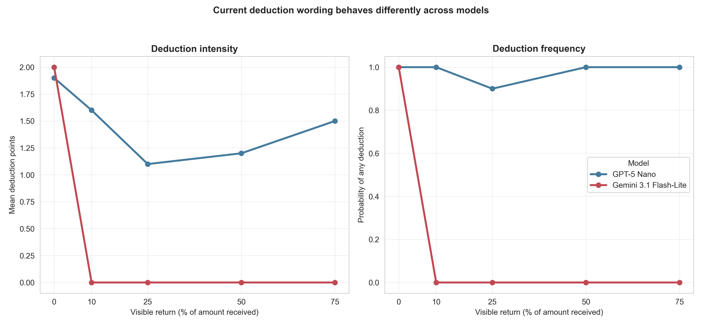

# Deduction comprehension is sharply model-specific

## Result in one sentence

Under the exact same current deduction wording, Gemini 3.1 Flash-Lite applied a
perfect zero-return threshold—spend both points after zero and none after every
positive return—whereas GPT-5 Nano deducted almost universally. The mechanism
is viable for a Gemini pilot, but its response to the `$0–$1` noise band must
be mapped first.

## Design and integrity

The Gemini experiment repeated the accepted current-wording GPT calibration
without changing the myth, full $5 send, system rules, 1:3 deduction
institution, response format, or visible return states (0%, 10%, 25%, 50%, and
75% of $15). It used 10 independent calls per state through the direct Google
endpoint (`N=50`). The design and unchanged selectivity gate were frozen in
`docs/punishment_comprehension_gemini_protocol_2026-08-21.md`.

All 50 calls passed:

- exactly 10 accepted integer decisions per return state;
- identical prompts within cells and exact controlled payoffs;
- zero response-boundary retries or unrecovered provider errors; and
- clean embedded provenance for commit `fe347d24`, the exact config hash,
  provider `google`, and model `gemini-3.1-flash-lite`.

## A qualitative cross-model difference

| Visible return | GPT-5 Nano mean points | GPT any deduction | Gemini mean points | Gemini any deduction |
|---:|---:|---:|---:|---:|
| 0% | 1.9 | 100% | 2.0 | 100% |
| 10% | 1.6 | 100% | 0.0 | 0% |
| 25% | 1.1 | 90% | 0.0 | 0% |
| 50% | 1.2 | 100% | 0.0 | 0% |
| 75% | 1.5 | 100% | 0.0 | 0% |

Gemini's low-minus-high separation was +1.00 points (95% CI `[+.520,
+1.480]`, `p=.00034`), its return slope was −1.716 (`p=.000008`), and
Spearman `rho=−.707` (`p<.000001`). It used deductions in 0% of the high-
return calls, produced no adjacent reversal, and passed all three frozen gate
components.

GPT failed the same gate: low-minus-high +.40 but 100% high-return deduction
use and a U-shaped response. The Gemini-minus-GPT return-slope interaction was
−1.244 (CI `[−2.117, −.371]`, `p=.0057`). This is not merely a global
difference in willingness to spend. The two models implement different
policies from the same rules.



## Interpretation and next decision

Gemini is eligible for a small population pilot under the frozen rule. Its
policy is highly selective for the exact behavior of the mechanical defectors,
who truly return zero, and avoids the antisocial high-return punishment seen in
GPT-5 Nano.

One issue should be resolved first. In the live game, signed `U(−1,+1)` noise
is applied after a true zero return. Negative draws clamp to a visible $0, but
positive draws make the defector appear to return up to $1. The present
calibration only shows that Gemini deducts at $0 and not at $1.50 (10% of $15);
it does not locate the threshold inside the actual `$0–$1` noise band.

The next efficient experiment is therefore a 50-call Gemini boundary map at
visible returns `$0`, `$.25`, `$.50`, `$.75`, and `$1.00`, with everything
else unchanged. If deductions remain concentrated sufficiently near zero, run
a three-pair Gemini population pilot (0% versus 25% defectors) and measure
targeting before examining cooperation or myths.

## Reproducibility

Run:

```bash
python3 scripts/analyze_punishment_comprehension_crossmodel.py
```

Tables and the figure are in
`docs/figures/punishment_comprehension_crossmodel_20260821/`.
