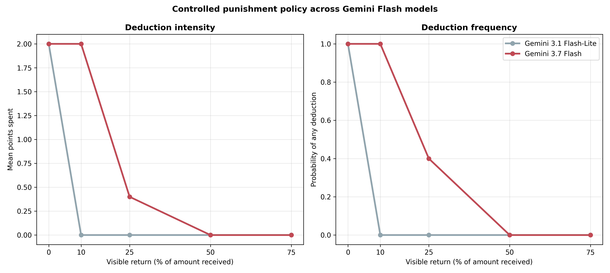

# Gemini 3.7 Flash uses a graded, selective punishment policy

## Result in one sentence

In 50 controlled decisions, Gemini 3.7 Flash punished every 0% and 10% return,
sometimes punished a 25% return, and never punished a 50% or 75% return,
passing every frozen selectivity criterion without a retry.

## Frozen design and integrity

The calibration held the rules, cooperative myth, full `$5` send, `$15`
receipt, two-point deduction budget, 1:3 sanction effect, and response format
fixed. Only the visible amount returned varied: 0%, 10%, 25%, 50%, or 75% of
the receipt, with ten independently sampled calls per level in a frozen random
order.

All 50 calls used Gemini 3.7 Flash through the direct Google API at medium
thinking. Every response passed the integer action boundary on its first
attempt. Cell counts, messages, controlled states, model/provider metadata,
thinking level, omitted temperature, 300-second timeout, and clean Git/config
provenance all passed.

## Results

| Visible return | Dollar return | Mean points spent | Any deduction |
|---:|---:|---:|---:|
| 0% | $0.00 | 2.0 | 10/10 |
| 10% | $1.50 | 2.0 | 10/10 |
| 25% | $3.75 | .4 | 4/10 |
| 50% | $7.50 | 0 | 0/10 |
| 75% | $11.25 | 0 | 0/10 |

Low-return mean spending exceeded high-return spending by exactly two points.
High-return punishment was 0%, and the cell means were strictly non-increasing.
The linear slope was `-2.97` points per unit return ratio (`p=3.96e-15`) and
Spearman rho was `-.890` (`p=5.26e-18`). All three pre-specified gate
components passed.



Gemini 3.7's policy is broader and more graded than the earlier Flash-Lite
policy under this exact calibration. Flash-Lite spent two points at a literal
zero return but zero at every positive ratio cell; Gemini 3.7 still imposed the
maximum sanction at 10% and sometimes a one-point sanction at 25%. Both models
fully restrained punishment at half or more.

This predicts especially reliable targeting of mechanical defectors under the
live `U(-1,+1)` observation noise: a true zero return can appear at most about
one dollar above zero, still below the `$1.50` level that Gemini 3.7 punished
in every controlled call. This is a prediction for the population test, not a
substitute for it.

## Decision

Gemini 3.7 is eligible for a small full-population punishment screen. Because
its baseline sending is completely ceiling-limited, the efficient design is a
new-seed 2x2 crossing deduction availability with 0% versus 25% hidden
defectors. That single screen can assess live targeting, whether defectors
create behavioral headroom, and whether the defector-dependent return crowding
seen in Flash-Lite generalizes.

## Cost and reproducibility

The calibration used 38,660 input tokens, 368 visible output tokens, and 8,109
thinking tokens. Estimated list-price cost was `$0.061`.

Run:

```bash
python3 scripts/analyze_punishment_comprehension_gemini37.py
```

Trial-level decisions, cell summaries, the frozen gate, metadata, token usage,
and the figure are in
`docs/figures/punishment_comprehension_gemini37_20260823/`.
