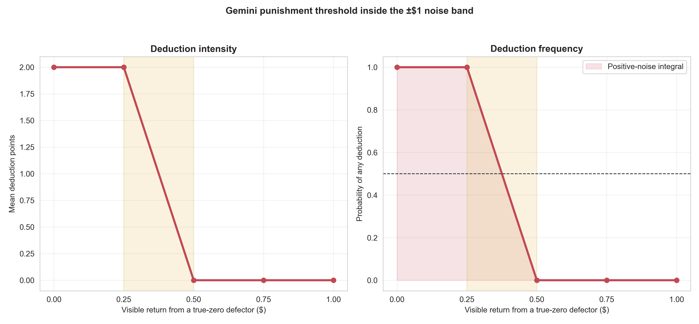

# Gemini's punishment threshold inside the live noise band

## Result

Gemini 3.1 Flash-Lite used a sharp threshold between a visible $.25 and $.50
return. Under the actual clamped `U(−1,+1)` noise applied to a mechanical
defector's true $0 return, the frozen interpolation implies a 68.75%
probability of punishment. The mechanism passes the gate for a small Gemini
population pilot.

## Design and integrity

The calibration held the current deduction wording, fixed cooperative myth,
full $5 send, $15 received, 1:3 deduction effect, response format, and direct
Gemini endpoint constant. It varied only the communicated return over the full
noise band: `$0`, `$.25`, `$.50`, `$.75`, and `$1`, with 10 randomized calls
per amount (`N=50`). The protocol and integration rule were frozen in
`docs/punishment_comprehension_gemini_noise_boundary_protocol_2026-08-21.md`.

All checks passed: 50/50 integer decisions, exact cell balance and states,
identical messages within cells, zero retries or provider errors, and clean
commit/config/provider provenance (`203ecd9f`, direct Google,
`gemini-3.1-flash-lite`).

## Exact observed boundary

| Visible return | Mean deduction points | Any deduction |
|---:|---:|---:|
| $0.00 | 2.0 | 100% |
| $0.25 | 2.0 | 100% |
| $0.50 | 0.0 | 0% |
| $0.75 | 0.0 | 0% |
| $1.00 | 0.0 | 0% |

The empirical switch interval is therefore `($.25, $.50)`. This is well
inside the band that positive return noise can generate from a true zero.

The live distribution has probability .5 at visible $0 because all negative
noise draws clamp to zero, plus uniform density .5 over `(0,$1]`. Piecewise-
linear interpolation across the five frozen points gives:

- positive-noise punishment area: .375;
- implied punishment probability for a true-zero defector:
  `.5 × 1 + .5 × .375 = .6875`; and
- implied mean deduction intensity: 1.375 points.

The 68.75% figure is a calibrated interpolation, not a direct population
estimate. The observed endpoints themselves are deterministic in this sample.



## Decision

Proceed to the predeclared small population test: three matched Gemini
Myth→Game population pairs with 0% versus 25% hidden mechanical defectors and
the unchanged current deduction wording. The primary mechanism outcome should
remain within-treatment targeting by ordinary senders:

- deduction intensity and frequency toward defectors versus ordinary
  receivers; and
- their relationship to the exact communicated return.

Only after that targeting check should we interpret sending, returning, or
myth differences. Noise means some defector encounters will not be punished,
and ordinary receivers with an unusually low visible return may be punished;
the population pilot should measure both rather than assume perfect
classification.

## Reproducibility

Run:

```bash
python3 scripts/analyze_punishment_comprehension_gemini_noise_boundary.py
```

Tables and the figure are in
`docs/figures/punishment_comprehension_gemini_noise_boundary_20260821/`.
