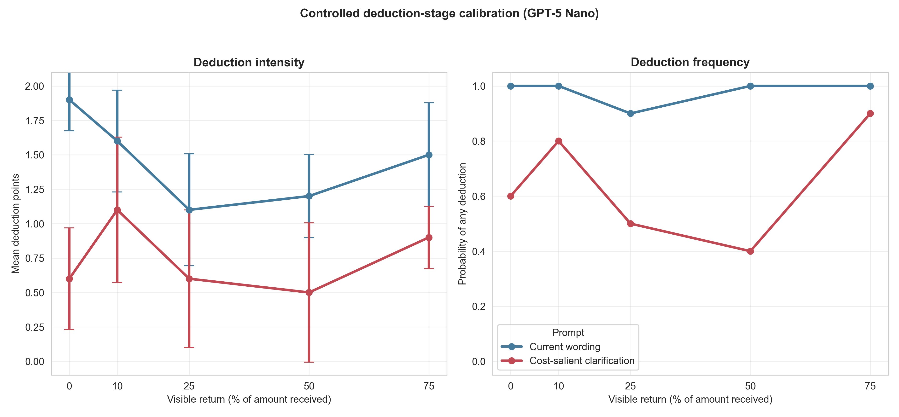
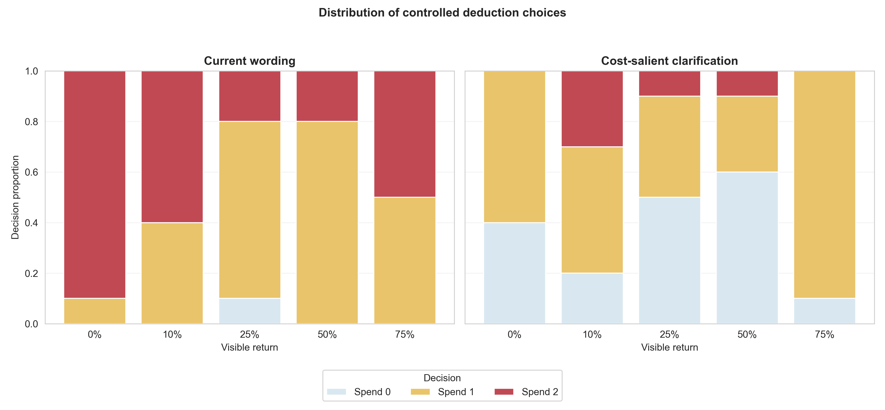

# Deduction-stage mechanism comprehension: GPT-5 Nano

## Result in one sentence

GPT-5 Nano does not use the current deduction stage as a selective sanction:
it spent points after every high-return scenario, and making the personal cost
more explicit lowered spending globally without making it track return level.
Neither wording passed the frozen gate for a population pilot.

## Controlled design and integrity

The calibration held constant the model, system rules, fixed cooperative myth,
full $5 sender decision, deduction budget, 1:3 effect, response format, and
Myth→Game decision instruction. It varied only:

- the visible return: 0%, 10%, 25%, 50%, or 75% of the $15 received; and
- current wording versus a norm-neutral clarification that spending is
  optional, zero is valid, and each point costs the sender $1 relative to
  keeping it.

The protocol and selectivity gate were frozen in
`docs/punishment_comprehension_gpt_protocol_2026-08-21.md`. Ten independent
direct OpenAI calls were randomized into each of the ten cells (`N=100`).

All acceptance checks passed:

- exactly 100 decisions and 10 per cell;
- every accepted decision was an integer in `[0,2]`;
- zero boundary retries or unrecovered provider errors;
- identical messages within every cell and exact controlled payoffs;
- a single fixed myth and sender history across all calls; and
- embedded clean-worktree provenance for commit `f14dc29b`, the exact config
  hash, provider `openai`, and provider model `gpt-5-nano`.

## Results

| Visible return | Current: mean points | Current: any | Cost-salient: mean points | Cost-salient: any |
|---:|---:|---:|---:|---:|
| 0% | 1.9 | 100% | .6 | 60% |
| 10% | 1.6 | 100% | 1.1 | 80% |
| 25% | 1.1 | 90% | .6 | 50% |
| 50% | 1.2 | 100% | .5 | 40% |
| 75% | 1.5 | 100% | .9 | 90% |

The current prompt shows a limited response to return level: low-return states
(0%/10%) elicited .40 more points than high-return states (50%/75%), CI
[+.101, +.699], `p=.010`; Spearman `rho=−.329`, `p=.019`. But this is not
selective punishment in the operational sense. Agents deducted in **all 20/20
high-return calls**, spending an average 1.35 of two points. The curve is
U-shaped: spending falls through 25% and then rises again at 50% and 75%.

The cost-salient clarification had a strong overall effect but the wrong
mechanistic profile. It reduced mean spending from 1.46 to .74 points
(`−.72`, CI `[−.954, −.486]`, `p<.000001`) and any-deduction frequency
from 98% to 64%. Yet its return slope was effectively zero (`+.003`,
`p=.994`), Spearman `rho=.014` (`p=.922`), and its low-minus-high separation
was only +.15 (CI `[−.249, +.549]`, `p=.451`). It still deducted in 65% of
high-return calls and in 90% of the 75%-return calls.

The wording×return slope interaction was uncertain (`+.475`, CI `[−.380,
+1.329]`, `p=.273`). Both variants failed all or most components of the frozen
selectivity gate; the clarified wording is therefore **not eligible** for a
population pilot.





## Interpretation and decision

The population result was not merely caused by noisy, hard-to-classify game
histories. Under fully controlled states, the current prompt makes using the
new action nearly a default. Clarifying its cost changes the model's overall
propensity to act, but does not turn the decision into a calibrated response to
free riding. This is an action-affordance/prompt-policy problem, not evidence
of selective norm enforcement.

Do not run a larger GPT-5 Nano punishment population with either wording. The
predeclared rule also counsels against iteratively tuning prose until the model
produces the desired curve. If explicit punishment remains a project priority,
the defensible options are:

1. run the unchanged controlled calibration in another model to determine
   whether the failure is model-specific; or
2. redesign the economic institution itself and treat that as a new
   experiment, for example by spending directly from existing earnings rather
   than introducing a separate salient point budget.

## Reproducibility

Run:

```bash
python3 scripts/analyze_punishment_comprehension_calibration.py
```

Tables and figures are in
`docs/figures/punishment_comprehension_gpt_20260821/`.
