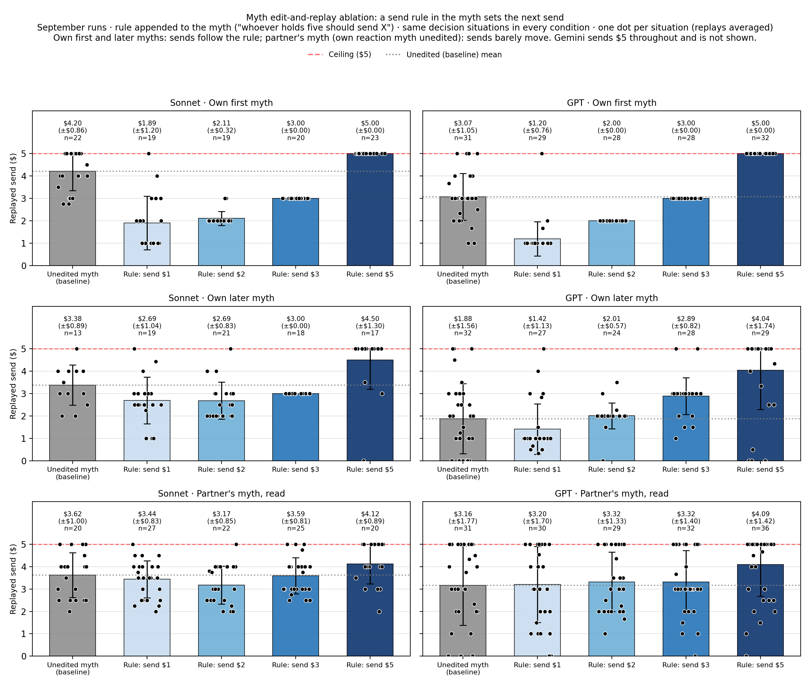

# What the replay ablation plot shows

*Colours follow the slide-678 ablation plot: grey = unedited myth, then red ($1), orange ($2),
blue ($3), green ($5).*

**In one line:** if we change only the amount an agent's *own* myth tells it to send, the agent
sends that amount; if the rule sits in a myth it *read* from a partner, its send hardly moves.

**How we tested it:** we took real decisions from the September runs and replayed them with
exactly the same text, except for one added sentence in a myth: *"whoever holds five should send
$1 / $2 / $3 / $5."* Any change in the send is caused by that sentence.

## Top row: the agent's own first myth (written just before its first send)

- The bars form a clean staircase that matches the rule.
- GPT sends **$1.20, $2.00, $3.00, $5.00** (unedited baseline $3.07).
- Sonnet sends **$1.89, $2.11, $3.00, $5.00** (baseline $4.20).
- Nearly every dot sits exactly on the stated amount.
- In plain terms: whatever plan the agent writes down, it carries out.

## Middle row: the agent's own later myth (written after a game, before the next)

- Still a staircase, but flatter and noisier.
- GPT goes from **$1.42** at "send $1" to **$4.04** at "send $5".
- Sonnet resists low amounts somewhat (about $2.70 at $1 and $2) but goes to **$4.50** at $5.
- Later myths still work as a plan for the next round, just less strictly. By then the agent
  also has the game it just played to go on.

## Bottom row: a partner's myth the agent read

- The bars barely move from the grey baseline for $1, $2 and $3.
- Only "send $5" lifts them, by about $0.50–0.90.
- Reading someone else's rule nudges an agent only a little.
- This is a lower bound: in these replays the agent's own myth, written in reaction to the
  original partner myth, was left unchanged.

## Not shown

Gemini sends $5 whatever its myth says.

## What it means for the research question

A send amount written into an agent's own myth drives its next decision almost completely, which
supports "the myth works as the agent's plan". Two limits:

- These are single decisions, not cooperation over whole runs.
- An amount told *inside the story*, rather than as an explicit rule, has a weaker effect.

*Bar values average each decision situation's replays first, so they differ slightly from the
per-$1 slopes in `README.md` (own first myth $0.93 per $1, own later myth $0.68, partner's myth
$0.23; Sonnet and GPT pooled).*
