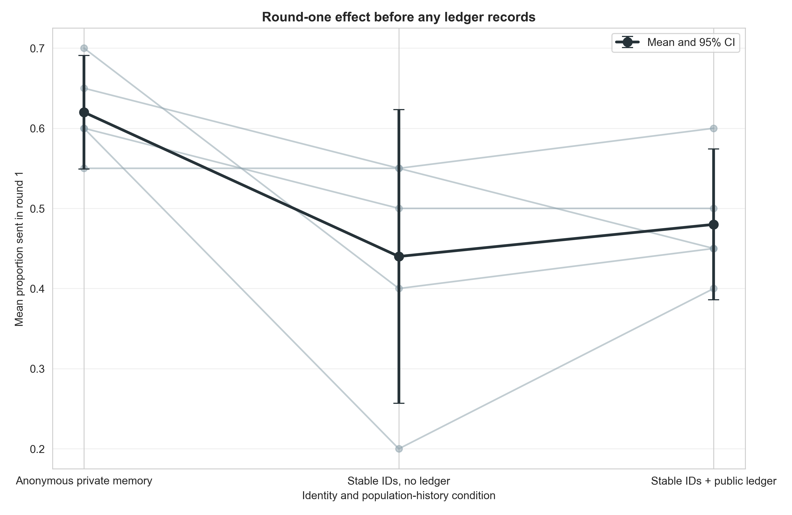
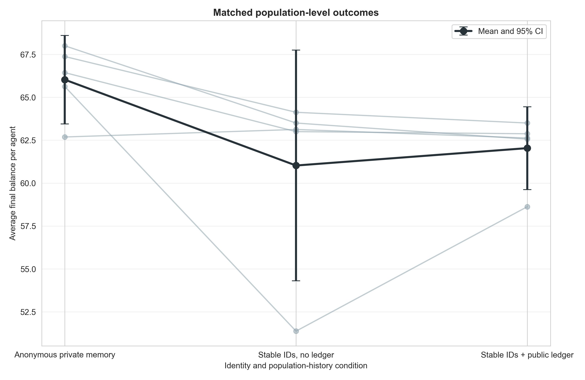
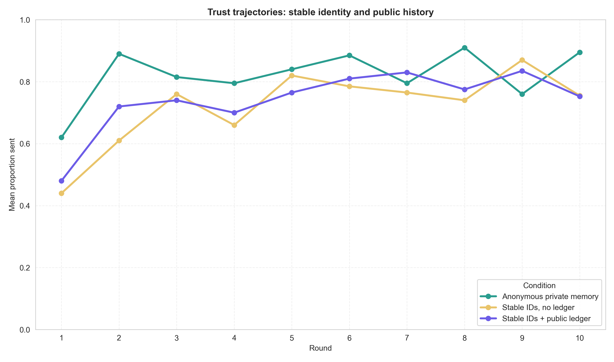

# GPT-5 Nano stable-ID/no-ledger mechanism control

## Frozen question and design

The public-ledger Game-only arm sent less from round 1, before behavioral
records existed. We froze a five-population control to distinguish persistent
identity/current-partner mapping from the public-monitoring/ledger component.

The three matched Game-only conditions are:

- **Anonymous private memory:** current opponents are referred to only as the
  current co-player; no stable ID or synthetic history block is shown.
- **Stable IDs, no ledger:** agents and current co-players are mapped to stable
  `Member A`–`Member H` IDs, but no population history or public-ledger
  announcement is shown.
- **Stable IDs + public ledger:** the same persistent IDs plus the communicated/
  noisy transfers from every dyad in the previous three population rounds and
  the statement that all agents see this ledger.

All cells use GPT-5 Nano, eight agents, ten rounds, balanced rotating dyads,
three-round private chat memory, hidden display names, informed signed
`U(−1,+1)` noise after both decisions, and matched seeds 0–4. The protocol was
frozen in `docs/stable_ids_control_protocol_2026-08-21.md`.

## Acceptance gate

All 15/15 selected populations passed the expanded audit jointly:

- 150 complete population-rounds and 600 dyads;
- 1,200 accepted decisions with no retries or unrecovered errors;
- 1,200 transfer-noise checks with no violations;
- identical realized schedules across the three matched arms;
- exact stable own/current-partner mappings in every relevant prompt; and
- no population-history rows in the stable-ID/no-ledger arm.

## Primary round-one result

Mean round-one proportion sent was:

| Condition | Proportion sent, round 1 |
|---|---:|
| Anonymous private memory | .620 [.549, .691] |
| Stable IDs, no ledger | .440 [.257, .623] |
| Stable IDs + public ledger | .480 [.386, .574] |

The prespecified public-ledger-minus-stable-ID contrast was only `+.040`
(95% paired CI `[−.095, +.175]`, `p=.456`). The public-monitoring announcement
therefore does not explain the initial ledger-arm decrease at this scale.

Stable IDs minus anonymous private memory was `−.180`
(`[−.384, +.024]`, `p=.070`, `dz=−1.10`). Four matched populations decreased
and one was unchanged. This points to the persistent-identity/current-partner
prompt bundle as the source of the early effect, though the `n=5` interval
still includes zero.

## Full-run outcomes

| Condition | Final balance/agent | Proportion sent | Return ratio |
|---|---:|---:|---:|
| Anonymous private memory | 66.03 [63.45, 68.60] | .821 [.769, .872] | .399 [.353, .445] |
| Stable IDs, no ledger | 61.03 [54.30, 67.75] | .721 [.586, .855] | .283 [.192, .373] |
| Stable IDs + public ledger | 62.04 [59.62, 64.45] | .741 [.692, .789] | .441 [.401, .481] |

Stable IDs minus anonymous private memory was `−5.00` final-balance units
(`[−11.83, +1.83]`, `p=.112`). One stable-ID population was much less
cooperative than the other four, producing substantial uncertainty. The public
ledger versus stable IDs estimate was `+1.01` (`[−3.33, +5.36]`, `p=.553`), so
the ledger does not have a resolved effect on sending or welfare beyond stable
identity.

In a post-hoc diagnostic, however, the public ledger raised return ratios by
`.158` relative to stable IDs (`[+.055, +.261]`, unadjusted `p=.013`); every
matched population moved in the same direction. This does not directly create
population surplus, because returns redistribute existing resources, but it
suggests that seeing population records may make reciprocal returning more
normatively or strategically salient.

## Interpretation

The earlier round-one ledger difference should not be described as an effect
of learning from public records or of the public-monitoring announcement. The
best current explanation is that persistent identity/current-partner mapping
changes GPT-5 Nano's default strategy from the outset and permits partner-
specific tracking through private memory in later rounds.

This control is not a perfect one-variable wording ablation: the stable-ID arm
also explicitly says that no population history is shown, whereas the anonymous
arm has no identity header. The conclusion is therefore about the identity/
mapping prompt bundle, not stable IDs in isolation.

The public ledger does not recover sending relative to stable IDs, but its
consistent return-ratio increase is a concrete hypothesis for a larger
confirmation. Before scaling, a further information-only arm could show the
same population transfers under unstable per-round labels; that would separate
general social-norm information from persistent reputation tracking.

## Reproducibility

Run:

```bash
python3 scripts/analyze_stable_ids_control_gpt_n5.py
```

Outputs are in `docs/figures/stable_ids_control_gpt_n5_20260821/`.






