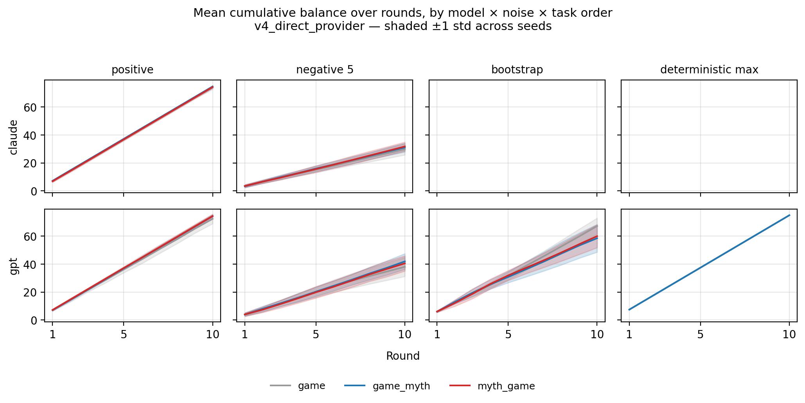
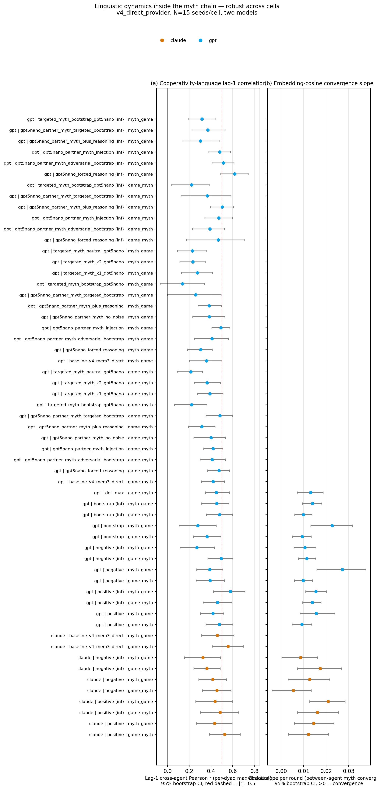
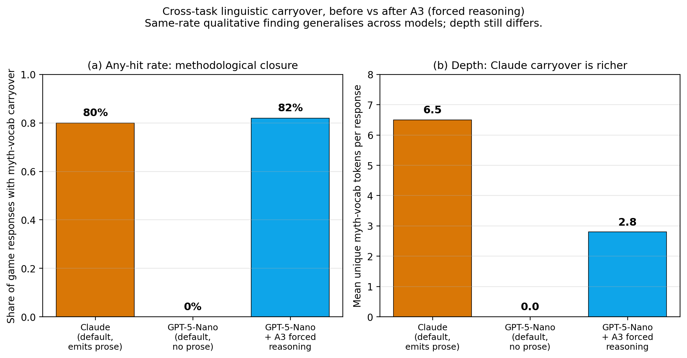
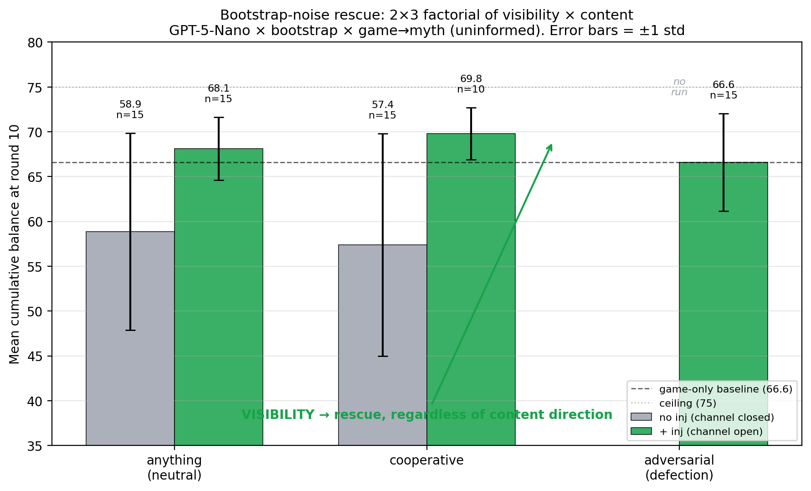

# 4. Results

## 4.1 Cross-model behavioural baselines (no-noise)

The two models occupy distinguishable but no longer dramatically different no-noise regimes. In the v4 direct-provider configuration with $T = 10$, mem-3, and the unconstrained `anything` myth topic, GPT-5-Nano reaches a mean cumulative dyad balance of 69.2 in the game-only cell (median 71.0, std 4.6, $N=15$), with `game_myth` and `myth_game` cells slightly higher (71.1 and 72.3). Claude-Sonnet-4.5's matched no-noise cell is under-replicated ($N = 2$); the prior `baseline/` corpus gives a mean of 55.7 (median 55.0, std 2.6, $N = 15$). Maximum possible dyad reward is 150. This revises an earlier working assumption: pilot work with GPT-5-Nano via OpenRouter showed apparent floor-locking at mutual defection, but with the direct provider the same model reaches roughly half the dyad ceiling without any noise intervention. The cross-model gap is therefore moderate, around 14 points, not the chasm the pilot suggested. We retain Claude as the higher-cooperation regime and GPT-5-Nano as the more variable one, but both exhibit substantive cooperation at baseline [@serapio2023]. Across-seed dispersion drops monotonically across task orders even at baseline (std 4.6 to 1.1 for GPT-5-Nano), so the variance-reduction pattern in §4.3 is not specific to the noise interventions.

## 4.2 Effect of noise on the cooperation profile

Direction of noise dominates the noise effect. Across the four implemented mechanisms, positive (uniform $+5$) noise pushes both models near the cooperation ceiling: Claude reaches a game-only mean of 73.5 (informed: 74.2), GPT-5-Nano 72.5 (informed: 72.4). Negative (uniform $-5$) noise depresses Claude to 29.3 (informed: 30.4) but lifts GPT-5-Nano relative to its baseline, to 37.9 (informed: 38.4); agents perceive losses as smaller than they are, sustaining trust longer.

Bootstrap noise is qualitatively distinct. It replaces the trustee's returned amount with the maximum possible return every round, masking actual reciprocation. GPT-5-Nano's game-only mean under bootstrap is 66.6 (informed: 67.9), well above no-noise. Bootstrap is therefore not just an "upward" variant; it removes the trustee-return signal entirely, a property that becomes load-bearing in §4.3. Informedness has not produced a large qualitative shift: agents told the channel is noisy still respond mainly to the realised ledger, and informed and uninformed cells differ by 1–2 points across most cells. We treat it as a robustness check. Gemini cells from the prior pilot are out of scope per §3.4 and left for the EMNLP follow-up.

## 4.3 Effect of myth-writing on game behaviour (the headline question)

The myth effect is conditional on the noise regime, not universal. Of 24 evaluable (model $\times$ noise $\times$ myth-order) cells in v4, the joint $\Delta$mean and variance-ratio classification (with bootstrap CIs) gives 4 lift+consolidation, 1 pure consolidation, 2 pure lift, 13 null, 2 harmful, and 2 destabilizing — seven positive cells, four negative, thirteen null. Lift+consolidation lives entirely in upward-noise cells; destabilization lives entirely in GPT-5-Nano $\times$ bootstrap. @fig-decision summarises the full classification.

{#fig-decision width=100%}

The strongest positive cells (lift+consolidation, with both mean and variance CIs strict) sit entirely in upward-noise conditions, and their variance reductions run between 3$\times$ and 20$\times$ relative to the matched game-only cell. The negative cells, by contrast, are all GPT-5-Nano $\times$ bootstrap; the four harmful or destabilizing cells share $\Delta$mean estimates roughly between $-7$ and $-10$ points of dyad reward. Per-cell estimates and bootstrap CIs are tabulated in @tbl-percell-deltas (§A.4).

The asymmetry is structural. Under upward noise, agents observe a perceived signal at least as positive as the underlying decision, and the dyad locks onto a coordination point [@boyd2011]. Under bootstrap, the perceived signal contradicts the underlying interaction and myth introduces a competing structured prior. All eight negative-noise cells are null.

{#fig-trajectories width=100%}

## 4.4 Linguistic dynamics in the myth chain

Between-agent embedding cosine convergence is robust across cells. Pairwise cosine between Agent_1 and Agent_2 myths at the same round (sentence-transformers/all-mpnet-base-v2, normalised) shows a positive slope in 18 of 21 cells, strongest in GPT-5-Nano $\times$ negative_5 $\times$ `myth_game` (slope +0.027/round [0.016, 0.038], cosine 0.42 $\rightarrow$ 0.74 across 10 rounds), GPT-5-Nano $\times$ bootstrap $\times$ `myth_game` (+0.023/round), and Claude $\times$ positive (informed) $\times$ `myth_game` (+0.021/round). Convergence holds even where the game outcome is null or harmful, so linguistic alignment is not contingent on behavioural improvement [@fontana2024].

Lag-1 cross-agent cooperativity correlations are positive in every cell. Pearson r between Agent_A's cooperativity-lexicon score in round-$t$ myth and Agent_B's in round $t+1$ ranges 0.27–0.58 in mean per-dyad max-direction, with 27–73% of dyads above |r| > 0.5. The strongest cell is GPT-5-Nano $\times$ positive (informed) $\times$ `myth_game` (lag1_max mean 0.58 [0.43, 0.71], 73% of dyads above 0.5); the pilot's Claude r $\approx$ 0.72 sits at the upper tail of a clearly non-zero distribution and is representative, not anomalous. Both convergence and lag-1 transmission are summarised across cells in @fig-linguistic.

Coinages persist within myth chains but do not transfer into game-reasoning text in any cell; the pilot observation of cross-task coinage leakage does not replicate at corpus scale.

{#fig-linguistic width=100%}

## 4.5 Coupling between game behaviour and myth content

Claude emits extensive game-response prose threaded with own-myth vocabulary: 78–82% of round-level responses contain at least one content word from the preceding myth (mean 5–7 unique overlaps per response), and 100% of runs have at least one such reference, with theme-lexicon hits (story, spirit, elder, sacred, ancestor, ritual) reaching 10–33% of responses. GPT-5-Nano, by default, emits no reasoning prose at all — its `game_responses[ag].content` is the bare JSON action (e.g. `{"send": 3}`, ~12 characters), which makes the metric methodologically undecidable in that configuration. An A3 forced-reasoning addendum closes the gap: GPT-5-Nano under A3 matches Claude's any-hit rate at 80–82% (@fig-reason-coding).

{#fig-reason-coding width=100%}

Three layers of evidence point the same direction: between-agent embeddings systematically converge in 18/21 cells; cooperativity-lexicon scores transmit lag-1 between agents in every cell; and for Claude, myth-vocabulary content is present in essentially every game response. The carriers differ across semantic embedding, narrow lexical scoring, and thematic vocabulary, but all three indicate that the myth channel is doing measurable work [@leng2023; @piatti2024]. The §4.3 mean-and-variance picture is consistent with this: language is doing real work, but its sign depends on whether it converges with or competes against the noise channel [@smith2017].

## 4.6 Tightening the cross-task channel — a 2x3 mechanism factorial

We opened the implicit channel of §3.3 by quoting the partner's most recent myth verbatim inside the trust-game prompt — a **partner-myth injection** variant — and ran it on the four noise conditions of §4.3 (all GPT-5-Nano).

In the bootstrap cells where myth was harmful, partner-myth injection reverses the destabilisation. Bootstrap $\times$ `game_myth`: baseline anything-myth $\Delta$mean -7.7 against a game-only mean of 58.9 (std 11.0); with injection, $\Delta$mean +1.5 (mean 68.1, std 3.5). The pattern holds in `myth_game` ($\Delta$mean -7.6 $\rightarrow$ +1.8; std 9.2 $\rightarrow$ 3.6). Across-seed variance collapses roughly threefold and mean cooperation returns to baseline. In the positive-noise cells where myth was already lifting, injection adds no detectable extra effect ($\Delta$mean change < 0.2 across all four positive cells). The intervention is regime-conditional: it acts only where the implicit channel was failing.

To discriminate visibility from content, a follow-up factorial varied the myth topic across three directions: anything-myth (neutral content), cooperative-themed (`reciprocity_oath`, a story about honouring reciprocal obligations), and adversarial (`trickster_exploitation`, a story about being exploited by a defector). Each crossed with the visibility manipulation (no injection vs injection), yielding [N_CELLS] cells of fresh data, all GPT-5-Nano $\times$ bootstrap, $N = 15$ per cell.

Visibility dominates content direction. The 2 $\times$ 3 factorial on bootstrap $\times$ `game_myth` (uninformed):

| Content / visibility | No injection | + Injection |
|---|---|---|
| Anything (neutral) | 58.9 $\pm$ 11.0 (harmful) | **68.1 $\pm$ 3.5** (rescue) |
| Cooperative | 57.4 $\pm$ 12.4 (harmful) | **69.8 $\pm$ 2.9** (rescue) |
| Adversarial (defection-themed) | n/a | **66.6 $\pm$ 5.5** (rescue) |

(The adversarial $\times$ no-injection cell was not run; the no-injection harm pattern was already established in the neutral and cooperative arms.) All three injection cells land in the rescue zone (66–70); both no-injection cells stay in the harmful zone (~58). The same pattern recurs in `myth_game` and in the informed bootstrap variants. Cooperative content modulates the rescue marginally upward (~+2 over neutral) and adversarial content marginally downward (~-2); content direction explains less than 5% of variance, visibility the rest (@fig-bootstrap-rescue).

{#fig-bootstrap-rescue width=100%}

Two further controls anchor the mechanism. An A1 $\times$ no-noise baseline produces no effect ($\Delta$mean -0.8 to +0.9 across two cells, $N = 30$ runs, 0 failures), ruling out the alternative that injection simply lifts cooperation by adding more partner-related text; if that were the mechanism, no-noise cells would also lift. An A1+A3 combination (injection plus a system-prompt addendum requiring 2–3 sentences of reasoning before each JSON action) erases A1's rescue in the bootstrap cells ($\Delta$mean returns to ~-13 against A1). Inspection shows GPT-5-Nano with forced reasoning surfaces explicit cost–benefit calculation rather than coordination; "net zero last round $\rightarrow$ send less" patterns dominate. The Claude reasoning-prose carryover from §4.5 may therefore be partly correlational: cooperative reasoning correlates with cooperative behaviour without necessarily causing it [@vallinder2024].

We read the mechanism as follows. Under bootstrap, agents see a perceived signal that contradicts the underlying game; with the partner's myth visible, both have common-knowledge access to a shared narrative anchor and resolve the contradiction by coordinating on it [@chwe2001]. Cooperative content provides a modest amplifier and adversarial content does not subtract enough to break the rescue, so content is a small modulator and visibility carries the work; the competing-prior interpretation is falsified by both content arms (cooperative and adversarial), since visibility rescues regardless of direction.
