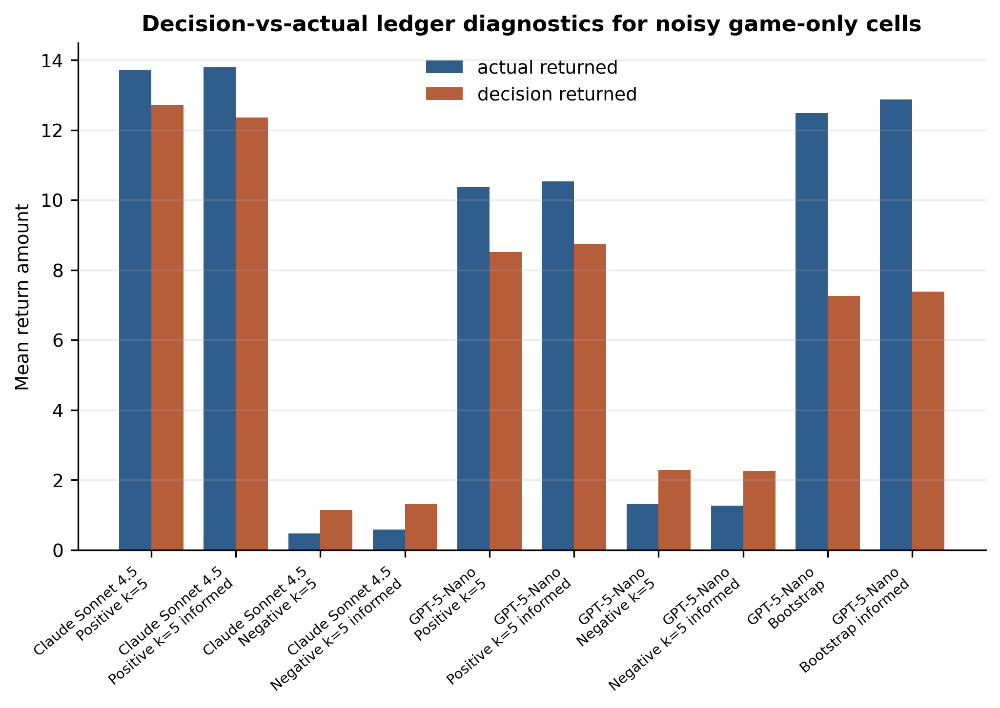
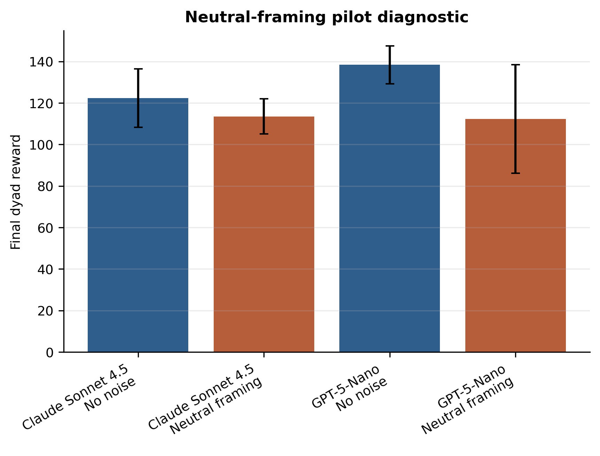
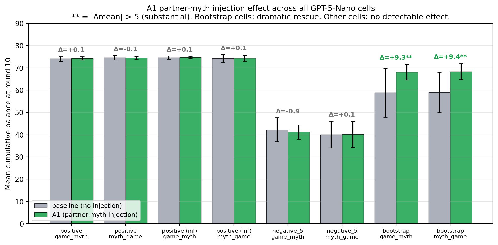

# Appendix

## A.1 Simulation flow and v4 noise bookkeeping

A batch run resolves one `experiment_set` from `config/experiments_noisy.yaml` into the cartesian product of model, prompt template, persona, task order, myth topic, game-parameter preset, and seed. Each cell is one independent dyad. The current direct-provider runs are launched with `LLM_PROVIDER=direct` through `scripts/run_noisy_missing.py`, which skips final JSONs that already exist and reruns only missing outputs.

Within each run, `TrustGameNoisy` assigns roles by round, fixes the move order to investor then trustee, and appends a per-round record to `conversation_history`. When the investor responds, the JSON `send` decision is extracted as `sent_decision`. If noise applies to sends, the environment adds the configured perturbation and clamps to the valid range; this actual amount is stored as `sent`, determines the trustee's received amount, and is shown to the trustee. When the trustee responds, the same process is applied to the `return` decision, yielding `returned_decision` and `returned`.

Payoffs and cumulative balances are computed from `sent` and `returned`, not from the unperturbed decisions. Later prompts also summarize the actual previous ledger. Thus the v4 state has one behavioural ledger plus decision fields, rather than parallel actual/communicated ledgers. A noisy round records `sent_noise`, `returned_noise`, the raw unclipped noise draws, final balances, full structured model responses, and any myth text.

If a game response cannot be parsed, the run aborts and writes an error checkpoint. Myth-writing calls receive one retry. The analysis excludes `.results.json`, `.checkpoint.json`, and `.error.json` files from final tables, while writing discovered error files to `analysis/draft_artifacts/error_manifest.csv`.

## A.2 Analysis artifacts

The draft artifacts are generated by:

```bash
MPLCONFIGDIR=/tmp/nlet-matplotlib XDG_CACHE_HOME=/tmp/nlet-cache \
PYTHONPYCACHEPREFIX=/tmp/nlet-pycache \
python3 scripts/build_neurips_draft_artifacts.py
```

The outputs are:

- `manifest.csv`: one row per final run JSON included in the analysis.
- `error_manifest.csv`: discovered error checkpoint files.
- `behavioral_summary.csv`: per model x condition x task-order behavioural summaries.
- `myth_effects.csv`: bootstrap myth-present deltas against matched game-only controls.
- `linguistic_rounds.csv` and `linguistic_summary.csv`: lexical convergence and cooperativity proxies.
- `draft_findings.md`: compact regenerated findings summary for paper-writing.

## A.3 Noise diagnostics

{#fig-appendix-decision width=100%}

{#fig-appendix-neutral width=100%}

## A.4 Per-cell delta summary (main 24-cell analysis)

Table A.1 summarises the per-cell mean shift and variance-ratio estimates for the 24 evaluable (model x noise x myth-order) cells of the main §4.3 analysis: 4 baseline (no-noise) cells plus 20 noise cells, excluding one GPT-5-Nano deterministic-max cell ($n_{\text{myth}} = 7$, classified as missing). $\Delta$mean is the difference between the matched myth-present cell and its game-only baseline; var ratio is the across-seed variance ratio (myth/game). 95% bootstrap CIs use 2000 resamples. Classifications follow the joint mean-shift x variance-ratio rule described in §3.5.

| Model | Noise | Task order | $\Delta$mean (95% CI) | Var ratio (95% CI) | Class |
|---|---|---|---|---|---|
| claude | no-noise | game->myth | -2.13 [-6.34, +2.00] | 0.52 [0.16, 1.01] | null |
| claude | no-noise | myth->game | -0.93 [-5.14, +3.53] | 0.62 [0.33, 1.10] | null |
| claude | positive | game->myth | +1.11 [+0.29, +1.96] | 0.27 [0.02, 1.76] | lift |
| claude | positive | myth->game | +0.80 [-0.13, +1.75] | 0.49 [0.09, 3.30] | null |
| claude | positive (inf) | game->myth | +0.59 [+0.21, +0.96] | 0.31 [0.03, 0.66] | lift+consolidation |
| claude | positive (inf) | myth->game | +0.15 [-0.33, +0.61] | 1.06 [0.36, 2.13] | null |
| claude | negative_5 | game->myth | +1.29 [-1.60, +4.16] | 0.79 [0.19, 2.66] | null |
| claude | negative_5 | myth->game | +2.48 [-0.36, +5.08] | 0.61 [0.22, 2.07] | null |
| claude | negative_5 (inf) | game->myth | +1.18 [-1.26, +3.33] | 0.36 [0.13, 1.62] | null |
| claude | negative_5 (inf) | myth->game | +1.51 [-0.98, +3.93] | 0.67 [0.21, 3.00] | null |
| gpt5-nano | no-noise | game->myth | +1.87 [-0.60, +4.33] | 0.36 [0.06, 1.78] | null |
| gpt5-nano | no-noise | myth->game | +3.07 [+0.87, +5.33] | 0.06 [0.02, 0.23] | lift+consolidation |
| gpt5-nano | positive | game->myth | +1.65 [-0.20, +3.97] | 0.07 [0.01, 0.65] | consolidation |
| gpt5-nano | positive | myth->game | +2.08 [+0.26, +4.52] | 0.05 [0.00, 0.50] | lift+consolidation |
| gpt5-nano | positive (inf) | game->myth | +2.23 [+0.99, +3.57] | 0.08 [0.01, 0.25] | lift+consolidation |
| gpt5-nano | positive (inf) | myth->game | +1.86 [+0.37, +3.41] | 0.50 [0.02, 2.19] | lift |
| gpt5-nano | negative_5 | game->myth | +4.35 [-0.56, +9.00] | 0.39 [0.10, 1.09] | null |
| gpt5-nano | negative_5 | myth->game | +2.20 [-2.80, +7.19] | 0.48 [0.18, 1.46] | null |
| gpt5-nano | negative_5 (inf) | game->myth | +3.37 [-0.65, +7.20] | 1.41 [0.62, 3.58] | null |
| gpt5-nano | negative_5 (inf) | myth->game | +2.70 [-0.81, +6.23] | 0.98 [0.41, 2.73] | null |
| gpt5-nano | bootstrap | game->myth | -7.73 [-14.07, -1.13] | 2.09 [0.72, 15.95] | harmful |
| gpt5-nano | bootstrap | myth->game | -7.60 [-13.33, -1.73] | 1.46 [0.49, 10.76] | harmful |
| gpt5-nano | bootstrap (inf) | game->myth | -9.67 [-14.60, -4.53] | 7.50 [3.62, 16.21] | destabilizing |
| gpt5-nano | bootstrap (inf) | myth->game | -6.87 [-11.13, -2.93] | 4.76 [1.45, 11.18] | destabilizing |

: Per-cell $\Delta$mean and variance-ratio estimates (with 95% bootstrap CIs) for the main §4.3 analysis. {#tbl-percell-deltas}

## A.5 Breadth of partner-myth injection (A1) across cells

The A1 effect is regime-conditional rather than uniform. Across all eight GPT-5-Nano noise cells, A1 produces no detectable behavioural shift in the positive or negative_5 cells ($\Delta$mean within $\pm$ 0.9), and only the bootstrap cells show a substantial $\Delta$mean of approximately +9.3 (@fig-a1-breadth). This pattern situates the rescue described in §4.6 as a property of the bootstrap regime specifically, not a generic lift from added partner-related text.

{#fig-a1-breadth width=100%}

## A.6 Deferred analyses

The current draft omits three analyses that should be added before a stronger later-conference submission. First, embedding-based myth similarity should replace lexical Jaccard as the main semantic convergence measure. Second, a blinded qualitative codebook should classify recurring myth motifs and explicit reciprocity language. Third, lagged behavioural models should test whether myth features at round $t$ predict send and return decisions at round $t+1$ after controlling for the previous game ledger.

## A.7 Prompt templates

The exact prompts live in `config/experiments_noisy.yaml`. For a submission supplement, copy the system prompt, the four trust-game round prompts, and the two myth-writing prompts verbatim from that file, together with the exact experiment-set names used for the final manifest.
